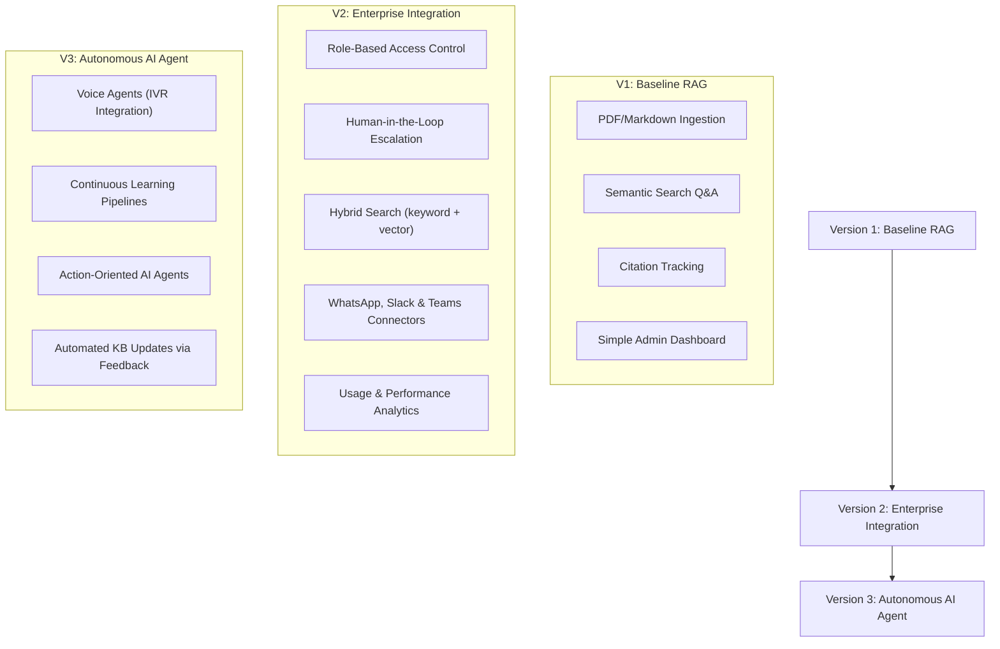

# Project Overview & Requirements Document

| Attribute | Details |
| :--- | :--- |
| **Project Name** | Enterprise AI Knowledge Platform with Intelligent Customer Support (RAG) |
| **Version** | v1.0.0 (Baseline Draft) |
| **Document Type** | Solution Architecture & Product Requirements |
| **Document Status** | Approved |
| **Author** | Principal Software Architect |
| **Last Updated** | 2026-06-27 |

### Document Description
This document provides a comprehensive, high-level overview of the *Enterprise AI Knowledge Platform with Intelligent Customer Support*. It serves as the foundation for the project, detailing the product's vision, objectives, scope, and target personas. It aims to align all stakeholders on the business value, functional goals, and non-functional requirements without pre-empting low-level system designs, database schemas, or API implementations.

---

## Executive Summary

In today's competitive landscape, delivering rapid, accurate, and high-quality customer service is a primary driver of customer retention and brand equity. However, scaling customer support traditionally requires a linear increase in headcount, creating a heavy financial burden. Furthermore, onboarding support staff to navigate a fragmented ecosystem of product manuals, warranties, internal operating procedures, and FAQs is slow and prone to human error.

The **Enterprise AI Knowledge Platform** bridges this gap. It is a secure, grounded customer support assistant powered by Retrieval-Augmented Generation (RAG). By integrating directly with an organization's existing corpus of verified documentation—including FAQs, product manuals, warranty policies, and troubleshooting guides—the platform acts as an automated, highly intelligent support assistant. When a customer or agent poses a question, the platform retrieves the precise text segments containing the answer and generates a response that is strictly grounded in that retrieved context. Every answer includes verifiable citations linking back to the source documents, ensuring transparency. This approach eliminates the risk of generative AI hallucinations, protects proprietary information, and delivers instant, 24/7 support.

---

## Vision

The long-term vision of the Enterprise AI Knowledge Platform is to become the unified, intelligent cognitive layer for all corporate knowledge. We envision a future where organizational documentation is not a passive, static archive of files, but a dynamic, conversational engine that instantly surfaces answers for customers and employees alike. By transforming unstructured text into active intelligence, the platform will enable organizations to scale customer operations limitlessly, maintain a unified brand voice, and unlock the value of their intellectual property.

---

## Mission

Our mission is to build a reliable, secure, and production-ready RAG platform that enables organizations to deliver grounded, accurate, and cost-effective customer support. We aim to bridge the gap between advanced generative AI capabilities and enterprise-grade reliability, ensuring that every AI-generated response is safe, verifiable, and strictly compliant with organizational knowledge.

---

## Problem Statement

Organizations face severe operational inefficiencies and customer satisfaction risks due to the following pain points:

*   **Support Cost Inflation & Human Dependency:** Customer support operations are highly labor-intensive. As customer volume grows, scaling support desks linearly drags down profitability and strains operations.
*   **Knowledge Fragmentation:** Essential information is scattered across disparate formats and systems (e.g., local PDFs, intranet wikis, external FAQs, Google Docs). Finding the single source of truth is time-consuming for both customers and support agents.
*   **Repetitive Q&A Overhead:** Support agents spend the majority of their work hours resolving highly repetitive, low-complexity questions (e.g., refund windows, warranty durations, password reset procedures), leaving them with less time to resolve complex, high-value customer problems.
*   **Slow Resolution Times:** Long support queues and wait times lead to customer frustration, decreased retention, and increased churn.
*   **Generative AI Hallucinations:** General-purpose public AI models are prone to "hallucinating"—generating highly plausible but entirely fabricated facts. Deploying standard LLMs directly to customers represents a critical business liability.
*   **Data Security & Privacy Gaps:** Organizations cannot risk uploading proprietary manuals, internal SOPs, or customer data to public AI services that use prompt data to train public models.

> [!WARNING]
> Deploying standard generative AI models directly to customers without anchoring them to verified internal documents leads to severe reputational and legal risks due to factual hallucinations. Enterprises require absolute factual correctness and citation-backed transparency.

---

## Proposed Solution

The Enterprise AI Knowledge Platform solves these problems by decoupling the AI's *reasoning capabilities* from its *static memory*. It implements a secure Retrieval-Augmented Generation (RAG) architecture that operates through the following stages:

1.  **Document Ingestion:** Administrators upload structured and unstructured documents (FAQs, warranties, policies, manuals) to a secure knowledge base.
2.  **Context-Grounded Retrieval:** When a user asks a question, the platform bypasses the general knowledge of the AI model. Instead, it searches the ingested enterprise repository to retrieve the exact paragraphs containing the relevant information.
3.  **Grounded Synthesis:** The retrieved paragraphs are provided to the AI model as the sole reference material. The model is strictly instructed to generate an answer based *only* on the provided context, preventing hallucinations.
4.  **Verifiable Citations:** Every generated response is paired with transparent citations pointing back to the specific source document and section, providing customers and agents with immediate verifiability.

---

## Business Value

By deploying this platform, enterprises can unlock substantial, measurable business value:

*   **Cost Reduction:** Automating up to 70% of routine inquiries reduces the volume of tickets routed to human agents, significantly lowering operational costs.
*   **Instantaneous Resolution (Zero Queue Time):** Customers receive accurate answers in seconds, eliminating queues and improving Customer Satisfaction (CSAT) scores.
*   **Enhanced Employee Productivity:** Support agents can use the platform internally to instantly retrieve information from complex technical manuals, reducing Average Handling Time (AHT) during live escalations.
*   **Scalable Knowledge Sharing:** Knowledge is made available 24/7 across multiple time zones without requiring additional headcount.
*   **Consistent Brand Voice & Policy Adherence:** AI answers are grounded in official documentation, ensuring consistent answers that adhere strictly to company policies.
*   **Knowledge Preservation:** Core operational knowledge is centralized in the platform, mitigating the risk of knowledge loss when key employees leave the company.
*   **Reduced Onboarding & Training Costs:** New agents use the platform as a real-time assistant, drastically reducing the time required to train them on product details.

---

## Target Users

The platform serves four primary user personas, each with distinct goals, responsibilities, and benefits:

### Administrator
*   **Goals:** Successfully ingest, organize, and monitor the organization's knowledge base. Ensure the system operates securely and stays updated with the latest policies.
*   **Responsibilities:** Upload documents, manage knowledge collections, configure system behaviors, review analytics/audit logs, and control access permissions.
*   **Benefits:** A centralized interface to manage all company knowledge in one place without needing technical database or AI engineering expertise.

### Customer
*   **Goals:** Get fast, accurate, and reliable answers to questions about products, policies, or services.
*   **Responsibilities:** Input natural language queries into the chat interface and review answers and citations.
*   **Benefits:** Instant 24/7 assistance without waiting on hold, with transparent citations that build trust in the provided answers.

### Support Agent
*   **Goals:** Resolve complex customer inquiries quickly and accurately. Reference company policies and product manuals with high confidence.
*   **Responsibilities:** Handle escalated tickets that the AI assistant cannot resolve. Use the platform internally to search manuals and find official answers.
*   **Benefits:** Eliminates the frustration of searching multiple PDFs and wikis during active chats. The platform acts as a co-pilot, surfacing relevant sections instantly.

### Business Owner / Executive
*   **Goals:** Lower operational overhead, increase CSAT, protect brand reputation, and gain insight into customer issues.
*   **Responsibilities:** Review high-level performance metrics, approve budget/licensing, and align support operations with overall business goals.
*   **Benefits:** Access to a scalable customer support model that supports growth without exponential hiring, along with analytics detailing customer pain points.

---

## Objectives

To guide the project's development and evaluation, we define three sets of objectives:

### Business Objectives
*   **Reduce Support Ticket Volume:** Deflect at least 50% of inbound support tickets in the first quarter of deployment.
*   **Improve First Contact Resolution (FCR):** Raise FCR by 30% by providing customers with comprehensive, instant answers.
*   **Increase Customer Satisfaction (CSAT):** Target an average CSAT score of 4.5/5 or higher for automated interactions.
*   **Control Operational Costs:** Achieve a 40% reduction in support costs per interaction compared to manual support.

### Technical Objectives
*   **Ensure Grounded Responses:** Achieve a zero-hallucination rate on properly configured knowledge bases by strictly enforcing context grounding.
*   **Sub-Second Response Latency:** Keep the system's end-to-end response time under 1.5 seconds for retrieving and generating answers.
*   **Support High-Fidelity Citations:** Every answer must map back to its precise source document to allow verification.
*   **Modular & Extensible Architecture:** Design the system with clean separation of concerns, enabling easy swaps of models, search mechanisms, or UI layers in the future.
*   **Enterprise-Grade Security:** Protect proprietary company documents by securing storage and ensuring data isolation.

### Learning Objectives
*   **Understand Modern RAG Architectures:** Master the mechanics of semantic search, chunking, indexing, and synthesis.
*   **Learn AI Engineering Best Practices:** Move beyond basic LLM API calls to build robust, fault-tolerant, and evaluation-driven AI systems.
*   **Optimize Context Utilization:** Understand context window management, prompt engineering, and grounding techniques to control costs and latency.
*   **Implement Citation Systems:** Learn how to preserve metadata throughout the text processing pipeline to link generated text back to original sources.

---

## Project Scope

The scope of the project's initial release (Version 1) is clearly demarcated from future milestones.

### Included Features

| Feature Area | Detailed Description | Target User |
| :--- | :--- | :--- |
| **Document Ingestion** | Bulk upload and processing of text, markdown, and PDF documents. Handles clean text extraction and metadata tag extraction (filename, upload date). | Administrator |
| **Knowledge Library** | Management dashboard to view all uploaded files, delete outdated files, and monitor document parsing status. | Administrator |
| **Grounded Chat UI** | Web-based chat interface supporting natural language inputs, delivering markdown-formatted grounded answers. | Customer, Support Agent |
| **Citation System** | Automatically highlights specific sources used for the generated text, showing document names and segment references. | Customer, Support Agent |
| **Graceful Fallback** | Detects when the user's query cannot be answered using the uploaded documents and responds with a polite, standardized fallback message. | Customer, Support Agent |
| **Escalation Mechanism** | Displays a ticket submission link or support email address when a query falls back, allowing seamless human routing. | Customer |
| **Basic Monitoring** | Visual log dashboard containing request volumes, common fallback topics, and performance latency statistics. | Administrator |

### Excluded Features (Version 1)

| Feature Area | Detailed Description | Reason for Exclusion |
| :--- | :--- | :--- |
| **Multi-Tenancy** | Partitioned databases and search spaces allowing multiple independent corporate accounts to share the system. | Excluded to keep the baseline architecture simple. |
| **Third-Party Integrations** | Direct connector plugins for Slack, Microsoft Teams, Zendesk, WhatsApp, or Salesforce. | Excluded to prioritize a robust core web application. |
| **Voice & Speech Support** | Speech-to-text input and synthesized voice output (IVR phone integration). | Excluded as text-based documents and chat are the immediate focus. |
| **Advanced Hybrid Search** | Blended keyword (BM25) and dense semantic vector search with secondary cross-encoder reranking. | Baseline semantic search will be validated and optimized first. |
| **SaaS Billing Integration** | Self-service subscription models, metered usage billing (Stripe), and tier limits. | Outside the scope of the core AI capability verification. |
| **Live Human Handoff** | Real-time chat redirection to a live support agent queue within the same chat box. | Deferred due to complexity of real-time WebSocket state management. |
| **Automated Knowledge Updates** | Continuous crawling of public company web pages to auto-update the vector index. | Focus is strictly on manual, admin-controlled document uploads. |

---

## Functional Goals

The primary high-level capabilities that the system must deliver are:

*   **Ingest Unstructured Knowledge:** The system must accept company documents and transform them into searchable knowledge blocks without manual pre-processing of text content by users.
*   **Maintain a Searchable Library:** Administrators must be able to view all documents currently stored in the system, search their metadata, and remove outdated files.
*   **Process Conversational Queries:** Customers must be able to type natural language questions and receive human-like, grammatically correct, and polite answers.
*   **Grounded Information Retrieval:** The system must locate the most relevant sections of company policies to answer a specific question, ignoring irrelevant documents.
*   **Provide Verifiable Proof:** The assistant must show where the information came from, ensuring transparency and enabling human oversight.
*   **Handle Out-of-Scope Questions Safely:** If a customer asks a question that cannot be answered by the company documents, the system must recognize the lack of information and politely decline to answer, offering a path to human support.

---

## Non-Functional Goals

The platform must satisfy the following critical quality-of-service parameters to support enterprise deployment:

*   **Performance:**
    *   Response retrieval and generation startup latency must be sub-second (time-to-first-token).
    *   The complete text generation must conclude within 3.0 seconds under normal load.
*   **Availability:**
    *   Maintain a target uptime of 99.9% for the chat interface.
    *   Gracefully degrade with local error messages if external LLM APIs experience outages.
*   **Security:**
    *   Documents must be stored in encrypted repositories at rest and transmitted using secure protocols.
    *   Ensure absolute isolation of chat sessions so users cannot cross-access history.
*   **Scalability:**
    *   The ingestion pipeline must support processing document libraries of up to 10,000 pages without memory exhaustion or degradation of search speed.
*   **Maintainability:**
    *   Structure the codebase using clean separation of concerns, ensuring that the retrieval mechanisms and generation engines are loosely coupled.
    *   Write clear documentation and provide a comprehensive test suite.
*   **Reliability:**
    *   Implement robust retry logic with exponential backoff for all external network requests.
    *   Ensure partial failures in ingestion do not result in a corrupted search index.
*   **Extensibility:**
    *   Design the system around interface abstractions, allowing developers to switch LLM models or vector backends with minimal code modification.
*   **Portability:**
    *   Define the entire environment configuration through standard containerization parameters, allowing the system to run identically on developer machines, staging servers, and cloud clusters.
*   **Usability:**
    *   The UI must adapt fluidly to desktop, tablet, and mobile screens.
    *   Ensure accessibility compliance (WCAG 2.1 AA) to accommodate all users.

---

## Assumptions

*   **Document Validity:** We assume that all uploaded documents are accurate, up-to-date, and free of conflicting policies. The system does not possess the capacity to resolve factual contradictions in the source material.
*   **Upstream Model Quality:** We assume that the upstream generative models remain available, maintain their reasoning performance, and support structured system instructions.
*   **Text Availability:** We assume that all PDFs uploaded are digital text documents rather than image scans, eliminating the need for OCR in the first release.
*   **Single-Tenant Focus:** The system is assumed to be deployed as a single-tenant instance for a specific enterprise client.

---

## Constraints

*   **Upstream Rate Limits:** Query throughput and ingestion volumes are directly constrained by the RPM (Requests Per Minute) and TPM (Tokens Per Minute) limits of the external LLM providers.
*   **Context Window Boundaries:** The maximum volume of document context that can be sent to the LLM at one time is physically constrained by the model's context window.
*   **Hosting Budget:** System components must be optimized to run on standard, low-cost virtual machines, constraining local caching sizes and processing capacity.
*   **Browser Technology:** The customer interface must run on standard modern web browsers without requiring custom extensions, plugins, or high-performance client GPU rendering.

---

## Risks

We identify the following technical, business, and future risks, along with proactive mitigation strategies:

### Technical Risks
*   **Context Fragmentation:** Breaking documents into smaller chunks may result in an answer being split across boundaries, making retrieval incomplete.
    *   *Mitigation:* Implement overlapping text windows and meta-tag indexing.
*   **Parsing Failures on Complex Layouts:** Multi-column PDFs, embedded data tables, or footnotes may parse out-of-order, corrupting the context.
    *   *Mitigation:* Utilize robust text extraction libraries tailored for structured document layouts.
*   **LLM API Latency:** External model calls can occasionally take up to 5-10 seconds, frustrating customers.
    *   *Mitigation:* Utilize streaming responses (SSE) to display text token-by-token and implement search result caching.

### Business Risks
*   **Customer Trust Erosion:** If the system provides even one incorrect answer, customers may lose trust and default to human support, negating the business value.
    *   *Mitigation:* Position the AI as an assistant with prominent citation links, making it easy for customers to double-check statements.
*   **Cost Overruns:** High conversational volumes could result in expensive API usage costs.
    *   *Mitigation:* Implement session-based rate limiting and optimize semantic query size.
*   **Compliance & Privacy:** Enterprise data might contain sensitive details that require localized storage.
    *   *Mitigation:* Ensure that document ingestion uses secure, enterprise-tier LLM endpoints that guarantee prompts are not used for training.

### Future Risks
*   **Upstream Model Deprecation:** Model providers rapidly update and deprecate endpoints, risking system failure.
    *   *Mitigation:* Build a strong abstraction layer around the LLM integration to allow model swapping with a single configuration change.
*   **Technical Obsolescence:** The rapid evolution of the generative AI industry could make the Version 1 architecture obsolete.
    *   *Mitigation:* Focus on clean code architecture and modular software design patterns rather than tight binding to any single AI API.

---

## Deliverables

The project will produce the following tangible artifacts:

*   **Documentation:**
    *   **Project Overview:** This baseline document.
    *   **Architecture Design:** Detailed specifications of data flows, ingestion pipelines, and retrieval mechanisms.
    *   **API Specification:** Detailed parameters of the backend endpoints.
    *   **Setup & Deployment Guide:** Instructions for local installation and cloud deployment.
*   **Architecture Models:** Complete UML diagrams representing the ingestion workflow and the chat query loop.
*   **Backend Application:** A robust service containing document parsing engines, search interfaces, and prompt orchestrators.
*   **Frontend UI:** A responsive web application featuring the Admin panel and the Customer chat window.
*   **Database:** Configured storage spaces for document metadata and chat sessions.
*   **Docker Containerization:** Complete container configuration files to ensure repeatable environment execution.
*   **Test Suite:** Unit and integration tests validating chunking, retrieval search quality, and fallback logic.
*   **Deployment Configuration:** Infrastructure configuration files for cloud-based hosting.
*   **README:** A markdown guide in the project root detailing installation steps, environment setup, and local execution.

---

## Long Term Vision

Following the successful execution of Version 1, the platform will evolve across subsequent major releases:

### Version 2: Enterprise Integration
*   **Role-Based Access Control (RBAC):** Limit document visibility based on user groups (e.g., customers can only retrieve public manuals; internal agents can retrieve internal SOPs).
*   **Human Escalation Queue:** Real-time routing of conversations to human agents when the AI triggers a fallback, passing along full conversation transcripts.
*   **Hybrid Search:** Combine keyword-based search with semantic vector search, followed by reranking, to maximize retrieval accuracy.
*   **Third-Party Messaging Connectors:** Native support for customer interactions on WhatsApp, Slack, Microsoft Teams, and email.
*   **Usage & Performance Analytics:** A dashboard displaying query volume, common questions, cost metrics, and user feedback ratings.

### Version 3: Autonomous AI Agent Platform
*   **Voice Support:** Natural speech-to-speech interaction via modern WebRTC interfaces and phone integrations.
*   **Continuous Learning:** Automatic detection of gaps in the knowledge base by clustering questions that trigger fallback responses, alerting administrators to upload missing content.
*   **Action-Oriented AI Agents:** Enable the AI to execute actions (e.g., looking up order statuses, editing customer accounts, or scheduling appointments) by planning tool calls safely within boundaries.

---

## Success Criteria

We will measure the success of the platform's initial implementation through the following metrics:

1.  **Response Groundedness:** 100% of generated responses to test queries must be directly traceable to the provided context, with zero occurrences of hallucinatory text in validation testing.
2.  **Speed & Responsiveness:** 90% of user queries must return the initial response chunk in under 1 second, and the complete response in under 2 seconds.
3.  **Ingestion Quality:** 100% of uploaded text documents and digital PDFs must process without loss of text or chunking failures.
4.  **Test Coverage:** Maintain a minimum of 80% test coverage across core ingestion and retrieval backend code.
5.  **Successful Verification:** Successful end-to-end execution of a complete support session, demonstrating ingestion, query, grounded response generation, citation visualization, and graceful fallback handling.

---

## Conclusion

The **Enterprise AI Knowledge Platform with Intelligent Customer Support** represents a shift from general-purpose AI chat to safe, verified, and contextual organizational intelligence. By building on a foundation of RAG, the platform addresses the critical corporate requirements of data privacy, factual accuracy, and immediate auditability. This overview document sets the strategic vision and functional boundaries for the system. Subsequent documentation will translate these requirements into concrete architecture diagrams, database designs, API specifications, and code.
