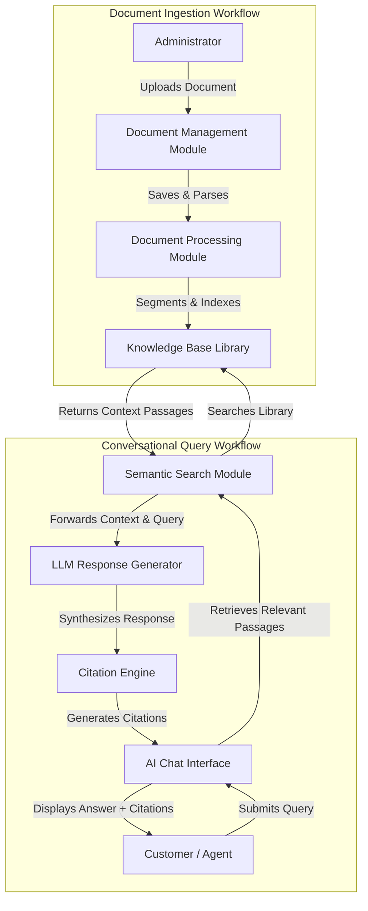
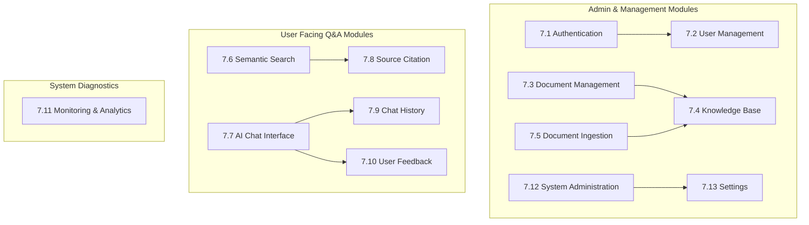
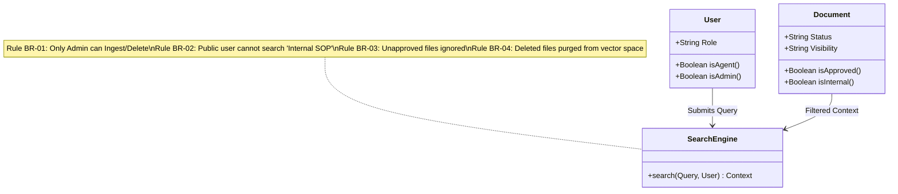

# Product Requirements Document (PRD)

| Attribute | Details |
| :--- | :--- |
| **Project Name** | Enterprise AI Knowledge Platform with Intelligent Customer Support (RAG) |
| **Document Version** | v1.0.0 (Baseline Approved) |
| **Document Owner** | Principal Product Manager & Senior AI Engineer |
| **Document Status** | Approved |
| **Last Updated** | 2026-06-27 |

### Document Purpose
This Product Requirements Document (PRD) defines the complete set of functional, non-functional, and business requirements for the *Enterprise AI Knowledge Platform with Intelligent Customer Support*. It serves as the single source of truth for the product's capabilities, user interactions, and quality standards, aligning product owners, software engineers, designers, and administrators before development commences.

---

## 1. Introduction

This Product Requirements Document details the target state for Version 1 of the Enterprise AI Knowledge Platform. The goal of this platform is to solve knowledge fragmentation, reduce operational support overhead, and prevent AI hallucinations by establishing a secure, grounded Q&A workflow. 

This PRD translates the project overview into detailed software requirements, outlining user personas, user stories, detailed functional modules, and clear acceptance criteria. In alignment with clean architecture, this document details *what* features and behaviors the product must exhibit, leaving technical implementations (such as database schemas, REST API specs, folder structures, or deployment parameters) to downstream technical design documents.

---

## 2. Product Overview

The Enterprise AI Knowledge Platform is a web-based, AI-powered customer support application. It allows administrators to upload proprietary company files (FAQs, warranty policies, manuals) and exposes a grounded, conversational chat interface for customers and internal agents. 

Rather than generating answers from the model's pre-trained weights (which risks hallucinations), the system uses a Retrieval-Augmented Generation (RAG) pattern. It retrieves relevant sections of the uploaded documents and uses them as context to synthesize responses. Every answer includes specific citations referencing the source file name and paragraph/section.

### 2.1 Core Architectural Flow
The high-level product workflow is divided into two distinct logical pathways: the **Document Ingestion Pathway** and the **Conversational Query Pathway**.

---

## 3. Product Goals

The product is designed to achieve goals across three core dimensions: Business, User, and Technical.

### 3.1 Business Goals
*   **Ticket Deflection:** Automatically deflect at least 50% of routine, repetitive customer support tickets within the first 90 days of deployment.
*   **Support Overhead Reduction:** Lower support operational costs by reducing human agent handling time for common questions.
*   **Knowledge Preservation:** Centralize institutional knowledge to insulate the company from knowledge loss caused by support team turnover.

### 3.2 User Goals
*   **Immediate Resolutions:** Enable customers to get instant, accurate responses to product and policy queries without waiting in lines.
*   **High Trust & Transparency:** Build customer confidence in AI-generated answers by displaying verifiable citations for every response.
*   **Co-Pilot Support:** Equip human support agents with an internal search assistant to locate policy details instantly during customer interactions.

### 3.3 Technical Goals
*   **Zero-Hallucination Grounding:** Ensure that the generative model restricts its outputs to the provided document context, generating a standard fallback when information is missing.
*   **Low Response Latency:** Optimize retrieval and synthesis speeds to deliver answers within conversational bounds.
*   **Modular Architecture:** Build a platform with clean, decoupled boundaries between ingestion, indexing, retrieval, synthesis, and presentation layers.

---

## 4. Stakeholders

The platform's success depends on several stakeholders, each defined by specific system responsibilities:

| Stakeholder Role | Responsibilities in Platform |
| :--- | :--- |
| **Company Owner** | Defines operational budgets, reviews cost analytics, and monitors ticket deflection rates. |
| **Administrator** | Ingests documentation, manages document lifecycle, monitors ingestion queues, and reviews system logs. |
| **Customer** | Queries the system via the chat widget, navigates citations, and submits feedback on answer quality. |
| **Support Team** | Uses the internal chat portal to find answers, flags bad responses, and handles escalated tickets. |
| **AI Engineering Team** | Monitors retrieval relevance, refines prompt guidelines, and ensures response safety and latency goals. |

---

## 5. User Personas

Detailed personas represent the target audience for the platform's features:

### 5.1 Administrator (e.g., "Elena, Support Operations Manager")
*   **Goals:** Keep the customer support assistant updated with the latest product releases, troubleshooting wikis, and warranty rules.
*   **Pain Points:** Document updates are frequent; manually updating a chatbot's hardcoded intents takes hours; hard to track if a chatbot is using outdated files.
*   **Expectations:** A simple dashboard to upload PDFs/Markdown files, see processing status, and delete old files immediately so they are no longer searched.
*   **Success Criteria:** Ingested files are live and searchable in under one minute; deleted files are purged from search immediately.

### 5.2 Customer (e.g., "Marcus, Product Owner & Buyer")
*   **Goals:** Quickly find out if a defective product is covered under warranty and retrieve return shipping instructions.
*   **Pain Points:** Long phone queues, complex FAQ page hierarchies, and ungrounded chatbots that give generic, unhelpful advice.
*   **Expectations:** A clean chat portal that understands natural language queries, gives direct answers, and links to the exact policy documents for proof.
*   **Success Criteria:** Obtains a direct response with file citations within two seconds without needing human redirection.

### 5.3 Support Agent (e.g., "Sarah, Tier-1 Support Specialist")
*   **Goals:** Answer customer chat tickets quickly to meet strict First Contact Resolution (FCR) and Average Handling Time (AHT) metrics.
*   **Pain Points:** Searching through a massive, 200-page product manual PDF in a separate window during a live call or chat session.
*   **Expectations:** A search tool that allows her to type natural questions and instantly copies the official, grounded policy text and links.
*   **Success Criteria:** Reduces search time for policy details from 3 minutes to under 5 seconds.

### 5.4 Business Owner (e.g., "David, VP of Customer Experience")
*   **Goals:** Lower customer service cost per contact while improving overall brand satisfaction and retention scores.
*   **Pain Points:** Skyrocketing support ticket volumes during sales, and high agent training costs due to agent attrition.
*   **Expectations:** High-level dashboards showing ticket deflection rates, most frequently asked questions, and general user feedback.
*   **Success Criteria:** Clear evidence of ticket deflection and positive CSAT ratings over 4.5/5.

---

## 6. User Stories

The system must satisfy the following user stories across all personas:

### 6.1 Administrator User Stories
1.  **US-ADM-001:** As an Administrator, I want to upload a single PDF document so that its contents can be added to the knowledge library.
2.  **US-ADM-002:** As an Administrator, I want to upload a markdown document (.md) so that my structured wikis can be indexed.
3.  **US-ADM-003:** As an Administrator, I want to upload text files (.txt) so that plain text notes can be parsed easily.
4.  **US-ADM-004:** As an Administrator, I want to upload multiple files at once in a bulk queue so that I can update the knowledge base efficiently.
5.  **US-ADM-005:** As an Administrator, I want to view a list of all uploaded documents including their file size and upload date so that I can audit the system storage.
6.  **US-ADM-006:** As an Administrator, I want to track the ingestion processing status (e.g., In Queue, Processing, Completed, Failed) of each uploaded file so that I know when they are searchable.
7.  **US-ADM-007:** As an Administrator, I want to see detailed error messages for files that failed to ingest so that I can fix file formatting issues.
8.  **US-ADM-008:** As an Administrator, I want to delete any uploaded document from the library so that its information is immediately purged from search indexes.
9.  **US-ADM-009:** As an Administrator, I want to mark a document as "Internal Use Only" so that its contents are excluded from customer searches but available to support agents.
10. **US-ADM-010:** As an Administrator, I want to mark a document as "Unapproved" to temporarily remove it from search results without deleting the source file.
11. **US-ADM-011:** As an Administrator, I want to assign a Category tag (e.g., Warranty, Refund, User Manual) to documents during upload so that I can filter retrieval context.
12. **US-ADM-012:** As an Administrator, I want to customize the default fallback message (e.g., "I cannot find this in my files...") that the AI outputs when it lacks context, so that I can align the assistant's voice with company guidelines.
13. **US-ADM-013:** As an Administrator, I want to configure the human support escalation URL or support email address that appears when the AI falls back.

### 6.2 Customer User Stories
14. **US-CUST-014:** As a Customer, I want to query the support assistant in conversational natural language so that I don't have to guess keyword phrases.
15. **US-CUST-015:** As a Customer, I want to receive answers formatted in clean Markdown (bullet points, bold text) so that the response is easy to read.
16. **US-CUST-016:** As a Customer, I want the system to display clear inline citation tags next to statements so that I can see which document the information came from.
17. **US-CUST-017:** As a Customer, I want to hover over or click a citation tag to view the source document name and details so that I can verify the statement.
18. **US-CUST-018:** As a Customer, I want to see suggested follow-up questions relevant to my query so that I can navigate our documents without thinking of the next question.
19. **US-CUST-019:** As a Customer, I want the assistant to explicitly state when it cannot find an answer in the uploaded files so that I am not given false information.
20. **US-CUST-020:** As a Customer, I want to receive a direct link to escalate my query to human support when the AI cannot answer my question.
21. **US-CUST-021:** As a Customer, I want to view my current chat history within my active browser session so that I can refer back to earlier answers.
22. **US-CUST-022:** As a Customer, I want to clear my active chat history at any time so that I can start a fresh conversation and protect my privacy.
23. **US-CUST-023:** As a Customer, I want to download a PDF or text transcript of my chat history so that I can save the troubleshooting steps for later.
24. **US-CUST-024:** As a Customer, I want to submit a thumbs-up or thumbs-down rating for each response to indicate if the answer was helpful.

### 6.3 Support Agent User Stories
25. **US-AGT-025:** As a Support Agent, I want to log into a secure agent portal so that I can access internal tools.
26. **US-AGT-026:** As a Support Agent, I want to run queries that search both public customer-facing documents and internal SOPs so that I can handle complex operations.
27. **US-AGT-027:** As a Support Agent, I want the system to show a clear visual flag (e.g., an "Internal SOP" label) next to search results and citations that are not public, so that I do not accidentally share internal details with customers.
28. **US-AGT-028:** As a Support Agent, I want to copy the AI's response text along with its citations in one click so that I can paste it directly into my active support ticketing tool.
29. **US-AGT-029:** As a Support Agent, I want to submit a written comment on incorrect AI responses to alert administrators of gaps in the documentation.

### 6.4 Business Owner User Stories
30. **US-OWN-030:** As a Business Owner, I want to view a dashboard showing the total query volume over time so that I can monitor usage trends.
31. **US-OWN-031:** As a Business Owner, I want to track ticket deflection rates (queries resolved without fallback/escalation) so that I can measure the return on investment.
32. **US-OWN-032:** As a Business Owner, I want to monitor average query response times so that I can ensure the user experience remains fast.
33. **US-OWN-033:** As a Business Owner, I want to see an aggregated report of user feedback (thumbs up/down percentages) to evaluate system performance.
34. **US-OWN-034:** As a Business Owner, I want to track estimated LLM token costs based on API usage logs so that I can manage our monthly budget.
35. **US-OWN-035:** As a Business Owner, I want to view system audit logs showing who uploaded or deleted documents to ensure regulatory compliance.

---

## 7. Functional Requirements by Module

This section details the functional modules of the platform, specifying their purpose, features, expected behavior, and user interactions.

### 7.1 Authentication
*   **Purpose:** Secure the administrative dashboard and agent interface, ensuring only authorized personnel can manage files or view internal knowledge.
*   **Features:**
    *   Secure user login and logout interfaces.
    *   Session-based timeout and lock.
    *   Password reset workflows.
*   **Expected Behavior:**
    *   Unauthorized users attempting to access admin or agent paths must be redirected to the login page.
    *   A session must expire after 30 minutes of inactivity, requiring re-authentication.
*   **User Interactions:**
    *   Users enter credentials (email/password) on the login screen.
    *   Upon validation, the system routes the user to their designated dashboard based on their role.

### 7.2 User Management
*   **Purpose:** Allow administrators to manage accounts and access rights for other administrators and support agents.
*   **Features:**
    *   User creation, deletion, and profile updates.
    *   Role assignments (Administrator, Support Agent).
*   **Expected Behavior:**
    *   Only users with the Administrator role can access this module.
    *   Removing a user account must immediately terminate any active sessions for that user.
*   **User Interactions:**
    *   Administrators view a user list table, click "Create User" to fill out a modal form, or click "Delete" next to an existing user record.

### 7.3 Document Management
*   **Purpose:** Provide administrators with a dashboard to manage the lifecycles of uploaded documents.
*   **Features:**
    *   Document listing with metadata columns (filename, size, format, upload date, status).
    *   Filter by ingestion status and document type.
    *   Search documents by title.
*   **Expected Behavior:**
    *   The list must auto-refresh when document statuses transition (e.g., from Processing to Completed).
    *   Deleting a document must initiate a cascading removal of its indices from the search space.
*   **User Interactions:**
    *   Administrators browse the document table, click column headers to sort, enter text in the search bar, and click delete buttons to trigger deletion confirmation modals.

### 7.4 Knowledge Base Management
*   **Purpose:** Enable fine-grained classification and visibility controls for documents within the searchable catalog.
*   **Features:**
    *   Toggle switch to mark documents as "Public" or "Internal Use Only".
    *   Toggle switch to mark documents as "Approved" or "Unapproved" for search.
    *   Category tag manager (e.g., Warranty, Troubleshooting).
*   **Expected Behavior:**
    *   If a document is marked "Internal Use Only", its content must never be retrieved for queries originating from the public customer chat interface.
    *   If a document is marked "Unapproved", it must be skipped by the search engine during context retrieval for all users.
*   **User Interactions:**
    *   Administrators toggle switch controls in the document row or assign category tags from drop-down menus in the details modal.

### 7.5 Document Ingestion & Processing
*   **Purpose:** Extract, parse, segment, and index document contents, making them ready for semantic search.
*   **Features:**
    *   Drag-and-drop file upload zone.
    *   Support for PDF, Markdown, and TXT files.
    *   Validation of file size and file extension.
    *   Ingestion progress tracking.
*   **Expected Behavior:**
    *   Files exceeding 25MB or using unsupported extensions must be rejected before upload begins, showing a clear warning message.
    *   Uploaded files must enter a parsing queue, split into digestible text segments (chunks), and be indexed in the vector library.
*   **User Interactions:**
    *   Administrators drag files onto the upload widget or click to browse files, then track progress in an upload queue modal.

### 7.6 Semantic Search
*   **Purpose:** Find and retrieve the most relevant sections of text from the knowledge library matching a user's natural language query.
*   **Features:**
    *   Query intent parsing.
    *   Retrieval of context chunks using semantic similarity matching.
    *   Document status and visibility filtering.
*   **Expected Behavior:**
    *   The retrieval engine must search only approved files that match the user's role constraints (e.g. omitting internal files for public customers).
    *   If the similarity score of the top-ranked results falls below a pre-configured threshold, the system must trigger the fallback state.
*   **User Interactions:**
    *   No direct user interaction; this module runs in the background when a customer or agent submits a question in the chat portal.

### 7.7 AI Chat Interface
*   **Purpose:** Provide users with a clean, responsive chat window to interact with the grounded AI assistant.
*   **Features:**
    *   Chat bubbles showing user queries and assistant responses.
    *   Rich-text markdown rendering in chat bubbles (lists, bold text, tables, code blocks).
    *   Streaming text output (displaying responses token-by-token).
    *   Suggested follow-up questions displayed as clickable pills below responses.
*   **Expected Behavior:**
    *   The assistant must output the response in real-time as it is generated, showing a pulsing loading indicator while waiting for the first word.
    *   Follow-up questions must only appear if they are returned by the generation engine based on the context.
*   **User Interactions:**
    *   Users type queries in the chat input, press Enter or click "Send", click follow-up pills, and copy response text.

### 7.8 Source Citation System
*   **Purpose:** Attach clear, verifiable source links to statements in the AI-generated responses, showing users the exact files and sections used.
*   **Features:**
    *   Numbered citation tags (e.g., `[1]`, `[2]`) placed at the end of relevant sentences.
    *   Interactive hover cards displaying source file name, category, and a text snippet.
    *   A list of references at the bottom of the chat bubble.
*   **Expected Behavior:**
    *   Clicking or hovering on a citation tag must open a card showing metadata about the source document chunk.
    *   Citations must correspond only to documents actually retrieved and passed to the generator.
*   **User Interactions:**
    *   Users hover their cursors over citation tags or click the citations to view the source details window.

### 7.9 Chat History & Session Management
*   **Purpose:** Maintain a record of the active conversation, allowing users to scroll back and review earlier Q&As.
*   **Features:**
    *   Sidebar listing active chat sessions (for agents) or simple thread view (for customers).
    *   "Clear Chat" action button.
    *   "Export Chat" utility (formats chat history to a downloadable file).
*   **Expected Behavior:**
    *   For customers, history must persist in browser storage until the tab is closed or the customer clicks "Clear Chat".
    *   For agents, session history must be saved in the database, allowing them to switch between active conversations without losing context.
*   **User Interactions:**
    *   Users click "Clear Chat" to reset the window, click "Export" to download a transcript, or click history items in the sidebar to review past chats.

### 7.10 User Feedback
*   **Purpose:** Capture user sentiment regarding response quality to help administrators identify outdated or missing documentation.
*   **Features:**
    *   Thumbs-up and thumbs-down icons next to every generated response.
    *   A feedback comment modal that appears when a user clicks the thumbs-down button.
*   **Expected Behavior:**
    *   Clicking thumbs-up must save a positive record for the response session in the database.
    *   Clicking thumbs-down must prompt the user with an optional text field to explain the issue (e.g., "Outdated policy", "Inaccurate information").
*   **User Interactions:**
    *   Users click the thumbs-up/down icons and fill out the comment form in the modal.

### 7.11 Monitoring & Analytics Dashboard
*   **Purpose:** Provide business owners and administrators with insights into how the system is performing.
*   **Features:**
    *   Metrics dashboard displaying total chats, deflection rates, and positive feedback percentages.
    *   Line chart showing daily query volume trends.
    *   Table displaying common questions that triggered the fallback response.
    *   Estimated API cost tracker.
*   **Expected Behavior:**
    *   Data on the dashboard must update hourly.
    *   Export buttons must allow downloading the analytics data in standard CSV format.
*   **User Interactions:**
    *   Administrators and Business Owners view charts, filter by date ranges, and click "Export CSV" to download reports.

### 7.12 System Administration
*   **Purpose:** Provide central administrative controls to manage security, logs, and system audits.
*   **Features:**
    *   Security log viewer tracking document additions and deletions with user IDs and timestamps.
    *   Application error log logs.
*   **Expected Behavior:**
    *   Security audit logs must be immutable and append-only.
*   **User Interactions:**
    *   Administrators view logs in a paginated list, filter logs by user activity or error severity, and export logs.

### 7.13 Settings & Configurations
*   **Purpose:** Enable customization of prompt parameters, thresholds, and support destination targets.
*   **Features:**
    *   Form fields to update the system prompt wrapper instructions.
    *   Similarity confidence threshold slider (0.0 to 1.0).
    *   Input fields for escalation targets (support email address, ticket URL).
*   **Expected Behavior:**
    *   Changes to the settings must apply immediately to all subsequent queries.
    *   A "Restore Defaults" button must reset configurations to baseline settings.
*   **User Interactions:**
    *   Administrators adjust the threshold slider, update text inputs, and click "Save Configurations".

---

## 8. Non-Functional Requirements

These requirements define the system's operational constraints, security requirements, and usability standards.

### 8.1 Performance NFRs
*   **Latency:** The system must return the first tokens of a chat response within 1.0 second of user submission (Time-to-First-Token). The full response must complete generation within 3.0 seconds under normal load.
*   **Ingestion Speed:** A standard 10-page document (approximately 3,000 words) must be parsed, chunked, and fully indexed in under 30 seconds.
*   **Page Load:** The initial page load of the customer-facing chat widget must be under 1.5 seconds on standard broadband connections.

### 8.2 Availability NFRs
*   **Uptime:** The customer chat interface must maintain a 99.9% availability SLA (excluding planned maintenance windows).
*   **Graceful Degradation:** If upstream AI provider APIs experience an outage, the chat interface must remain operational, displaying a friendly maintenance message rather than crashing or freezing.

### 8.3 Security NFRs
*   **Data Encryption:** All uploaded documents must be encrypted at rest and in transit (using HTTPS/TLS 1.3).
*   **Data Isolation:** Multi-user data access rules must prevent users from accessing chat histories or active sessions belonging to other accounts.
*   **Model Isolation:** Prompts and context sent to LLM providers must use enterprise API contracts that guarantee data is not stored or used to train public models.

### 8.4 Scalability NFRs
*   **Document Ingestion:** The indexing database must support up to 50,000 distinct document chunks without performance degradation in search queries.
*   **Concurrent Users:** The backend API must handle up to 200 concurrent chat sessions without experiencing latency spikes.

### 8.5 Reliability NFRs
*   **Fault Tolerance:** The ingestion queue must support automatic retries for failed file parsing attempts (up to 3 times) before logging a failure.
*   **Index Consistency:** If document deletion fails midway, the database transaction must roll back, ensuring no partial or broken document references remain searchable.

### 8.6 Maintainability NFRs
*   **Modular Architecture:** The codebase must use decoupled layers (Presentation, Application Core, Infrastructure Adapters) to allow developers to swap model APIs or databases with minimal code changes.
*   **Test Coverage:** Core business logic, including document chunking, citation generation, and access control filters, must have at least 80% test coverage.

### 8.7 Accessibility NFRs
*   **Standard Compliance:** The frontend must follow WCAG 2.1 AA standards.
*   **Keyboard Navigation:** All interactive chat elements, inputs, and feedback buttons must be accessible using standard keyboard shortcuts.
*   **Screen Readers:** Form elements, buttons, and chat responses must have descriptive ARIA labels to support screen-reader technologies.

### 8.8 Usability NFRs
*   **Responsive Design:** The chat widget and administrative panel must adjust layouts fluidly across desktop screens (1920x1080) down to mobile displays (375x812).
*   **Intuitive Interface:** The system must not require training for customers. The chat widget must resemble standard messaging apps with clear input boxes, send buttons, and scrollable histories.

### 8.9 Compatibility NFRs
*   **Browser Support:** The web applications must be fully compatible with the current and previous major versions of Google Chrome, Apple Safari, Mozilla Firefox, and Microsoft Edge.

### 8.10 Logging & Monitoring NFRs
*   **Audit Logging:** Ingestion actions, document deletions, user creation, and role adjustments must write a log record containing actor, action, timestamp, and target ID.
*   **Performance Monitoring:** The system must record and log processing times for vector search retrieval and prompt generation for every transaction.

---

## 9. Business Rules

The following core business logic rules must be enforced by the platform:

*   **BR-01 (Upload Authority):** Only users authenticated with the `Administrator` role are permitted to upload, modify, configure, or delete files from the knowledge library.
*   **BR-02 (Visibility Separation):** Public users (Customers) must never receive answers or search citations derived from documents marked `Internal Use Only`. Only users authenticated as `Support Agent` or `Administrator` can retrieve internal document context.
*   **BR-03 (Approval Gatekeeping):** Documents marked as `Unapproved` are excluded from indexing and search retrieval space, regardless of the user's role.
*   **BR-04 (Deletions purging):** When a document is deleted, all associated text segments and semantic index arrays must be purged, preventing them from appearing in subsequent query responses.
*   **BR-05 (Grounded Output):** The AI assistant must base its responses strictly on the retrieved text segments. If the query cannot be resolved using the provided text, the system must output the configured fallback message instead of extrapolating.
*   **BR-06 (Auditable Logs):** All operations affecting the document corpus (uploads, deletion, status changes) must create a permanent audit log record.

---

## 10. Acceptance Criteria

To ensure validation and verification, the major functional modules must meet the following criteria:

| Module ID | Module Name | Acceptance Criteria |
| :--- | :--- | :--- |
| **AC-01** | Ingestion | 1. Support drag-and-drop of PDF, MD, and TXT files. 2. Block uploads exceeding 25MB with a user warning. 3. Ingestion dashboard must display real-time status transitions. |
| **AC-02** | Visibility | 1. Querying with internal documents filtered out must not retrieve internal text chunks. 2. Support agent portal queries must successfully retrieve both public and internal context chunks. |
| **AC-03** | Grounding | 1. If test queries contain questions outside the document scope, the model must output the configured fallback text. 2. AI must not answer using information outside the retrieved documents. |
| **AC-04** | Citation | 1. Every statement pulled from a document must have an adjacent citation badge `[N]`. 2. Clicking/hovering on `[N]` must show the source filename and text snippet. |
| **AC-05** | Fallback | 1. When context similarity is below the configured threshold, return the fallback text. 2. Display a clickable link routing the user to human support. |
| **AC-06** | Chat History | 1. Customers can view their active session's conversation history. 2. Clicking "Clear Chat" must delete history from browser memory and clear the chat window. |
| **AC-07** | User Management | 1. Administrators can create, modify, and delete agent/admin accounts. 2. Removing an account must immediately invalidate the active session of that user. |
| **AC-08** | Settings | 1. Changing the similarity threshold must immediately alter query retrieval sensitivity. 2. Custom fallback text edits must apply to all subsequent queries immediately. |

---

## 11. Error Scenarios

This section outlines how the system must handle common failures:

### 11.1 Document Upload Interruptions
*   *Scenario:* The user's internet connection drops midway through a bulk upload of a large PDF file.
*   *Expected Behavior:* The UI must catch the connection loss, halt the upload progress, mark the file status as "Failed" with the label "Upload Interrupted", and prompt the user to re-attempt the upload. No corrupted file fragments must remain in the storage library.

### 11.2 Ingest Parsing Errors
*   *Scenario:* An administrator uploads a corrupted PDF file or a file with an unsupported encoding scheme.
*   *Expected Behavior:* The system must catch the parsing exception during document ingestion, update the document status to "Failed", display a warning alert in the document list, and log the detailed error traceback for system admins.

### 11.3 Upstream AI API Outages
*   *Scenario:* The external model provider API returns a 500 error or becomes unreachable during a user query.
*   *Expected Behavior:* The chat portal must stop the loading indicator, display a friendly response bubble stating: *"The AI assistant is temporarily unavailable. Please try your question again or click here to reach human support."*, and log the external API failure details.

### 11.4 LLM Token Rate Limits
*   *Scenario:* A sudden traffic spike causes the system to hit upstream API rate limits (HTTP 429 Too Many Requests).
*   *Expected Behavior:* The backend must catch the rate limit error, wait for a short period (using exponential backoff), and retry the query (up to 3 times). If the retries fail, it must display a message asking the user to wait a moment before sending another message.

---

## 12. Edge Cases

### 12.1 Contradictory Document Context
*   *Scenario:* The administrator uploads an updated user guide, but leaves an outdated policy document active. A user query retrieves segments from both files, which contain contradictory statements (e.g., "Returns within 30 days" vs. "Returns within 14 days").
*   *Expected Behavior:* The retrieval engine will pull both segments. The prompt wrapper instructs the LLM to summarize the conflict if it cannot reconcile them, and to cite both sources, highlighting the contradiction so the user or agent can verify the discrepancy.

### 12.2 Text Extraction from Embedded Tables
*   *Scenario:* A warranty manual contains product warranty periods formatted inside a complex grid table.
*   *Expected Behavior:* The parser must extract table contents while preserving structural readability (such as converting it to Markdown tables) rather than flattening the cells into unstructured text, which would lose the relationships between cells.

### 12.3 Query Containing Empty or Nonsensical Inputs
*   *Scenario:* A user submits a blank input, a long string of special characters, or random words (e.g., "asdfghjkl").
*   *Expected Behavior:* The system must validate the query before searching, bypass semantic retrieval if it contains no searchable keywords, and output a friendly response prompting the user to ask a clear, structured question.

---

## 13. Assumptions

*   **Clean Digital Formats:** It is assumed that all uploaded company manuals are digital text files and do not require Optical Character Recognition (OCR) for scanned images in the first release.
*   **Upstream Interface Stability:** We assume that external LLM APIs remain stable and continue to support prompt grounding.
*   **Administrator Review:** We assume that administrators will verify the factual accuracy of documents before marking them as "Approved" in the library.

---

## 14. Constraints

*   **API Model Rate Limits:** System throughput is restricted by the RPM/TPM boundaries set by the upstream model API providers.
*   **Context Window Caps:** The volume of text passages passed to the LLM per query is physically constrained by the model's maximum input token limits.
*   **Single-Tenant Scope:** The first release operates as a single-tenant system, meaning all administrators manage a single knowledge library.

---

## 15. Risks

*   **Potential Hallucination:** Under extreme, ambiguous, or misleading queries, the model may attempt to output facts outside the context.
    *   *Mitigation:* Use highly restrictive system instructions, lower temperature values, and perform validation checks on generated text.
*   **Unstructured Layout Failures:** Ingestion of highly stylized corporate manuals (with sidebar notes, footnotes, or diagrams) may result in scrambled text parsing.
    *   *Mitigation:* Integrate structured PDF parsing engines and perform regular chunking evaluations.
*   **Cost Volatility:** Token consumption fees can spike quickly during high-volume periods.
    *   *Mitigation:* Implement session-based rate limiting and optimize retrieval chunk lengths.

---

## 16. Future Scope

*   **Role-Based Access Controls (RBAC):** Extend knowledge indexing to support user group filters, ensuring users only search documentation matching their access levels.
*   **Automated Continuous Ingestion:** Integrate web crawlers to periodically sync public company support pages with the vector index.
*   **Voice Portal Integration:** Extend the web interface to support real-time speech-to-speech queries.
*   **Native Integrations:** Deploy connectors for Slack, Microsoft Teams, WhatsApp, and Zendesk.

---

## 17. Glossary

*   **Retrieval-Augmented Generation (RAG):** An architectural pattern that retrieves relevant documents from a private library and passes them to an LLM to generate an answer grounded in that context.
*   **Large Language Model (LLM):** A deep learning model trained on vast text corpora, capable of understanding and generating human-like language.
*   **Embedding:** A vector representation of text that captures its semantic meaning, allowing search engines to find conceptually related text rather than just matching keywords.
*   **Chunk:** A segment of text extracted from a larger document, representing the unit of storage and search retrieval.
*   **Vector Database:** A database optimized for storing mathematical vector arrays (embeddings) and performing fast similarity searches.
*   **Semantic Search:** A search method that matches documents based on the conceptual meaning of a query rather than exact keyword matching.
*   **Citation:** A reference indicator linking a generated statement back to the source file name and paragraph from which it was retrieved.
*   **Grounding:** The practice of restricting an LLM's response to a provided context, preventing the model from generating information outside the reference material.
*   **Knowledge Base:** The central library of uploaded and processed company documents used as the source of truth for the Q&A system.
