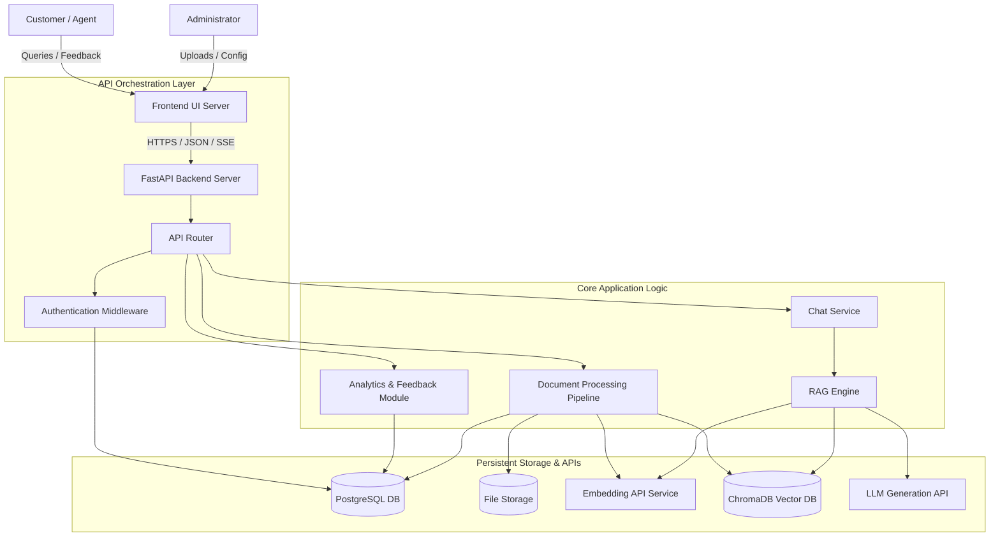
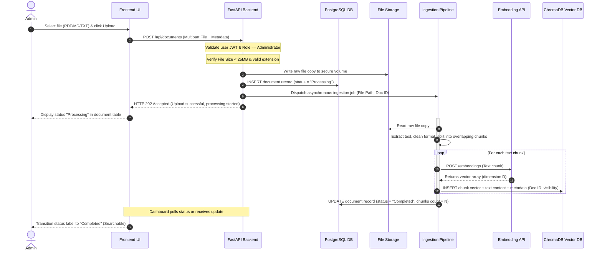
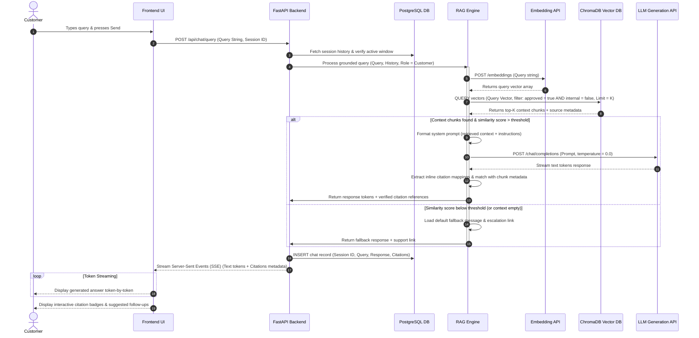
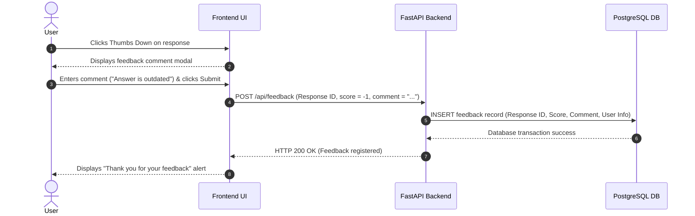
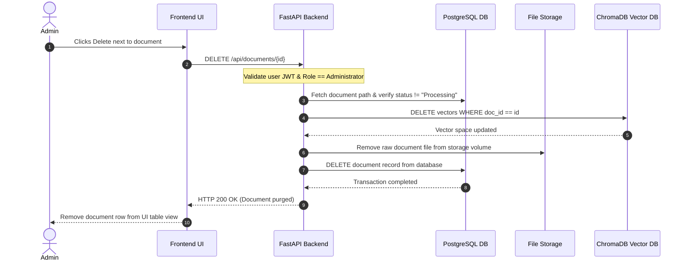
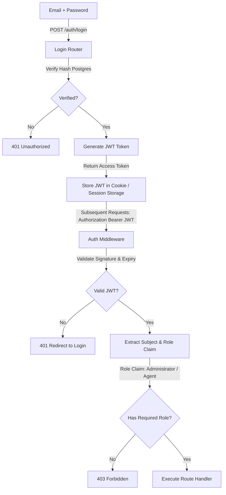
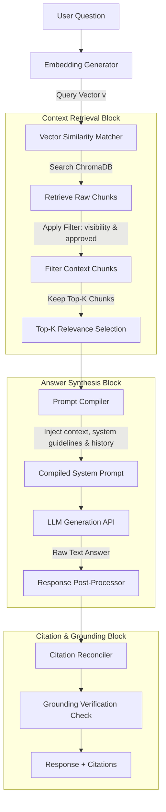
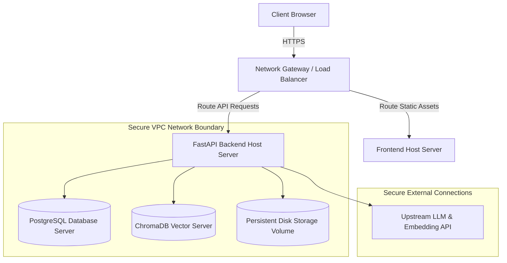

# System Architecture Document

| Attribute | Details |
| :--- | :--- |
| **Project Name** | Enterprise AI Knowledge Platform with Intelligent Customer Support (RAG) |
| **Document Name** | System Architecture Document |
| **Version** | v1.0.0 (Baseline Approved) |
| **Document Owner** | Principal Solution Architect & AI Systems Architect |
| **Document Status** | Approved |
| **Last Updated** | 2026-06-27 |

### Document Purpose
This document details the architectural design and structural blueprint for the *Enterprise AI Knowledge Platform with Intelligent Customer Support*. It specifies the system components, data flows, integration patterns, security boundaries, and architectural design decisions required to build a modular, secure, and extensible system. It serves as the primary guidance document for backend, frontend, and AI engineers.

---

## 1. Architecture Philosophy

The system architecture for the Enterprise AI Knowledge Platform is built on a set of core software engineering patterns designed to ensure that the platform transitions smoothly from a single-tenant pilot into a high-scale enterprise SaaS application.

### 1.1 Modular Design & Loose Coupling
The platform's features are divided into distinct modules with clear responsibilities, preventing the codebase from becoming a monolith. Modules communicate across abstract boundaries (interfaces) rather than binding to concrete implementations. For instance, the **RAG Engine** interacts with a generic **Embedding Service Interface** rather than a specific API client, allowing embedding models to be swapped without modifying the core query synthesis logic.

### 1.2 Separation of Concerns (SoC)
Each layer in the application has a single, well-defined responsibility:
*   **Presentation Layer:** Exposes the user interface and captures user events, remaining agnostic of database states or prompt templates.
*   **Application & Orchestration Layer:** Directs routing, authentication, and job validation (FastAPI).
*   **Business Logic Core:** Executes user stories, including document parsing, session state tracking, and feedback collection.
*   **AI Infrastructure (RAG Engine):** Manages vector database communication, chunk retrieval, context formatting, and prompt execution.
*   **Data Tier:** Stores relational tables and vector embeddings separately.

### 1.3 Clean Architecture Compliance
By nesting dependencies inward, the core business domain logic remains independent of databases, web frameworks, user interfaces, or external API clients. 

```
┌──────────────────────────────────────────────┐
│  Presentation Layer (Frontend / UI Servers)   │
└──────────────┬───────────────────────────────┘
               │ (HTTP / JSON / Server-Sent Events)
               ▼
┌──────────────────────────────────────────────┐
│  Application Layer (FastAPI Routers & Auth)  │
└──────────────┬───────────────────────────────┘
               │ (Interface Calls)
               ▼
┌──────────────────────────────────────────────┐
│  Business Domain (Document Pipelines / RAG)  │
└──────────────┬───────────────────────────────┘
               │ (Database & API Abstractions)
               ▼
┌──────────────────────────────────────────────┐
│  Infrastructure Layer (ChromaDB / Postgres)  │
└──────────────────────────────────────────────┘
```

### 1.4 High Cohesion
Classes, functions, and files grouped within a module are highly related to that module's core task. For example, all code related to PDF, Markdown, or text parsing is contained within the **Document Processing Pipeline**, and is not scattered across API endpoints or routing wrappers.

### 1.5 Scalability & Future Extensibility
To support growth without requiring complete rewrites, the architecture separates stateless request handling (which can be scaled horizontally) from stateful database queries. Key systems (e.g. document indexing) are designed to run asynchronously, ensuring that CPU-intensive document processing does not block user chat requests.

---

## 2. High-Level System Architecture

The high-level architecture diagram illustrates the flow of a user query from the client browser through the API orchestration layers, downstream RAG execution blocks, and the persistent storage backends.



### 2.1 Core Architectural Components

*   **Customer / Agent / Admin:** User actors interacting with the frontend web clients.
*   **Frontend UI Server:** Hosts the user interfaces. Serves the static assets for the client-facing chat widget and the administrative portal.
*   **FastAPI Backend Server:** The single entry point for all API requests. Provides input validation, manages routing, and enforces user authentication policies.
*   **Authentication Middleware:** Intercepts requests to verify JSON Web Tokens (JWT) and checks user permissions before allowing access to backend routers.
*   **Business Logic Core:** Executes application workflows. It separates the execution of transactional user stories (e.g. user management) from AI computation pipelines.
*   **RAG Engine:** The orchestrator for context retrieval and response generation. It manages embedding generation for queries, executes similarity searches against the vector database, formats the system context prompt, and runs validation on LLM outputs.
*   **PostgreSQL Relational DB:** Stores structured system data, including user accounts, permissions, document metadata (file names, upload dates, processing status), chat logs, and feedback ratings.
*   **ChromaDB Vector DB:** A vector database optimized for storing numerical text embeddings and executing similarity searches.
*   **Local File Storage:** Persistent disk space used to store raw uploaded document files (PDFs, Markdown, TXT) before and after parsing.
*   **Embedding API Service:** An external or local machine learning model endpoint used to convert raw text strings into high-dimensional vector embeddings.
*   **LLM Generation API:** The upstream large language model endpoint used to synthesize natural language responses based on the retrieved context.

---

## 3. Complete Component Diagram

The platform's functional modules are structured into clear components to ensure high maintainability and testability.

| Component Name | Core Responsibility | Upstream Dependencies | Downstream Dependencies |
| :--- | :--- | :--- | :--- |
| **Frontend UI** | Renders views, handles file uploads, streams chat responses, and captures user inputs. | None | FastAPI Backend |
| **FastAPI Backend** | Validates incoming payloads, manages API routing, and handles CORS configurations. | Frontend UI | Business Logic Core |
| **Authentication Module** | Issues, refreshes, and validates JSON Web Tokens (JWT). Encrypts passwords. | FastAPI Backend | PostgreSQL |
| **Document Ingestion Pipeline** | Validates uploads, extracts raw text, cleans formatting, and coordinates chunking. | FastAPI Backend | File Storage, PostgreSQL, RAG Engine |
| **RAG Engine** | Coordinates query embedding, semantic search, prompt building, and response validation. | Chat Service | Embedding Service, Vector DB, LLM Service |
| **Embedding Service** | Translates text segments into high-dimensional numerical vectors. | Ingestion Pipeline, RAG Engine | External API Providers |
| **Vector Database (ChromaDB)** | Stores document chunk embeddings and executes similarity searches. | Ingestion Pipeline, RAG Engine | None |
| **Relational DB (PostgreSQL)** | Maintains records for users, document metadata, audit logs, and feedback. | Auth Module, Ingestion Pipeline, Chat Service | None |
| **LLM Service** | Communicates with the language model provider to generate grounded text responses. | RAG Engine | External API Providers |
| **Chat Service** | Manages conversational session workflows, updates chat histories, and handles fallbacks. | FastAPI Backend | PostgreSQL, RAG Engine |
| **Analytics Module** | Compiles system metrics, tracks cost logs, and generates CSV reports. | FastAPI Backend | PostgreSQL |
| **Feedback Module** | Records thumbs-up/down ratings and user commentary. | FastAPI Backend | PostgreSQL |
| **Configuration Layer** | Validates and exposes environment variables (system prompts, thresholds, keys). | FastAPI Backend | All Components |
| **Logging Layer** | Captures application events, API request data, system errors, and audit trails. | All Components | Server Filesystem |

---

## 4. Complete Data Flow

These sequence diagrams detail the interactions between system components during core operational flows.

### 4.1 Administrator Document Ingestion Flow
This flow illustrates an administrator uploading a new file to the knowledge library, from the initial upload to text indexing.



### 4.2 Customer Conversational Chat Flow
This flow details how a customer's query is processed, retrieved, and answered by the grounded generator.



### 4.3 Feedback Collection Flow
This flow illustrates how user feedback is captured and recorded.



### 4.4 Document Deletion & Purging Flow
This flow details how documents are removed from the relational and vector databases.



---

## 5. Authentication & Authorization Flow

The platform implements a secure, stateless session pattern for users, and separates customer access from administrative paths.



### 5.1 Authentication Mechanism
*   **Password Hashing:** Passwords are never stored in plain text. The system uses secure, salted hashing functions (e.g. bcrypt or Argon2) to hash passwords on creation and verify them during login.
*   **Token Delivery:** Upon successful verification of login credentials, the server issues a JSON Web Token (JWT).
*   **JWT Payload:** The token payload contains:
    *   `sub` (Subject): Unique database user identifier.
    *   `role`: The user's role (`Administrator` or `Support Agent`).
    *   `exp`: Token expiration timestamp (configured to 30 minutes).

### 5.2 Session Lifecycle
*   **Token Validity:** Access tokens are short-lived. To continue using the dashboard after expiration, users must re-authenticate.
*   **State Management:** The backend remains stateless. It does not store active sessions in memory, validating incoming signatures against a secure cryptographic secret instead.
*   **Logout:** Initiating a logout clears the token from the client's storage (cookies or session storage). If a token needs to be invalidated before expiration, it is added to a temporary redis-based blacklist.

### 5.3 Authorization & Access Control
The system enforces Role-Based Access Control (RBAC) at the route level:
*   **Anonymous (Customer):** Access is limited to the public chat interface. Anonymous users cannot make requests to document endpoints or user management APIs.
*   **Support Agent:** Permitted to query both public and internal documents, view chat logs, and submit feedback. They are blocked from uploading or deleting files.
*   **Administrator:** Unrestricted access. Permitted to upload documents, delete files, change visibility settings, modify user accounts, and update system prompts.

---

## 6. Document Ingestion Pipeline

The document ingestion pipeline processes unstructured files and indexes them for retrieval, ensuring that parsed text retains its structural context.

```
[Raw File Uploaded]
        │
        ▼
[Validate Extension & Size]
        │
        ▼
[Extract Text by Type (PDF / MD / TXT)]
        │
        ▼
[Clean Text (Remove Artifacts & Standardize Whitespace)]
        │
        ▼
[Chunk Text using Recursive Splitting (Overlap = O, Size = S)]
        │
        ▼
[Call Embedding API for Each Chunk (Generate Vector Array)]
        │
        ▼
[Save Vectors & Chunks to Vector DB] ───► [Register Metadata in PostgreSQL]
```

### 6.1 Upload & Validation
The system validates files against a whitelist of extensions (`.pdf`, `.md`, `.txt`) and enforces a 25MB file size limit. Uploaded files are assigned a unique UUID and saved to disk.

### 6.2 Text Extraction
*   **PDF Extraction:** The system uses standard text extraction libraries (e.g., PyPDF or pdfplumber) to parse PDF pages. The extraction process preserves tables by translating grid arrays into structured Markdown tables where possible.
*   **Markdown Extraction:** Headers, lists, and formatting blocks are parsed while stripping out complex HTML markup.
*   **TXT Extraction:** Plain text is read using standard UTF-8 encoding.

### 6.3 Cleaning & Chunking
*   **Cleaning:** The system removes repetitive headers, footers, page numbers, and extra whitespaces.
*   **Chunking Strategy:** The cleaned text is chunked using a recursive character splitting strategy. This approach attempts to split text at natural boundaries (paragraphs, sentences, and words) to keep semantically related text together.
    *   *Chunk Size:* 500 characters (configured dynamically).
    *   *Chunk Overlap:* 50 characters (ensures information is not lost at chunk boundaries).

### 6.4 Embedding Generation
Each text chunk is passed to the embedding API, which converts the string into a high-dimensional vector representing its semantic meaning.

### 6.5 Vector Indexing & Metadata Registry
*   **Vector Storage:** The generated vector is saved in ChromaDB, along with the text chunk and a metadata dictionary containing:
    *   `document_id`: The database UUID of the source file.
    *   `filename`: The original name of the file (used for citation).
    *   `visibility`: `public` or `internal`.
*   **Relational Storage:** PostgreSQL logs the document status as `Completed`, and records the chunk count and file metadata.

---

## 7. RAG Engine Architecture

The RAG Engine coordinates the retrieval of context and the generation of answers.



### 7.1 Embedding & Vector Search
The RAG Engine converts user queries into vector embeddings and searches ChromaDB for matches. It filters results based on document status (`approved = true`) and visibility rules (omitting internal documents for public customers).

### 7.2 Top-K Selection & Prompt Assembly
The top-K (typically 3 to 5) most relevant context chunks are retrieved. The system formats these chunks and inserts them into a system prompt wrapper along with any active chat history.

> [!NOTE]
> The prompt template strictly instructs the LLM to restrict its answers to the provided context, preventing the model from utilizing its pre-trained general knowledge to guess answers.

### 7.3 Grounded Generation & Citation Reconciliation
The prompt is sent to the LLM API. The generated text is then parsed to match statements with their source chunks. Citation badges (e.g., `[1]`) are appended to the response, referencing the source metadata.

---

## 8. Database Interaction

The system uses a relational database and a vector database to manage structured application data and semantic text representations.

```
  ┌────────────────────────────────────────────────────────┐
  │                   PostgreSQL Database                  │
  ├────────────────────────────────────────────────────────┤
  │ * User Accounts & Roles (Admin, Agent)                 │
  │ * Document Metadata (UUID, File Path, Chunk Count)     │
  │ * Chat Session States & Conversational Threads         │
  │ * Response Feedback Records (Ratings & Commentary)      │
  │ * Audit & Access Logs                                  │
  └────────────────────────────────────────────────────────┘

  ┌────────────────────────────────────────────────────────┐
  │                 ChromaDB Vector Database               │
  ├────────────────────────────────────────────────────────┤
  │ * Text Chunk Content Strings                           │
  │ * Numerical Embedding Vector Arrays                    │
  │ * Document Reference IDs (FK relationships)            │
  │ * Ingestion Tag Filters (visibility, approved status)   │
  └────────────────────────────────────────────────────────┘
```

### 8.1 Relational Database: PostgreSQL
PostgreSQL manages structured relational models, ensuring transactional safety and referential integrity:
*   **User Registry:** Stores identifiers, email addresses, hashed passwords, active account flags, and roles.
*   **Document Registry:** Tracks file locations, original filenames, upload timestamps, processing status (`In Queue`, `Processing`, `Completed`, `Failed`), and category tags.
*   **Chat History Logs:** Stores conversation histories, linking user messages, system responses, citations, and session metadata.
*   **Feedback Registry:** Logs rating scores and user comment strings, linking them to their corresponding chat messages for audit reviews.

### 8.2 Vector Database: ChromaDB
ChromaDB is optimized for storing embedding vectors and performing fast similarity searches:
*   **Vector Collection:** Stores vector arrays generated by the embedding model.
*   **Context Strings:** Stores the raw text associated with each embedding vector.
*   **Metadata Dictionary:** Stores reference tags (e.g., `document_id`, `visibility`, `approved`) to enable filtering during similarity searches.

---

## 9. External Services

The platform integrates with external API endpoints to support core AI functions.

*   **Large Language Model (LLM) API:** An upstream service (e.g. Google Gemini API) used to generate grounded, conversational answers.
*   **Embedding API:** Used to translate text chunks and incoming user queries into vector representations.
*   **File Storage:** In development, files are stored on secure local disk space. In production, this can be transitioned to an object storage service (e.g., Google Cloud Storage) using an adapter interface.
*   **Email Notification Service (Future):** An integration to send automated alerts when support requests are escalated.
*   **System Monitoring Services (Future):** Integration points for monitoring application health, token usage, and API latency.

---

## 10. Security Architecture

The platform implements high-level security practices to protect user sessions and data integrity.

*   **API Security & Authentication:** JWT signatures verify user identities on all requests, preventing unauthorized access.
*   **Input Validation:** The backend validates incoming payloads against strict schemas, blocking common web attacks (e.g., SQL injection, Cross-Site Scripting, and prompt injection).
*   **Secrets Management:** API keys, database credentials, and token signatures are stored in secure environment variables, never hardcoded in the codebase.
*   **Data Isolation:** Search queries filter documents based on the authenticated user's role, ensuring public customers cannot retrieve internal documentation.
*   **Session Rate Limiting:** The backend limits the number of requests per minute per IP address, preventing denial-of-service attempts and controlling API costs.

---

## 11. Logging Architecture

The application implements a structured logging design to support diagnostics, auditing, and performance monitoring.

```
                           [Application Logging Router]
                                       │
            ┌──────────────────────────┼──────────────────────────┐
            ▼                          ▼                          ▼
     [API Request Logs]          [Error Logs]              [Audit Logs]
    (IP, Path, Latency)        (Stack Traces)           (File uploads/deletes)
            │                          │                          │
            └──────────────────────────┼──────────────────────────┘
                                       ▼
                             [Secure Log Storage]
```

### 11.1 API & Performance Logs
*   **Format:** Standardized log structures (e.g. JSON format) detailing requests.
*   **Parameters:** Records client IP addresses, requested paths, HTTP status codes, processing latency, and token consumption statistics.

### 11.2 Error Logs
*   **Format:** Stack traces and error descriptions.
*   **Parameters:** Captures database query failures, upload errors, chunking issues, and API timeout events.

### 11.3 Security & Audit Logs
*   **Format:** Write-once, append-only logs.
*   **Parameters:** Records administrative activities (uploads, document deletions, system setting updates, and user modifications) along with the performing user's ID and timestamp.

---

## 12. Deployment Architecture (Conceptual)

The conceptual deployment model highlights the network boundaries separating client interactions from backend processing and database management.



---

## 13. Scalability Strategy

The system architecture is designed to scale across three dimensions:

### 13.1 Supporting More Users
*   **Stateless Backend:** The FastAPI application is stateless, allowing multiple backend instances to run behind a load balancer.
*   **Connection Pooling:** The PostgreSQL database layer uses connection pooling to handle concurrent database queries efficiently.

### 13.2 Supporting Larger Document Libraries
*   **Asynchronous Processing:** Document chunking and embedding generation are run as background tasks, preventing ingestion overhead from slowing down user chats.
*   **Vector Database Indexing:** ChromaDB indexes vectors to maintain fast similarity search query speeds as the document library grows.

### 13.3 Multi-Tenant Expansion (Future)
*   **Logical Isolation:** The vector and relational database schemas can be extended to include tenant-specific identifiers, allowing the system to isolate data for multiple organizations on a single hosted platform.

---

## 14. Reliability & Fault Tolerance

The platform implements standard reliability patterns to handle dependencies and API outages:

*   **API Retry Handling:** The backend handles upstream API failures (timeouts, rate limits) using retry policies with exponential backoff.
*   **Transaction Rollbacks:** Ingestion and deletion processes run in database transactions. If a step fails, the transaction is rolled back, preventing orphaned records.
*   **Graceful Degradation:** If the embedding or LLM service is offline, the chat interface displays a polite error message and offers direct links to human support.

---

## 15. Future Architecture Evolution

The platform's design allows it to evolve through subsequent stages of enterprise development:

```
[Phase 1: Modular Monolith] ──► [Phase 2: Microservices Integration] ──► [Phase 3: Autonomous Agent Core]
   - Unified FastAPI Backend       - Decouple Ingestion from Chat         - Direct Tool Execution
   - Direct ChromaDB Search        - Introduce Message Queues             - Continuous Retrieval Evaluation
   - Single Tenant Instance        - Hybrid Semantic + Keyword Search     - Multi-Region Cloud Deployments
```

### 15.1 Phase 2: Microservices Integration
*   **Decoupled Services:** The Document Ingestion Pipeline can be moved to a separate worker service, allowing CPU-heavy text extraction and embedding generation to run on optimized compute instances.
*   **Message Queues:** Introducing message queues (e.g. RabbitMQ or Redis) to manage ingestion tasks, ensuring that bulk document uploads do not impact system performance.
*   **Hybrid Search & Reranking:** Combining semantic vector search with keyword-based search (BM25), followed by a reranking model (cross-encoder) to improve retrieval precision.

### 15.2 Phase 3: Autonomous Agent Platform
*   **Tool Execution:** The LLM can be configured to call external tools (APIs) to perform actions like checking order statuses or filing tickets.
*   **Continuous Feedback Integration:** Automated analytics systems that flag poorly answered queries and suggest document updates based on user feedback.

---

## 16. Design Decisions

The table below explains why specific technologies and patterns were selected for the platform:

| Design Choice | Selection Rationale | Alternatives Considered |
| :--- | :--- | :--- |
| **FastAPI** | High-performance Python web framework, supports asynchronous request handling, auto-generates documentation, and integrates well with ML/AI pipelines. | Flask, Django, Node.js |
| **PostgreSQL** | Industry-standard relational database, ensures transactional safety, handles structured system records, and provides strong reliability. | MySQL, MongoDB |
| **ChromaDB** | Lightweight, open-source vector database optimized for AI search applications, supports direct metadata filtering, and is easy to embed. | Pinecone, Qdrant, Milvus |
| **LangChain** | Provides modular abstractions for prompt templates, document parsing, text chunking, and LLM integrations. | Native API integrations |
| **JWT (JSON Web Token)** | Enables stateless, scalable user sessions, reduces database read requirements during request routing, and handles role-based claims. | Stateful Session Cookies |
| **Streamlit / Vanilla JS** | Simplifies creating clean, responsive administrative dashboards and client widgets, reducing frontend complexity. | React.js, Angular |
| **Google Gemini API** | Advanced generative capabilities, support for long context windows, and cost-efficient API options for enterprise grounding. | OpenAI GPT-4, Anthropic Claude |

---

## 17. Architecture Principles

The design follows these core engineering principles:

1.  **Strict Context Grounding:** The AI assistant must rely exclusively on retrieved source documents for context, declining to answer queries outside the provided library.
2.  **Statelessness:** Keep application services stateless to enable horizontal scaling.
3.  **Traceability:** Ensure every system response is auditable, with citations linking back to original sources.
4.  **Interface Abstraction:** Define clean abstraction boundaries around external databases and APIs to prevent vendor lock-in.
5.  **Fail Safely:** Design the system to degrade gracefully during API outages, keeping critical user interfaces active.

---

## 18. Conclusion

This System Architecture Document details the design and components of the Enterprise AI Knowledge Platform. By separating presentation, application, domain, and data layers, the platform achieves high modularity and maintainability. The integration of relational databases for metadata management and vector databases for semantic search ensures structured security and fast retrieval. This architecture serves as the blueprint for development, ensuring the system remains scalable, secure, and extensible.
