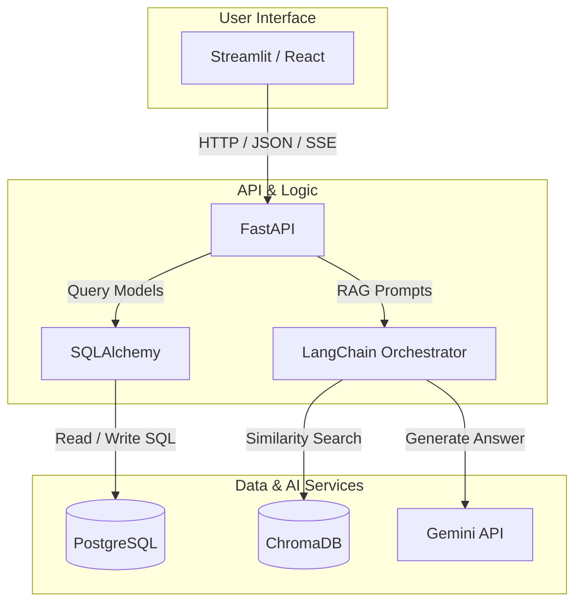
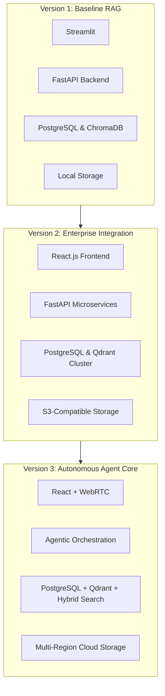

# Technology Selection & Architecture Decisions

| Attribute | Details |
| :--- | :--- |
| **Project Name** | Enterprise AI Knowledge Platform with Intelligent Customer Support (RAG) |
| **Document Name** | Technology Selection and Architecture Decisions |
| **Version** | v1.0.0 (Baseline Approved) |
| **Document Status** | Approved |
| **Owner** | Principal AI Architect & Staff AI Engineer |
| **Last Updated** | 2026-06-27 |

### Document Purpose
This document provides a detailed evaluation and justification of the technology selections and architectural design decisions for the *Enterprise AI Knowledge Platform with Intelligent Customer Support*. It describes the evaluated alternatives, trade-offs, security, and compatibility requirements for each component in the system, establishing a baseline of engineering decisions to guide current and future developers.

---

## 1. Introduction

When building a production-grade enterprise platform, selecting technologies must go beyond choosing popular libraries. It requires balancing development speed, run-time latency, deployment costs, data isolation, and the engineering team's capacity to maintain the codebase. 

This document acts as a combined **Architecture Decision Record (ADR)** and **Technology Selection Report**. It outlines the rationale behind every major technology choice in the project. By documenting these decisions, we preserve context for reviewers, new developers, and architects, explaining *why* decisions were made, *what* trade-offs were accepted, and *how* the architecture can adapt to changing technology requirements in the future.

---

## 2. Technology Selection Philosophy

Our approach to selecting technologies is guided by a core set of engineering principles:

*   **Production Readiness:** We select stable, production-tested libraries that have robust support ecosystems and receive regular security updates.
*   **Separation of Concerns & Modularity:** Technologies must respect boundary limits, allowing modules to be swapped or refactored with minimal impact on other components.
*   **Scalability & Performance:** We select technologies that support horizontal scaling, asynchronous request handling, and low-latency similarity queries.
*   **Maintainability & Developer Experience:** The stack must support clean code practices, clear interface definitions, type safety, and fast local development cycles.
*   **Open-Source Ecosystem:** We prioritize open-source technologies with active developer communities and permissive licensing (e.g. MIT, Apache 2.0).
*   **Learning Value:** The technology choices should help engineers learn modern AI and data systems engineering practices, moving beyond basic wrappers to understand retrieval and chunking patterns.
*   **Cost Control:** The architecture must minimize hosting overhead (such as compute resources and memory consumption) and manage LLM token usage.

---

## 3. Decision Matrix

The table below summarizes the technology selections for each major component category of the platform:

| Component Category | Selected Technology | Alternatives Evaluated | Final Decision Status | Core Reason for Selection |
| :--- | :--- | :--- | :--- | :--- |
| **Programming Language** | **Python** | Go, Java, Node.js, C# | Approved | Ecosystem dominance in machine learning, document parsing, and RAG frameworks. |
| **Backend Framework** | **FastAPI** | Flask, Django, Express, Spring Boot | Approved | Native asynchronous support, automatic Swagger schema generation, and high performance. |
| **Frontend** | **Streamlit** (Phase 1)<br>**React.js** (Phase 2) | Angular, Vue.js, Vanilla HTML/JS | Approved | Streamlit enables fast prototyping in Phase 1; React provides a robust UI for Phase 2. |
| **Relational Database** | **PostgreSQL** | MySQL, MongoDB, SQLite | Approved | Strong transactional safety, reliable indexing, and clean integrations with Django/SQLAlchemy. |
| **Database ORM** | **SQLAlchemy** | SQLModel, Tortoise ORM, Raw SQL | Approved | Highly flexible, mature database adapter offering comprehensive query and transaction features. |
| **Authentication & Hash** | **JWT & bcrypt** | OAuth2 providers, Session Cookies | Approved | Enables stateless session validation and secure password storage. |
| **Document Processing** | **PyMuPDF** | pdfplumber, PyPDF2, Apache Tika | Approved | Fast PDF parsing speed with clean layout, image, and text extraction capability. |
| **Chunking Strategy** | **Recursive Character** | Fixed-size chunking, Semantic Splitting | Approved | Retains paragraph structure, minimizes context splitting, and runs efficiently. |
| **Embedding Model** | **Gemini Embeddings** | OpenAI text-embedding, HuggingFace BGE | Approved | Large context window support and low API latency. |
| **Vector Database** | **ChromaDB** | FAISS, Pinecone, Weaviate, Milvus | Approved | Lightweight, embedded vector store, easy to configure locally, and supports metadata filtering. |
| **AI Framework** | **LangChain** | LlamaIndex, Haystack, Custom | Approved | Standard library for prompt management, parsing, and context loading. |
| **Language Model (LLM)** | **Google Gemini** | OpenAI GPT-4, Claude, Llama 3 (local) | Approved | Competent reasoning capacity, large context limits, and cost-efficient API options. |
| **File Storage** | **Local Storage** (V1)<br>**S3 / Cloud Storage** (V2+) | Database BLOBs, NFS | Approved | Local disk files are sufficient for Version 1; Object storage supports cloud scaling. |
| **Logging Framework** | **Python standard logging** | loguru, structlog | Approved | Zero external dependency, built-in configuration, and standard formatting. |
| **Configuration** | **Pydantic Settings** | python-dotenv, configparser | Approved | Enforces environment validation, type safety, and clean settings management. |
| **Testing Framework** | **pytest** | unittest, nose2 | Approved | Clean test syntax, rich plugin ecosystem, and simple mock handling. |
| **Documentation Format** | **Markdown / OpenAPI** | ReStructuredText, Sphinx | Approved | Standard, readable format that integrates with Github and API schemas. |
| **Version Control** | **Git / GitHub** | GitLab, Bitbucket | Approved | Core version control standard with integrated CI/CD and pull request features. |
| **Containerization** | **Docker** | Podman, Kubernetes | Approved | Isolates application environments and ensures consistent local and production execution. |

---

## 4. Detailed Technology Analysis

This section analyzes the selected technologies, evaluating them against alternatives, advantages, disadvantages, and potential migration paths.

### 4.1 Programming Language: Python
*   **Purpose:** The core programming language for backend business logic, document processing, and RAG execution.
*   **Selected Technology:** Python (v3.11+)
*   **Alternatives:** Go, Java, Node.js, C#
*   **Advantages:**
    *   Unmatched ecosystem for AI and machine learning packages (LangChain, PyMuPDF, ChromaDB, etc.).
    *   Fast development speed and readable code.
    *   Excellent support for processing unstructured data and text.
*   **Disadvantages:**
    *   Higher memory usage and slower execution speed compared to compiled languages (Go, Java).
    *   Concurrence is constrained by the Global Interpreter Lock (GIL) in multi-threaded workflows.
*   **Why this project chose it:** The core of RAG relies heavily on text parsing, data preparation, and LLM orchestration. Python is the industry standard for these tasks, and has the most mature integrations for AI frameworks.
*   **When another choice might be better:** If the system required high-frequency, low-latency microsecond transactions, Go or Java would offer better performance.
*   **Future migration possibilities:** The core computational tasks and document processing can remain in Python, while high-throughput routing APIs could be migrated to Go if needed in the future.

### 4.2 Backend Framework: FastAPI
*   **Purpose:** The REST API web framework used to route client requests and run backend tasks.
*   **Selected Technology:** FastAPI
*   **Alternatives:** Flask, Django, Express (Node.js), Spring Boot (Java)
*   **Advantages:**
    *   High performance, leveraging ASGI, Starlette, and Pydantic.
    *   Built-in support for asynchronous requests (`async/await`), enabling efficient database and API queries.
    *   Generates interactive API documentation (Swagger/OpenAPI UI) automatically.
    *   Enforces static typing and data validation using Pydantic.
*   **Disadvantages:**
    *   Smaller built-in feature set than Django, requiring developers to choose and configure libraries for database management and migrations.
*   **Why this project chose it:** FastAPI provides a strong balance of high performance, asynchronous support, and modern Python developer experiences. Its automatic Swagger docs speed up testing and integration with the frontend.
*   **When another choice might be better:** If we were building a standard relational web app with many forms, Django's built-in Admin panel and database systems would save development time.
*   **Future migration possibilities:** If the application requires a more complex relational design, FastAPI can be paired with Django, or split into independent microservices.

### 4.3 Frontend: Streamlit (Phase 1) & React.js (Phase 2)
*   **Purpose:** User interface for the customer-facing chat widget and the administrative dashboard.
*   **Selected Technology:** Staged deployment: Streamlit for Phase 1 (MVP/Internal Pilot), React.js for Phase 2 (Enterprise SaaS).
*   **Alternatives:** Angular, Vue.js, Vanilla HTML/CSS/JS
*   **Advantages:**
    *   *Streamlit (Phase 1):* Allows developers to build data-focused dashboards in pure Python, reducing development overhead.
    *   *React.js (Phase 2):* Industry-standard library for building highly interactive, responsive web interfaces with rich user experiences.
*   **Disadvantages:**
    *   Streamlit has layout limitations and does not scale well for custom consumer UI designs.
    *   React.js requires a separate build system (Node.js, Webpack/Vite) and added frontend development overhead.
*   **Why this project chose it:** Streamlit allows us to build and test the ingestion pipeline and chat logic quickly in Phase 1. Once verified, we will migrate to React.js to deliver a polished, custom UI for the public chat widget and dashboards.
*   **When another choice might be better:** If frontend resources are limited, using a standard Django template system could be an alternative to avoid maintaining two separate codebases.

### 4.4 Relational Database: PostgreSQL
*   **Purpose:** Structured data storage for system state, user roles, document metadata, audit logs, and feedback.
*   **Selected Technology:** PostgreSQL
*   **Alternatives:** MySQL, MongoDB, SQLite
*   **Advantages:**
    *   Enterprise-grade relational database with ACID compliance.
    *   Rich support for complex queries, JSON document columns, and full-text searches.
    *   Large ecosystem of drivers, migration systems, and cloud management tools.
*   **Disadvantages:**
    *   Requires active database management and configuration, adding more overhead than embedded solutions like SQLite.
*   **Why this project chose it:** PostgreSQL ensures transactional safety, data integrity, and supports complex queries for metadata-based retrieval and audit logs.
*   **When another choice might be better:** SQLite is better for lightweight, single-file local testing, while MongoDB might be preferred if the schema was entirely unstructured.
*   **Future migration possibilities:** PostgreSQL is highly scalable and compatible with managed cloud databases (e.g., AWS RDS, GCP Cloud SQL), making migrations straightforward.

### 4.5 Database ORM: SQLAlchemy
*   **Purpose:** Object-Relational Mapper (ORM) to manage Python database models and execute SQL queries safely.
*   **Selected Technology:** SQLAlchemy
*   **Alternatives:** SQLModel, Tortoise ORM, Raw SQL queries
*   **Advantages:**
    *   Mature, flexible, and feature-rich Python ORM.
    *   Protects against SQL injection attacks by default.
    *   Supports both synchronous and asynchronous query patterns.
*   **Disadvantages:**
    *   Steep learning curve due to complex patterns, and can generate inefficient SQL queries if not configured carefully.
*   **Why this project chose it:** SQLAlchemy is the industry standard for database operations in Python, offering strong query design tools, stability, and compatibility with migration systems like Alembic.
*   **When another choice might be better:** Raw SQL or simpler wrappers (like Peewee) might be preferred if the application required only basic queries and minimal database overhead.

### 4.6 Authentication & Hashing: JWT & bcrypt
*   **Purpose:** Verify user identities, manage sessions, and secure stored credentials.
*   **Selected Technology:** JSON Web Tokens (JWT) for session management, and `bcrypt` for password hashing.
*   **Alternatives:** Cookie-based sessions, OAuth2 providers (Auth0, Okta, Firebase Auth)
*   **Advantages:**
    *   JWTs support stateless sessions, reducing database lookup requirements during request routing.
    *   Bcrypt provides a secure, computationally expensive hashing mechanism to protect stored passwords.
*   **Disadvantages:**
    *   JWTs can be difficult to revoke before they expire without building token blacklists.
*   **Why this project chose it:** Using JWT and bcrypt allows us to build a self-contained, secure authentication system for Version 1 without depending on external services.
*   **When another choice might be better:** If the enterprise client requires integration with their active user directory, OAuth2/SAML integrations would be necessary.
*   **Future migration possibilities:** The system's authentication layer can be updated in the future to delegate token verification to external identity providers (IDPs).

### 4.7 Document Processing: PyMuPDF (fitz)
*   **Purpose:** Extract raw text and layout structures from uploaded PDF, Markdown, and TXT files.
*   **Selected Technology:** PyMuPDF
*   **Alternatives:** pdfplumber, PyPDF2, Apache Tika
*   **Advantages:**
    *   Extremely fast rendering and text extraction speed.
    *   Extracts formatting details, allowing layout-aware parsing.
    *   High accuracy for extracting text from multi-column layouts and structured tables.
*   **Disadvantages:**
    *   Uses C/C++ bindings under the hood, which can occasionally lead to platform-specific installation issues.
*   **Why this project chose it:** In RAG platforms, extraction speed and layout accuracy are critical to getting clean text chunks. PyMuPDF is significantly faster than PyPDF2 and provides cleaner extractions of tables and formatting.
*   **When another choice might be better:** If the application ran on highly constrained server environments, a pure Python parser (like PyPDF) might be preferred to avoid compilation dependencies.

### 4.8 Chunking Strategy: Recursive Character Text Splitter
*   **Purpose:** Split long documents into smaller, semantically consistent text chunks.
*   **Selected Technology:** Recursive Character Text Splitter (using standard separators: `\n\n`, `\n`, ` `, `""`)
*   **Alternatives:** Fixed-size token chunking, Semantic chunking (based on sentence embeddings)
*   **Advantages:**
    *   Splits text using a hierarchical list of characters, maintaining structural groupings like paragraphs and sentences.
    *   Highly configurable size and overlap settings.
    *   Low computational overhead, running in linear time.
*   **Disadvantages:**
    *   Relies on text punctuation characters, meaning it does not adapt automatically to shifting semantic topics like embedding-based splitters do.
*   **Why this project chose it:** The Recursive Character Text Splitter is the industry standard for general documents. It provides a strong balance of preserving context (e.g. keeping paragraphs together) and computational efficiency.
*   **When another choice might be better:** If documents are highly unstructured or contain changing, abstract topics, semantic splitters using sentence embeddings could improve chunk boundaries.

### 4.9 Embedding Model: Google Gemini Embeddings
*   **Purpose:** Generate numerical vector representations of queries and document chunks.
*   **Selected Technology:** Google Gemini Embeddings (`text-embedding-004`)
*   **Alternatives:** OpenAI text-embedding-3, Cohere Embed, HuggingFace BGE, Sentence Transformers (local)
*   **Advantages:**
    *   Native integration with our Gemini LLM pipeline.
    *   Low latency, high dimensional accuracy, and cost-efficient API pricing.
    *   Supports large context inputs.
*   **Disadvantages:**
    *   Relies on external API calls, introducing network latency and depending on internet connectivity.
*   **Why this project chose it:** Gemini Embeddings offer a strong balance of accuracy and performance, and align with our core model selection.
*   **When another choice might be better:** If all data must be kept local and offline, running a Sentence Transformer model (e.g. BGE-M3) on local GPUs would be required.
*   **Future migration possibilities:** The retrieval engine is designed around abstract interfaces, allowing us to swap the embedding model in the future by re-indexing the document library.

### 4.10 Vector Database: ChromaDB
*   **Purpose:** Index, store, and perform similarity searches on text chunk embeddings.
*   **Selected Technology:** ChromaDB
*   **Alternatives:** FAISS, Pinecone, Weaviate, Milvus, Qdrant
*   **Advantages:**
    *   Lightweight, open-source database that can run embedded within the Python process or as a standalone server.
    *   Supports metadata filtering, enabling role-based access checks directly during vector search.
    *   Requires zero configuration and minimal resource overhead for local development and testing.
*   **Disadvantages:**
    *   Not optimized for massive enterprise clustering (millions of documents) compared to distributed engines like Milvus or Qdrant.
*   **Why this project chose it:** ChromaDB is ideal for our Version 1 scope. It is easy to run embedded during development, requires no cloud database subscriptions, and supports our metadata filtering requirements.
*   **When another choice might be better:** If we were deploying a multi-tenant application with millions of documents, a distributed service like Qdrant or Milvus would offer better scaling.
*   **Future migration possibilities:** As the platform grows, the vector database adapter can be refactored to migrate data to a dedicated, distributed Qdrant or Pinecone instance.

### 4.11 AI Orchestration Framework: LangChain
*   **Purpose:** Manage prompt templates, document loaders, chunking utilities, and model integrations.
*   **Selected Technology:** LangChain (Core components)
*   **Alternatives:** LlamaIndex, Haystack, Custom prompt engineering
*   **Advantages:**
    *   Large ecosystem of pre-built wrappers for models, databases, and document loaders.
    *   Standardizes patterns for model orchestration, prompt handling, and data parsing.
    *   Active community support and regular updates.
*   **Disadvantages:**
    *   The library is large and can introduce complexity. Frequent API updates require careful dependency management.
*   **Why this project chose it:** LangChain provides a robust set of utilities for prompt management, chunking, and model integration, reducing the amount of custom code we need to write for core AI workflows.
*   **When another choice might be better:** If the application required only basic LLM calls, writing a custom lightweight wrapper would avoid the dependency overhead of LangChain.
*   **Future migration possibilities:** If LangChain introduces integration issues, we can refactor our AI modules to run on direct, custom API integrations.

### 4.12 Language Model (LLM): Google Gemini
*   **Purpose:** Generate natural language responses grounded in the retrieved document context.
*   **Selected Technology:** Google Gemini (`gemini-1.5-flash` / `gemini-1.5-pro`)
*   **Alternatives:** OpenAI GPT-4, Anthropic Claude, Ollama/Llama 3 (local)
*   **Advantages:**
    *   Large context window limits, allowing the system to pass extensive context chunks when needed.
    *   Cost-efficient API pricing compared to other frontier models.
    *   Strong performance in structured systems instructions and output generation.
*   **Disadvantages:**
    *   Dependent on external cloud APIs and network availability.
*   **Why this project chose it:** Gemini provides a highly competitive balance of reasoning capability, large context windows, and cost efficiency, making it ideal for grounded RAG applications.
*   **When another choice might be better:** If data compliance policies prohibit using external APIs, running a local model (e.g. Llama 3) via Ollama would be necessary.
*   **Future migration possibilities:** The LLM integration is abstracted behind service interfaces, allowing us to swap model providers with simple configuration updates.

### 4.13 File Storage: Local Disk Storage (V1) to Cloud Object Storage (V2)
*   **Purpose:** Store raw document files uploaded by administrators.
*   **Selected Technology:** Local filesystem storage for Version 1, migrating to S3-compatible cloud object storage in future releases.
*   **Alternatives:** Database BLOB storage, Network File System (NFS)
*   **Advantages:**
    *   Local storage is simple to set up and has zero external dependencies for the Version 1 MVP.
    *   Object storage (S3/Cloud Storage) offers high durability, built-in backups, and scales to handle massive file libraries.
*   **Disadvantages:**
    *   Local storage does not scale horizontally across multiple backend instances and risks data loss if the server is deleted without backups.
*   **Why this project chose it:** Local storage keeps the Version 1 architecture simple and self-contained, allowing us to verify the ingestion pipeline before configuring cloud storage permissions.

### 4.14 Logging: Standard Python logging
*   **Purpose:** Capture application events, API requests, errors, and system audit logs.
*   **Selected Technology:** Standard Python `logging` module
*   **Alternatives:** loguru, structlog
*   **Advantages:**
    *   Zero external dependencies, standard library module.
    *   Thread-safe and highly configurable.
*   **Disadvantages:**
    *   Requires manual configuration to support structured outputs like JSON logs out-of-the-box.
*   **Why this project chose it:** The standard logging library is reliable, lightweight, and easily integrated with cloud logging agents for downstream aggregation.

### 4.15 Configuration: Pydantic Settings
*   **Purpose:** Validate and manage environment configurations (API keys, ports, system prompts).
*   **Selected Technology:** Pydantic Settings (BaseSettings)
*   **Alternatives:** python-dotenv, configparser, manual os.environ parses
*   **Advantages:**
    *   Enforces type safety and validates configurations during application startup.
    *   Provides clear error messages if required variables are missing or incorrectly formatted.
*   **Disadvantages:**
    *   Adds a dependency on Pydantic (which is already included with FastAPI).
*   **Why this project chose it:** Pydantic Settings ensures that configuration errors are caught immediately when the server starts up, preventing runtime crashes due to missing keys.

### 4.16 Testing: pytest
*   **Purpose:** Manage unit, integration, and end-to-end test execution.
*   **Selected Technology:** pytest
*   **Alternatives:** Python's built-in `unittest`
*   **Advantages:**
    *   Clean test syntax, requiring less boilerplate than unittest.
    *   Powerful fixture system, supporting modular setup/teardown actions.
    *   Large plugin ecosystem (e.g., pytest-cov for coverage, pytest-asyncio for async code).
*   **Disadvantages:**
    *   Requires learning pytest-specific patterns (like fixtures) which differ from standard class-based tests.
*   **Why this project chose it:** pytest is the standard testing tool for modern Python projects, and simplifies writing tests for our asynchronous API endpoints and database operations.

### 4.17 Documentation: Markdown, Mermaid, & Swagger
*   **Purpose:** Write system documentation, architecture diagrams, and API specifications.
*   **Selected Technology:** Markdown for documentation, Mermaid for diagrams, and Swagger (OpenAPI) for API specifications.
*   **Alternatives:** Sphinx, ReStructuredText
*   **Advantages:**
    *   Markdown is highly readable and natively rendered by platforms like GitHub.
    *   Mermaid allows developers to define diagrams in text, making them easy to update and track in version control.
    *   Swagger generates interactive API docs automatically from our FastAPI code.
*   **Disadvantages:**
    *   Mermaid rendering can vary across different markdown viewers.
*   **Why this project chose it:** These formats keep our documentation readable, close to the code, and easy to maintain directly within the repository.

### 4.18 Version Control: Git & GitHub
*   **Purpose:** Manage codebase changes, branch merges, and coordinate team collaborations.
*   **Selected Technology:** Git (with GitHub hosting) using a standard feature-branching strategy (Feature Branches -> Develop -> Main).
*   **Alternatives:** GitLab, Bitbucket, SVN
*   **Advantages:**
    *   Industry-standard version control system with robust team collaboration features.
*   **Disadvantages:**
    *   Requires active branch management to avoid conflicts in fast-moving projects.
*   **Why this project chose it:** Git and GitHub provide the standard tooling for modern software development, including issue tracking, pull request reviews, and CI/CD integrations.

### 4.19 Containerization: Docker
*   **Purpose:** Package the application, backend APIs, and database instances into isolated, repeatable environments.
*   **Selected Technology:** Docker
*   **Alternatives:** Podman, LXC, Direct local installations
*   **Advantages:**
    *   Ensures the system runs identically across local development, staging, and production servers.
    *   Simplifies local setups by packaging PostgreSQL and ChromaDB into containers.
    *   Isolates dependencies, avoiding local path conflicts.
*   **Disadvantages:**
    *   Adds configuration overhead and consumes additional local system resources.
*   **Why this project chose it:** Docker is essential for ensuring that the application builds and runs reliably across different developer machines and hosting environments.

---

## 5. Engineering Trade-Off Analysis

This section compares the primary design choices against evaluated alternatives, highlighting their key characteristics:

### 5.1 Web Framework Trade-offs
The table below compares Python web frameworks to evaluate performance, async support, and built-in features:

| Metric | FastAPI (Selected) | Flask | Django |
| :--- | :--- | :--- | :--- |
| **Performance** | High (ASGI, uvloop) | Medium (WSGI) | Medium (WSGI/ASGI) |
| **Async Support** | Native, out-of-the-box | Limited, requires extensions | Partial, added in recent releases |
| **Data Validation** | Native (Pydantic models) | Manual, requires packages | Native (Django Forms/DRF) |
| **Auto API Docs** | Yes (Swagger & Redoc) | No, requires packages | No, requires packages |
| **Built-in Admin Panel** | No, must be custom built | No | Yes |
| **Learning Curve** | Low / Medium | Low | High |

### 5.2 Vector Database Trade-offs
The table below compares ChromaDB against local and distributed vector search alternatives:

| Database | ChromaDB (Selected) | FAISS | Pinecone | Qdrant / Milvus |
| :--- | :--- | :--- | :--- | :--- |
| **Deployment Type** | Embedded or Server | Local library (in-memory) | Managed SaaS | Distributed Server |
| **Setup Overhead** | Minimal (Zero config) | Low (Library import) | Low (API registration) | Medium (Docker cluster) |
| **Metadata Filtering** | Yes | Manual implementation | Yes | Yes |
| **Horizontal Scaling** | Moderate | Poor | Excellent (Cloud scaled) | Excellent |
| **Memory Footprint** | Low | High (Keeps vectors in RAM) | Zero on-premise | Medium (Database server) |
| **License** | Apache 2.0 | MIT | Commercial | Open Source / Cloud |

### 5.3 AI Model Provider Trade-offs
The table below evaluates model API options to balance reasoning capabilities, token context windows, and cost:

| Model Provider | Google Gemini (Selected) | OpenAI GPT-4 | Anthropic Claude | Local Llama 3 (Ollama) |
| :--- | :--- | :--- | :--- | :--- |
| **Reasoning Capacity** | High | Very High | Very High | Medium |
| **Context Window Size** | Extremely Large (1M+ tokens) | Large (128K tokens) | Large (200K tokens) | Small / Medium (8K-32K) |
| **API Cost** | Low / Efficient | High | High | Zero (Host compute costs only) |
| **Data Privacy** | Cloud Contract | Cloud Contract | Cloud Contract | Absolute (Runs on-premise) |
| **Dependency** | Internet API | Internet API | Internet API | None (Local CPU/GPU) |

---

## 6. Technology Compatibility Matrix

This section explains how the selected technologies integrate across system boundaries:



*   **FastAPI & Pydantic:** FastAPI uses Pydantic models to validate API payloads. When data is received, Pydantic parses and validates it before passing it to backend routes.
*   **SQLAlchemy & PostgreSQL:** SQLAlchemy acts as the ORM mapper for PostgreSQL. It manages connection pooling and translates Python database models into optimized SQL commands.
*   **LangChain, ChromaDB, & Gemini:** LangChain coordinates the RAG workflow. It sends text chunks to ChromaDB, manages semantic search queries, and formats the retrieved context into prompts for the Gemini API.

---

## 7. Version Evolution

Our technology selections are designed to adapt as the platform grows from an initial pilot to a high-scale enterprise SaaS application.



### 7.1 Version 1: Baseline RAG
*   **Focus:** Core Q&A capabilities and document ingestion.
*   **Frontend:** Streamlit dashboard for administrative tasks and chat testing.
*   **Database:** PostgreSQL for relational tables and ChromaDB (running embedded) for vector search.
*   **Storage:** Local server disk space for uploaded documents.

### 7.2 Version 2: Enterprise Integration
*   **Focus:** UI enhancements, scalability, and multi-tenant isolation.
*   **Frontend:** Migrate the UI to React.js to provide a custom experience for public customer chat widgets.
*   **Database:** Migrate vector storage to a dedicated, distributed Qdrant or Milvus cluster.
*   **Storage:** Transition document storage to S3-compatible cloud object storage (e.g. AWS S3 or Google Cloud Storage) to support horizontal scaling.

### 7.3 Version 3: Autonomous Agent Core
*   **Focus:** Continuous learning, voice support, and tool integrations.
*   **Frontend:** Add WebRTC support for real-time speech interactions.
*   **AI Engine:** Transition the system from standard RAG to an autonomous agent architecture that allows the LLM to call external APIs safely within configured boundaries.

---

## 8. Risks & Mitigation Strategies

The table below identifies the primary risks associated with the selected technology stack and outlines proactive mitigation strategies:

| Technology / Choice | Risk Identified | Risk Severity | Proactive Mitigation Strategy |
| :--- | :--- | :--- | :--- |
| **Google Gemini API** | Upstream API updates or endpoint deprecation could break integrations. | High | Build a generic interface abstraction layer around the LLM integration, decoupling the API client from core application code. |
| **Google Gemini API** | Internet outages or provider downtime will make the Q&A system unresponsive. | Medium | Implement fallback checks in the UI, displaying friendly maintenance messages and links to human support. |
| **ChromaDB** | Memory footprint and query latency may increase significantly as the document library grows. | Medium | Monitor database performance closely during development. Design the database adapter to allow easy migrations to Qdrant or Milvus. |
| **PyMuPDF** | Parsing complex PDF layouts (multi-column tables, styled forms) may result in disorganized text extraction. | High | Implement layout-aware text extraction checks and validation tests for ingested document chunks. |
| **Local File Storage** | Local disk failures or server replacements can cause data loss. | High | Set up regular automated backups of the document directory. Use S3-compatible storage adapters to simplify future cloud migrations. |
| **JWT Authentication** | Expired or compromised tokens cannot be easily revoked without database verification. | Medium | Set a short token expiration limit (30 minutes) and use a Redis-based token blacklist to revoke compromised tokens on logout. |

---

## 9. Final Architecture Technology Stack

The table below summarizes the finalized technology stack for the Enterprise AI Knowledge Platform:

```
┌──────────────────────────────────────────────────────────────────────────┐
│                            User Interfaces                               │
│  - Chat Widget / Admin Dashboard: Streamlit (V1) ──► React.js (V2)        │
├──────────────────────────────────────────────────────────────────────────┤
│                         API & Application Core                           │
│  - Framework: FastAPI                                                    │
│  - Object Relational Mapper: SQLAlchemy                                  │
│  - Config & Data Validation: Pydantic Settings                           │
│  - Authentication: JWT Token verification & bcrypt                       │
├──────────────────────────────────────────────────────────────────────────┤
│                           AI & Retrieval Core                            │
│  - Language Model: Google Gemini API                                     │
│  - Vector Embedding API: Google Gemini text-embeddings                   │
│  - Ingestion & In-Memory Indexing: PyMuPDF (fitz)                        │
│  - AI Orchestration Library: LangChain                                   │
├──────────────────────────────────────────────────────────────────────────┤
│                             Data & Storage                               │
│  - Relational Database: PostgreSQL                                       │
│  - Vector Database: ChromaDB                                             │
│  - Document File Storage: Local Filesystem                               │
├──────────────────────────────────────────────────────────────────────────┤
│                         Tooling & Quality Control                        │
│  - Containerization Tool: Docker                                         │
│  - Testing Framework: pytest                                             │
│  - Version Control System: Git & GitHub                                  │
└──────────────────────────────────────────────────────────────────────────┘
```

---

## 10. Conclusion

The selected technology stack for the Enterprise AI Knowledge Platform provides a balanced foundation for the system's goals. Using Python, FastAPI, and SQLAlchemy enables fast backend development and async request handling. The combination of PostgreSQL for transactional data and ChromaDB for vector storage ensures reliable structured data management and fast semantic searches. By abstracting integrations with external services like Google Gemini, the platform remains modular and cloud-ready, allowing it to adapt to future scale requirements and technological changes.
