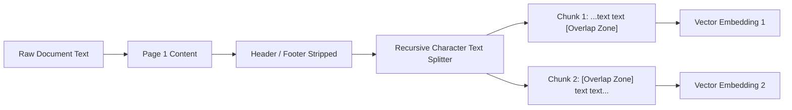
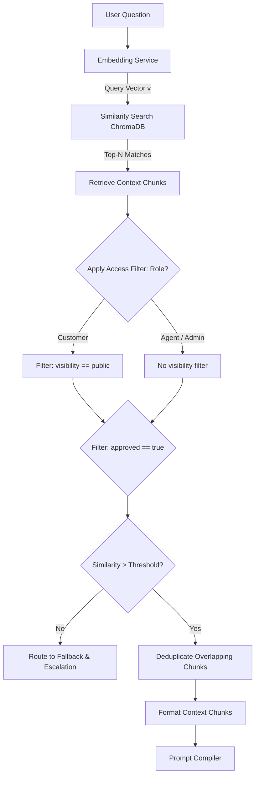
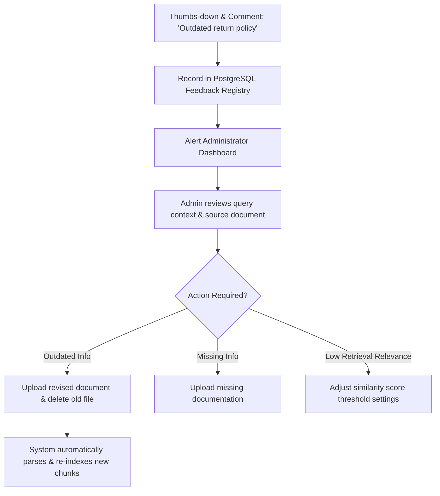

# AI RAG Engine Design Specification

| Attribute | Details |
| :--- | :--- |
| **Project Name** | Enterprise AI Knowledge Platform with Intelligent Customer Support (RAG) |
| **Document Name** | AI RAG Engine Design Specification |
| **Version** | v1.0.0 (Baseline Approved) |
| **Document Status** | Approved |
| **Owner** | Principal AI Architect & LLM Systems Engineer |
| **Last Updated** | 2026-06-27 |

### Document Purpose
This document specifies the conceptual design and behavioral rules of the *Retrieval-Augmented Generation (RAG)* engine. It serves as the authoritative blueprint for document ingestion, text chunking, embedding generation, semantic retrieval, prompt construction, grounding verification, and citation processing. It provides system and AI engineers with the complete logic required to build a safe, grounded, and accurate Q&A subsystem.

---

## 1. Introduction

Deploying generative AI directly to customers poses a critical business risk: standard large language models (LLMs) can generate incorrect or fabricated information ("hallucinations"). This unreliability stems from the fact that LLMs are trained to predict the next logical word based on general patterns, rather than verifying factual assertions against a specific source of truth.

To deploy AI safely in an enterprise environment, we decouple the model's *reasoning capabilities* from its *stored knowledge*. The **Retrieval-Augmented Generation (RAG)** engine bridges this gap. Instead of relying on the LLM's pre-trained memory to answer customer queries, the platform acts as an interface that searches private company documents (FAQs, product guides, and policies) to retrieve relevant text segments. It then presents these verified segments to the LLM, instructing it to synthesize a response based *only* on the provided context. By rooting every answer in verified source text and appending clickable citations, the RAG engine ensures absolute transparency, verification, and data safety.

---

## 2. AI System Goals

The RAG engine is designed to meet specific goals across business, technical, and AI operational areas:

### 2.1 Business Goals
*   **Customer Trust & Verifiability:** Enable customers to verify AI responses immediately by providing clear, direct citations for every statement.
*   **Operational Risk Mitigation:** Ensure the system does not hallucinate product warranties, refund conditions, or company policies, protecting the brand's reputation and avoiding legal liability.
*   **Consistent Support Delivery:** Ensure customers receive consistent answers based on official corporate guidelines across all sessions and timezones.

### 2.2 Technical Goals
*   **Stateless Computations:** Keep the core retrieval and generation execution steps stateless to allow horizontal scaling.
*   **Model Agnostic Design:** Build the pipeline around standard interfaces, allowing embedding models, vector databases, and LLM APIs to be swapped without requiring core logic modifications.
*   **Low Query Latency:** Optimize the retrieval, context assembly, and token synthesis steps to maintain responsive conversation flows.

### 2.3 AI Goals
*   **Strict Groundedness:** Restrict generated answers to the provided context, preventing the model from drawing on external general knowledge.
*   **Safe Refusal Behavior:** Ensure the model gracefully declines to answer queries that cannot be resolved using the retrieved documents, redirecting the user to human support instead.
*   **Retrieval Precision:** Optimize the chunking and indexing process to retrieve highly relevant text segments while minimizing unrelated context.

---

## 3. End-to-End RAG Pipeline

The RAG engine lifecycle is split into two asynchronous pipelines: the **Document Ingestion Pipeline** and the **Conversational Query Pipeline**.

```mermaid
graph TD
    subgraph Ingestion_Pipeline [1. Ingestion Pipeline Asynchronous]
        DocSource[Raw File Upload] --> DocVal[File Validation]
        DocVal --> DocExtract[Text Extraction PyMuPDF]
        DocExtract --> DocClean[Text Cleaning & Normalization]
        DocClean --> DocChunk[Recursive Character Splitter]
        DocChunk --> VectorEmbed[Embedding Generator API]
        VectorEmbed --> VectorStore[Insert ChromaDB Index]
        DocChunk --> MetadataReg[PostgreSQL Metadata DB]
    end

    subgraph QandA_Pipeline [2. Conversational Query Pipeline Synchronous]
        UserQuery[User Question] --> MemoryManager[Conversation History Manager]
        MemoryManager --> QueryEmbed[Query Embedding Generator API]
        QueryEmbed --> VectorSearch[Similarity Query ChromaDB]
        VectorSearch --> Filter[Context Filter & Metadata Security]
        Filter --> ContextAssemble[Context Assembler & Deduplicator]
        ContextAssemble --> PromptBuild[Prompt Construction]
        PromptBuild --> LLMCall[LLM Response Generator API]
        LLMCall --> PostProcess[Post-Processor & Grounding Verify]
        PostProcess --> CitationGen[Citation Reconciler]
        CitationGen --> UIOutput[Grounded Response + Citations]
    end
```



---

## 4. Document Ingestion Pipeline

The document ingestion pipeline processes unstructured files into clean, searchable, and structured text segments.

### 4.1 Supported Formats & Validation
*   **Format Constraints:** The system accepts `.pdf`, `.md`, and `.txt` files.
*   **Size Constraints:** Uploads are limited to 25MB. Files with incorrect file extensions or containing corrupted data are rejected before entering the processing queue.

### 4.2 Text Extraction
The system uses PyMuPDF (fitz) to extract text, coordinate layouts, and identify structural metadata from digital documents. The extraction process is designed to handle multi-column layouts and format structured tables into Markdown tables to preserve data relationships.

### 4.3 Text Cleaning & Normalization
To reduce embedding noise and control context costs, extracted text goes through several cleaning steps:
*   Remove repeating page headers, footers, and page numbers.
*   Convert multiple consecutive whitespaces and line breaks into single characters.
*   Normalize curly quotes, hyphens, and ligatures to standard Unicode characters.

### 4.4 Language & Metadata Handling
*   **Language Detection:** The ingestion pipeline identifies the language of the uploaded document to ensure it matches the metadata tag library.
*   **Metadata Tagging:** The ingestion process automatically extracts structural metadata, including document titles, categories, and section hierarchies, pairing them with the text chunks.

### 4.5 Future Ingestion Enhancements
*   **Optical Character Recognition (OCR):** Integrate parsing services to process scanned image documents and non-digital PDFs in subsequent releases.
*   **Multilingual Expansion:** Add cross-lingual retrieval support, allowing users to query documents in different languages.

---

## 5. Text Chunking Strategy

Standard large documents are too long to pass directly to an LLM's context window. They must be split into smaller, coherent segments called "chunks."



### 5.1 Chunking Philosophy
*   **Semantics Preservation:** Chunks must be small enough to stay focused on a single topic (optimizing vector similarity search), but large enough to retain the context of the surrounding sentences.
*   **Size and Overlap Parameters:**
    *   *Target Size:* 500 characters.
    *   *Overlap Size:* 50 characters. The overlap zone ensures that sentences split at chunk boundaries are not lost during retrieval.

### 5.2 Recursive Character Text Splitter
The RAG engine uses a recursive character splitting strategy. This splitter recursively looks at a list of separators (e.g., `\n\n` for paragraphs, `\n` for sentences, ` ` for words, and `""` for characters) to split the text. It attempts to keep paragraphs and sentences together before splitting them at word boundaries.

| Parameter | Value | Selection Justification |
| :--- | :--- | :--- |
| **Separators** | `["\n\n", "\n", " ", ""]` | Keeps paragraphs intact, then falls back to sentences, then words. |
| **Target Chunk Size** | 500 characters | Matches the average paragraph length, keeping topics focused. |
| **Chunk Overlap** | 50 characters | Retains context across boundaries without introducing redundant text. |

### 5.3 Trade-offs & Alternatives
*   *Fixed-token splitting:* Simple to implement but often cuts chunks mid-sentence, reducing retrieval accuracy.
*   *Semantic chunking:* Uses embedding models to split text at topic changes. While highly accurate, it requires significant compute resources and increases processing times.

---

## 6. Embedding Generation

Embedding models convert raw text chunks into multi-dimensional numerical vector arrays that capture the semantic meaning of the words.

```
                  ┌────────────────────────────────────────┐
                  │          Text Ingestion Chunk          │
                  │  "Our refund policy allows returns     │
                  │   within 30 days of purchase."         │
                  └───────────────────┬────────────────────┘
                                      │
                                      ▼
                        ┌──────────────────────────┐
                        │   Embedding Generator    │
                        │   (Gemini Embeddings)    │
                        └─────────────┬────────────┘
                                      │
                                      ▼
                  ┌────────────────────────────────────────┐
                  │             Vector Array               │
                  │   [-0.012, 0.084, ..., 0.125, -0.043]  │
                  │            (Dimension = D)             │
                  └────────────────────────────────────────┘
```

### 6.1 Core Concept
By converting text into vectors, we map semantic meaning to a high-dimensional space. Queries and document chunks with similar meanings will have vector representations that are close to each other in this space, allowing semantic search to function without relying on exact keyword matches.

### 6.2 Selected Embedding Model
*   **Model:** Google Gemini Embeddings (`text-embedding-004`).
*   **Dimensionality:** 768 dimensions (conceptual). This high-dimensional space provides the necessary resolution to capture fine-grained semantic details.
*   **Model Swapping Support:** The retrieval engine abstracts the embedding generation behind a service interface, allowing the model to be swapped in the future by updating configurations and re-indexing the document library.

---

## 7. Metadata Strategy

Metadata tags are stored alongside every text chunk in both the vector database and the relational database. This strategy is essential for metadata filtering, access control, and generating citations.

```
┌────────────────────────────────────────────────────────────────────────┐
│                          Document Chunk Payload                        │
├────────────────────────────────────────────────────────────────────────┤
│  Text Content: "Section 4.2: Gold-tier members receive a 2-year..."    │
├────────────────────────────────────────────────────────────────────────┤
│  Metadata Dictionary:                                                  │
│  {                                                                     │
│    "document_id": "8f3b9c7d-2b1a-4d9e-8c7f-6e5d4c3b2a1a",              │
│    "filename": "warranty_policy_2026.pdf",                             │
│    "page_number": 14,                                                  │
│    "section_heading": "Warranty Periods by Tier",                      │
│    "chunk_index": 42,                                                  │
│    "creation_timestamp": "2026-06-27T17:14:00Z",                       │
│    "language": "en",                                                   │
│    "tags": ["warranty", "gold-tier", "duration"],                      │
│    "access_level": "public",                                           │
│    "version": "1.2"                                                    │
│  }                                                                     │
└────────────────────────────────────────────────────────────────────────┘
```

### 7.1 Key Metadata Fields
*   **Document Identifier (UUID):** Connects the chunk to its parent document record in PostgreSQL.
*   **Source Filename:** Used to generate source citation tags in the UI (e.g. `[warranty_policy_2026.pdf]`).
*   **Page Number & Section Heading:** Provides detailed context for citations (e.g. `warranty_policy_2026.pdf, Page 14`).
*   **Chunk Index:** Tracks the chunk's position within the document, helping reconstruct surrounding context if needed.
*   **Access Level (`public` / `internal`):** Used to filter retrieval results based on the user's role, preventing unauthorized access.
*   **Version Tag:** Tracks document iterations, ensuring the search engine retrieves only the latest approved version.

---

## 8. Vector Database Strategy

The vector database stores document chunk embeddings and performs fast similarity searches against incoming queries.

### 8.1 Database Selection & Indexing
The RAG engine uses ChromaDB as its vector store. ChromaDB runs embedded in the backend process during development and can be scaled to a standalone server. It organizes vectors using HNSW (Hierarchical Navigable Small World) indexing to maintain fast query times.

### 8.2 Similarity Search Metric
The system calculates similarity using **Cosine Similarity**:

$$\text{Similarity}(A, B) = \cos(\theta) = \frac{A \cdot B}{\|A\| \|B\|}$$

Cosine similarity measures the angle between vectors rather than their magnitude, making it ideal for comparing texts of varying lengths.

---

## 9. Retrieval Strategy

The retrieval strategy defines how the system locates, filters, and formats context chunks to answer a user's query.



### 9.1 Context Retrieval Flow
1.  **Query Conversion:** Convert the user's query into a vector representation using the embedding API.
2.  **Similarity Search:** Query ChromaDB for vectors matching the query, retrieving the top-K (typically 3 to 5) results.
3.  **Role Filtering:** Filter results based on user access levels (e.g., public customer queries are restricted to chunks marked `visibility = public`).
4.  **Status Filtering:** Filter out chunks from documents marked `approved = false`.
5.  **Deduplication:** Remove redundant chunks if multiple results reference the same text section.
6.  **Context Formatting:** Format the remaining context chunks into a structured text block for the prompt builder.

### 9.2 Fallback Gate
If the top-ranked retrieval matches fall below a pre-configured similarity threshold (e.g. 0.70), the system bypasses generation and outputs the standard fallback message, avoiding hallucinations.

---

## 10. Prompt Construction

The prompt builder compiles the system instructions, retrieved context chunks, active chat history, and user query into a structured text prompt for the LLM.

```
┌────────────────────────────────────────────────────────────────────────┐
│                         System Instruction Block                       │
│  - Define role, tone, and formatting instructions.                     │
│  - Specify grounding rules: ONLY answer using the provided context.    │
│  - Enforce citation requirements: append [filename] to statements.     │
├────────────────────────────────────────────────────────────────────────┤
│                          Retrieved Context Block                       │
│  Context Segment 1: [Source: warranty_policy_2026.pdf]                 │
│  "Warranty coverage lasts 2 years for standard hardware..."            │
│                                                                        │
│  Context Segment 2: [Source: return_manual_2026.pdf]                   │
│  "Returns are accepted within 30 days of invoice receipt..."           │
├────────────────────────────────────────────────────────────────────────┤
│                        Conversation History Block                      │
│  Customer: "How long is my warranty?"                                  │
│  Assistant: "Standard hardware is covered for 2 years [1]."            │
├────────────────────────────────────────────────────────────────────────┤
│                            User Query Block                            │
│  Customer: "Does this cover shipping costs?"                           │
└────────────────────────────────────────────────────────────────────────┘
```

### 10.1 Grounding Instructions
The system prompt contains strict instructions that force the model to behave as a grounded Q&A engine:
*   Answer the question using *only* the retrieved context blocks.
*   Do not make assumptions, extrapolate facts, or draw on external knowledge.
*   If the answer cannot be found in the provided context, output the configured fallback response exactly.

### 10.2 Citation Formatting Rules
The prompt instructs the LLM to place citation tags (e.g. `[1]`, `[2]`) at the end of sentences that reference specific context chunks. These tags are mapped back to document metadata in the post-processing layer.

---

## 11. Response Generation

The generation layer manages how the LLM synthesizes answers based on the prompt.

*   **Faithfulness:** The primary metric. The generated answer must not contain factual assertions that cannot be verified by the retrieved context.
*   **Completeness:** The response should fully address the user's query using the available context without adding unrelated details.
*   **Conciseness:** Avoid overly verbose responses. The system prefers direct, markdown-formatted answers (e.g., using bullet points for lists).
*   **Context Limits:** Ensure the context size fits comfortably within the model's token limits to prevent truncation.

---

## 12. Citation Strategy

Citations build trust by showing users the exact files and sections used to answer their questions.

```
Generated Answer:
"Our standard hardware warranty coverage lasts for two years [1]. However, please 
note that return shipping costs for warranty repairs are not covered and must be paid 
by the customer [2]."

Citations Reference List:
[1] warranty_policy_2026.pdf, Page 14 (Section 3.1: Hardware Duration)
[2] return_manual_2026.pdf, Page 2 (Section 1.4: Shipping Fees)
```

### 12.1 Citation Processing Flow
1.  **Reference Mapping:** The prompt builder assigns an identifier (e.g. `[Source 1]`) to each context chunk sent to the LLM.
2.  **Tag Insertion:** The LLM is instructed to append the matching identifier (e.g. `[Source 1]`) to statements derived from that chunk.
3.  **UI Formatting:** The post-processing layer replaces these identifiers with formatted citation badges (e.g. `[1]`) and links them to document metadata (file name, page number, section heading) in the UI.

---

## 13. Hallucination Prevention

The system implements multiple validation layers to prevent hallucinations and ensure output quality.

| Validation Layer | Verification Mechanism | Expected Behavior |
| :--- | :--- | :--- |
| **Retrieval Confidence Gate** | Check the similarity score of the top-ranked context chunks against the threshold. | If the score is below 0.70, bypass the LLM and return the fallback message. |
| **System Prompt Grounding** | Instructions telling the model to decline answering if the context is insufficient. | The LLM outputs the configured fallback string when it cannot find the answer. |
| **Post-Generation Check** | Cross-reference statements in the LLM's response against the retrieved context sentences. | Flag or reject responses containing statements that cannot be verified by the context. |
| **Citation Verification** | Verify that all citation tags in the response map to documents that were actually retrieved. | Remove invalid citation tags or re-run the query generation. |

---

## 14. Conversation Memory

The platform uses two memory systems to manage conversation history and support follow-up questions:

### 14.1 Short-Term Conversation Context
*   **Purpose:** Track context within an active conversation thread.
*   **Implementation:** The system retains the last 3 to 5 exchanges in the prompt payload, allowing the LLM to resolve pronouns and follow-up questions (e.g., "Is it covered?" following "How long is my warranty?").
*   **Purge Rule:** For public customers, this memory is deleted when the session ends or the user clicks "Clear Chat".

### 14.2 Long-Term Chat History
*   **Purpose:** Log conversation transcripts for agent reviews and system audits.
*   **Implementation:** Conversations are stored in PostgreSQL, allowing administrators to audit past questions, system answers, and user feedback ratings.

---

## 15. Feedback Learning Loop

The system uses user feedback to improve retrieval quality over time without requiring model retraining.



*   **Feedback Capture:** Users click the thumbs-up/down icons and submit optional comments.
*   **Actionable Dashboard:** Feedback is aggregated on the administrator dashboard, highlighting queries that returned poor results or triggered fallback responses.
*   **Content Updates:** Administrators resolve issues by uploading updated manuals or adding missing documentation, updating the search index immediately.

---

## 16. AI Evaluation Metrics

The system uses standard evaluation metrics to measure RAG pipeline performance:

*   **Faithfulness:** Measures if the generated response is based *only* on the retrieved context, checking for hallucinations.
*   **Answer Correctness:** Evaluates if the generated response addresses the user's query accurately.
*   **Citation Quality:** Verifies that all citations map to the correct source documents and sections.
*   **Retrieval Precision:** Measures the percentage of retrieved chunks that are relevant to the query.
*   **Retrieval Recall:** Measures if all relevant chunks needed to answer the query were successfully retrieved.
*   **System Latency:** Tracks time-to-first-token and complete response generation times.
*   **Deflection Rate:** Tracks the percentage of queries resolved without triggering fallbacks or human escalations.

---

## 17. Failure Scenarios & Expected System Behavior

This section describes how the system handles common RAG pipeline failures:

### 17.1 Missing Documents
*   *Scenario:* A customer asks about a newly released product, but the administrator has not uploaded its manual.
*   *Expected Behavior:* The retrieval similarity scores will fall below the threshold. The system must return the configured fallback message and display the support escalation link.

### 17.2 Conflicting Policies
*   *Scenario:* The document library contains two conflicting manuals (e.g., an old guide stating "15-day refund window" and a new guide stating "30-day refund window").
*   *Expected Behavior:* The retrieval engine will pull chunks from both documents. The prompt instructions direct the LLM to highlight the contradiction and cite both sources, alerting the user to verify the details.

### 17.3 Upstream API Outages
*   *Scenario:* The external embedding or LLM service is offline or unreachable.
*   *Expected Behavior:* The system must catch the timeout or connection error, stop the loading animation in the UI, and display a message stating: *"The AI assistant is temporarily offline. Please try again in a moment or click here to reach human support."*

---

## 18. Future AI Evolution Roadmap

The RAG engine is designed to support future AI integration milestones:

```
[Phase 1: Baseline RAG] ──► [Phase 2: Advanced Search] ──► [Phase 3: Agentic Orchestration]
  - Semantic Search            - Hybrid Keyword + Vector         - Action-Oriented Agents
  - Access Level Filters       - Cross-Encoder Reranking         - Direct Tool Execution
  - Page & File Citations      - Automated Ingestion Crawlers    - Autonomous System Audits
```

### 18.1 Phase 2: Advanced Retrieval & Search
*   **Hybrid Search:** Blending sparse keyword search (BM25) with dense vector search to improve retrieval accuracy for technical terms and product IDs.
*   **Cross-Encoder Reranking:** Adding a secondary reranking step to evaluate the top-N retrieved chunks, improving the relevance of context passed to the LLM.
*   **Knowledge Graph Integration:** Connecting text chunks with structured knowledge graphs to resolve relationships across complex document structures.

### 18.2 Phase 3: Autonomous Agent Core
*   **Tool Execution:** Allow the LLM to call external APIs (e.g. looking up order statuses) by generating structured tool call requests within configured boundaries.
*   **Self-Reflection loops:** Program the engine to self-evaluate generated responses against the retrieved context before displaying them to the user.

---

## 19. AI Design Principles

The design of the AI subsystem follows these core principles:

1.  **Strict Grounding:** The assistant must base its responses exclusively on the provided document context, declining to answer queries when context is missing.
2.  **Verifiable Citations:** Every statement must be traceable to its original source document and section.
3.  **Data Privacy:** Ensure that data sent to model APIs is not used to train public models.
4.  **Graceful Fallbacks:** The system must degrade safely during API outages, keeping critical user interfaces active.
5.  **Modular Abstraction:** Build the pipeline around generic interfaces to prevent vendor lock-in with specific AI models or vector databases.

---

## 20. Conclusion

This AI RAG Engine Design Specification defines the retrieval, synthesis, and grounding logic of the Enterprise AI Knowledge Platform. By decoupling LLM reasoning from knowledge storage and implementing strict context grounding and fallback thresholds, the platform delivers accurate, verifiable responses. This design ensures that every AI-generated answer is transparent, traceable, and secure, establishing a reliable foundation for enterprise customer support.
