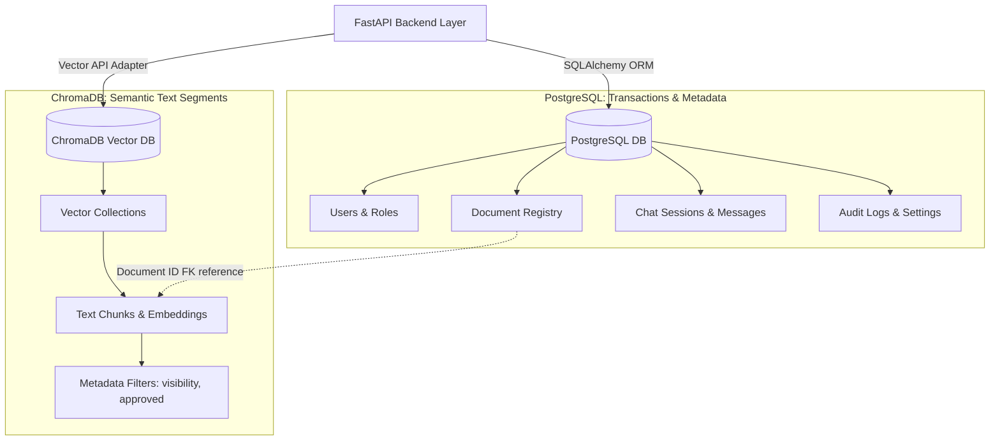
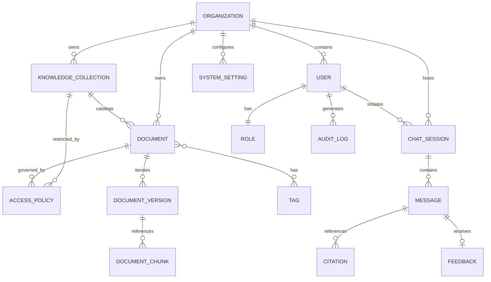
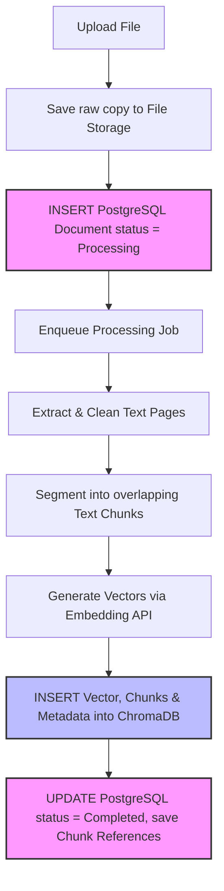
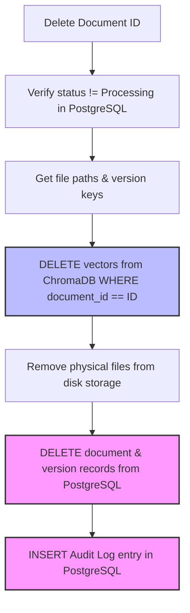

# Database Design Specification

| Attribute | Details |
| :--- | :--- |
| **Project Name** | Enterprise AI Knowledge Platform with Intelligent Customer Support (RAG) |
| **Document Name** | Database Design Specification |
| **Version** | v1.0.0 (Baseline Approved) |
| **Document Status** | Approved |
| **Owner** | Principal Database Architect & Enterprise Data Architect |
| **Last Updated** | 2026-06-27 |

### Document Purpose
This Database Design Specification defines the complete storage architecture for the *Enterprise AI Knowledge Platform*. It specifies the dual-database layout (PostgreSQL and ChromaDB), logical entity schemas, relationship models, indexing guidelines, data integrity rules, lifecycle workflows, and security controls. It serves as the authoritative implementation guide for backend database designers and ORM developers.

---

## 1. Introduction

The storage tier of the Enterprise AI Knowledge Platform is built on a dual-database design. A production-grade RAG platform handles two fundamentally different types of data: structured transactional records (users, permissions, document metadata, audit logs, and feedback) and unstructured text segments mapped to high-dimensional numerical vectors (embeddings). 

To optimize performance, security, and scalability, we separate these concerns:
*   **Relational Data Store (PostgreSQL):** Manages relational entities, ensuring transactional integrity (ACID compliance) for users, configurations, document states, and session logs.
*   **Vector Data Store (ChromaDB):** Indexes and stores text chunk vectors to perform fast semantic similarity searches during user queries.

By separating relational data from vector representations, the platform maintains transactional security while enabling fast vector searches. This design specification serves as the blueprint for both storage systems.

---

## 2. Database Architecture Overview

The system uses an asynchronous storage architecture. The FastAPI backend coordinates transactions across PostgreSQL (via SQLAlchemy) and ChromaDB (via LangChain's vector database clients).



---

## 3. Database Selection Rationale

The selection of PostgreSQL and ChromaDB is based on specific system requirements:

### 3.1 PostgreSQL: Relational Information
*   **Transactional Integrity:** PostgreSQL ensures absolute compliance with ACID properties. This is critical for authentication records, permission settings, and audit logs.
*   **Relational Querying:** Managing relationship chains (e.g. associating user feedback with specific chat messages and documents) requires structured JOIN capabilities.
*   **Query Performance:** Highly optimized index structures (B-Tree, Hash) support fast searches across metadata logs, session archives, and user profiles.

### 3.2 ChromaDB: Vector Embeddings
*   **Vector-Native Queries:** Vector databases are optimized to store high-dimensional arrays and execute similarity searches (such as cosine similarity queries) across thousands of items in milliseconds.
*   **Logical Partitioning:** ChromaDB allows grouping vectors into collections, simplifying multi-tenant isolation.
*   **Development Simplicity:** Can run embedded in the application process during development, reducing deployment complexity, and scales to a standalone server in production.

### 3.3 Separation Rationale
Storing high-dimensional vector arrays in a standard relational database can lead to performance issues. While tools like `pgvector` exist for PostgreSQL, separating relational data from vector storage provides several advantages:
1.  **Independent Scaling:** Allows us to scale the vector database (which requires CPU and memory for similarity searches) independently from the transactional database.
2.  **Resource Isolation:** Heavy document ingestion tasks or frequent chat queries will not degrade database performance for administrative operations.
3.  **Modular Flexibility:** Decouples our search indexing from transactional tables, allowing us to swap the vector database provider (e.g. to Qdrant) in the future without modifying relational schemas.

---

## 4. High-Level Entity Model

This section defines the core entities in the database architecture:

*   **Organization:** The tenant entity (built in to support future multi-tenant updates). All documents, users, collections, and settings belong to an organization.
*   **User:** Represents authenticated administrators and support agents.
*   **Role:** Represents user authorization groups (`Administrator`, `Support Agent`).
*   **Knowledge Collection:** A logical folder that groups related documents (e.g. "HR Policies", "Technical Manuals").
*   **Document:** Represents files uploaded by administrators (warranties, FAQs, product guides).
*   **Document Version:** Tracks document iterations, ensuring the search engine retrieves only the latest approved version.
*   **Document Chunk:** Tracks document fragments that are converted to vectors and stored in ChromaDB.
*   **Chat Session:** Tracks conversation threads.
*   **Message:** Represents individual interactions (user queries and generated system responses) within a chat session.
*   **Feedback:** Captures thumbs-up/down ratings and user comments associated with specific messages.
*   **Audit Log:** Immutable security logs tracking administrative operations (uploads, deletions, user updates).
*   **System Setting:** Configurable settings (prompts, similarity thresholds, and fallback text) managed by administrators.
*   **Tag:** Custom metadata labels assigned to documents to assist with filtering.
*   **Access Policy:** Defines rules restricting access to specific collections or documents based on user roles.

---

## 5. Entity Relationship Diagram

The Entity Relationship Diagram (ERD) below defines the logical links and cardinalities between system entities.



---

## 6. Entity Descriptions

This section details the purpose, responsibilities, and lifecycle of each logical database entity.

### 6.1 Organization
*   **Purpose:** Logical boundary to support multi-tenant isolation.
*   **Responsibilities:** Connects users, documents, collections, and settings to a single customer account.
*   **Lifecycle:** Created during tenant onboarding; deleted only if the tenant account is removed.
*   **Ownership:** Top-level entity, parent to all other relational data.

### 6.2 User
*   **Purpose:** Authenticated system user (Administrator or Support Agent).
*   **Responsibilities:** Manages credentials, verification keys, email addresses, and roles.
*   **Lifecycle:** Created by administrators; disabled or soft-deleted when their access is revoked.
*   **Ownership:** Belongs to an Organization.

### 6.3 Role
*   **Purpose:** Define user permissions.
*   **Responsibilities:** Maps access permissions to system routes and actions.
*   **Lifecycle:** Static records initialized during database setup.
*   **Ownership:** Read-only entity referenced by User records.

### 6.4 Knowledge Collection
*   **Purpose:** Group related documents.
*   **Responsibilities:** Provides logical partitioning for documents (e.g. separating public FAQs from internal HR policies).
*   **Lifecycle:** Created and managed by administrators.
*   **Ownership:** Belongs to an Organization.

### 6.5 Document
*   **Purpose:** Track files uploaded to the knowledge base.
*   **Responsibilities:** Stores document names, categories, and processing statuses.
*   **Lifecycle:** Created during upload; marked as `Processing` during text extraction, transitioning to `Completed` or `Failed`.
*   **Ownership:** Belongs to a Knowledge Collection.

### 6.6 Document Version
*   **Purpose:** Support document updates while preserving historical records.
*   **Responsibilities:** Tracks document revisions and active states.
*   **Lifecycle:** Created when a document is updated. The previous version is marked inactive.
*   **Ownership:** Belongs to a parent Document record.

### 6.7 Document Chunk
*   **Purpose:** Reference text segments stored in ChromaDB.
*   **Responsibilities:** Links vector database records back to PostgreSQL.
*   **Lifecycle:** Created when a document version is parsed; deleted when the document is removed.
*   **Ownership:** Belongs to a Document Version.

### 6.8 Chat Session
*   **Purpose:** Track active conversation threads.
*   **Responsibilities:** Groups messages into a single session thread.
*   **Lifecycle:** Created when a user initiates a chat session; deleted when a customer clears history.
*   **Ownership:** Belongs to an Organization.

### 6.9 Message
*   **Purpose:** Record individual chat exchanges.
*   **Responsibilities:** Stores queries, generated responses, and processing latencies.
*   **Lifecycle:** Appended to a session thread during active chats.
*   **Ownership:** Belongs to a Chat Session.

### 6.10 Feedback
*   **Purpose:** Capture user ratings of system responses.
*   **Responsibilities:** Logs satisfaction scores and comments to help administrators evaluate response quality.
*   **Lifecycle:** Created when a user submits feedback; deleted if the parent message is removed.
*   **Ownership:** Belongs to a Message record.

### 6.11 Audit Log
*   **Purpose:** Immutable records of administrative actions.
*   **Responsibilities:** Logs uploads, deletions, configuration updates, and user modifications.
*   **Lifecycle:** Append-only records created automatically; preserved for compliance audits.
*   **Ownership:** Belongs to an Organization, references the performing User.

### 6.12 System Setting
*   **Purpose:** Store system configuration parameters.
*   **Responsibilities:** Manages settings like system prompts, similarity thresholds, and fallback text.
*   **Lifecycle:** Initialized during setup; modified by administrators.
*   **Ownership:** Belongs to an Organization.

---

## 7. Data Lifecycle

The workflows below illustrate how data flows through the relational and vector databases.

### 7.1 Ingestion & Processing Flow
The flow begins when a document is uploaded, moving text extraction tasks to background queues and updating the databases asynchronously.



### 7.2 Deletion & Purging Flow
When a document is deleted, the system executes transactions to remove records from both databases.



---

## 8. Vector Database Data Model: ChromaDB

ChromaDB is optimized for similarity searches, storing embeddings and associated text fragments inside collections.

```
                  ┌────────────────────────────────────────┐
                  │          ChromaDB Collection           │
                  │  (e.g., "org_01_knowledge_collection") │
                  └───────────────────┬────────────────────┘
                                      │
          ┌───────────────────────────┼───────────────────────────┐
          ▼                           ▼                           ▼
┌───────────────────┐       ┌───────────────────┐       ┌───────────────────┐
│ Vector Embeddings │       │   Text Content    │       │     Metadata      │
│  [0.082, -0.012,  │       │  "Grounded text   │       │ {document_id,     │
│   ..., 0.412]     │       │   segment string" │       │  page_number,     │
│  (Dimension = D)  │       │                   │       │  visibility, ...} │
└───────────────────┘       └───────────────────┘       └───────────────────┘
```

### 8.1 Chunk Storage Schema
Each record in the ChromaDB collection contains:
*   **ID (String):** A composite string mapping the document ID to the chunk index (e.g. `doc_8f3b9c7d_chunk_0042`).
*   **Vector (Embedding):** A 768-dimensional array generated by the Gemini embedding API.
*   **Document Text (String):** The raw, cleaned text segment.
*   **Metadata (Dictionary):** Configuration tags used to filter results during queries:
    *   `document_id`: Source document UUID.
    *   `visibility`: `public` or `internal` (enforces role access).
    *   `approved`: `true` or `false` (filters out unapproved documents).
    *   `filename`: Used for UI citation displays.
    *   `page_number`: Page reference for citations.
    *   `section_heading`: Header hierarchy reference.

### 8.2 Retrieval Filtering Logic
During a query, the retrieval engine applies metadata filters directly to the vector search, ensuring users only search documentation matching their access levels:

$$\text{Filter Expression:} \quad (\text{approved} == \text{true}) \quad \text{AND} \quad (\text{visibility} == \text{"public"})$$

---

## 9. PostgreSQL Relational Model

PostgreSQL manages relational tables, user sessions, audit trails, and system settings.

*   **Authentication & Roles:** Stores user profiles, credentials (hashed via bcrypt), and active roles to authorize requests.
*   **Document Registry:** Tracks document lifecycles, file system paths, category tags, and ingestion processing statuses.
*   **Chat Logs & Transcripts:** Stores session states and historical message logs to support auditing.
*   **Feedback Registry:** Logs rating scores and comments to help administrators evaluate response quality.
*   **Audit Logging:** Logs administrative activities to maintain a secure audit trail.
*   **Configurations:** Stores system variables (prompts, thresholds, and fallback text) in relational tables, allowing settings to be updated without restarting the application.

---

## 10. Indexing Strategy

To maintain performance as data scales, the relational database uses specific indexing strategies:

*   **Primary Keys:** Primary keys are indexed using B-Trees automatically, ensuring fast retrievals by unique identifiers.
*   **Foreign Keys:** Foreign keys (e.g. `document_id` in version records, `session_id` in message logs) are indexed to speed up JOIN operations.
*   **Unique Constraints:** Fields like user email addresses have unique constraints with associated B-Tree indexes to prevent duplicate accounts.
*   **Composite Indexing:** For queries that filter and sort on multiple fields (e.g., querying messages by session ID and sorting by timestamp), composite indexes (B-Tree) are applied:
    *   `idx_messages_session_timestamp` on `(session_id, created_at DESC)`.
    *   `idx_audit_logs_org_timestamp` on `(organization_id, created_at DESC)`.
*   **Full-Text Search Indexes:** To support keyword-based administrative searches across file registries, full-text search indexes (GIN/GiST) are applied to document name columns.

---

## 11. Constraints & Integrity Rules

The relational schema enforces data integrity and database consistency:

*   **Referential Integrity:** Enforces foreign key relationships. If a record is missing or deleted, dependent tables must adapt cleanly.
*   **Cascade Behavior Rules:**
    *   *Document Deletion:* Cascades to delete associated Document Versions, Document Chunks, and citations, preventing orphaned records.
    *   *User Deletion:* Does not cascade to delete audit logs. Instead, the user reference is set to NULL (`ON DELETE SET NULL`) to preserve historical audit trails.
*   **Soft Delete Philosophy:** To prevent accidental data loss, records like Users and Documents are soft-deleted by setting an `is_deleted` flag to true, excluding them from default queries while preserving them for audit purposes.
*   **Validation Rules:** Inputs are validated at both the database level (e.g. field constraints, non-null values) and the application level (Pydantic schemas).

---

## 12. Document Versioning Strategy

To support document updates while preserving historical citations, the system uses a versioning strategy.

```
[Document Entry Created]
        │ (Active Version = 1)
        ▼
[Admin uploads revised file]
        │
        ├─► [Extract text & index new chunks in ChromaDB]
        ├─► [Create Document Version 2 in PostgreSQL]
        ├─► [Update Active Version pointer to Version 2]
        ▼
[Mark Document Version 1 inactive]
(Historical chat logs preserve citations pointing to Version 1)
```

*   **Unique Version Identifiers:** Every document upload creates a new `DocumentVersion` record with a unique UUID.
*   **Active Version Pointer:** The parent `Document` record stores an `active_version_id` foreign key pointing to the current version.
*   **Historical Citations:** Historical chat messages point to the specific version ID used when the query was run. When a document is updated, old versions are marked inactive but retained in the database, ensuring historical citations remain valid.

---

## 13. Audit Logging

The platform maintains an immutable audit trail of administrative activities.

*   **Audit Scope:** Logs user logons, document uploads, visibility modifications, file deletions, user creation, and setting changes.
*   **Record Attributes:** Every audit entry records the performing user's UUID, organization ID, action type, IP address, target entity ID, and a JSON payload detailing the changes.
*   **Retention Policy:** Audit logs are write-once, append-only, and preserved for a configurable retention window (e.g., 7 years) to meet compliance requirements.

---

## 14. Backup & Recovery Philosophy

The backup and recovery strategy ensures data protection and disaster recovery readiness:

*   **PostgreSQL Backups:** The relational database runs daily automated backups. Transaction logs (Write-Ahead Logging) are archived to support point-in-time recovery.
*   **ChromaDB Backups:** Vector storage directories are backed up in sync with PostgreSQL. Because vectors are generated from raw text, they can be reconstructed by re-processing the document library if a recovery failure occurs.
*   **High Availability:** In production, databases are deployed in high-availability configurations with primary-replica replication to support automatic failovers.

---

## 15. Scalability Strategy

The database tier is designed to scale across three dimensions:

*   **Scaling Document Volume:** As the document library grows, PostgreSQL table partitioning (e.g., partitioning audit logs and messages by month) keeps query performance consistent.
*   **Scaling Vector Volume:** ChromaDB organizes vectors using HNSW indexing. For massive libraries (millions of documents), ChromaDB can be transitioned to a distributed cluster like Qdrant, using consistent hashing to distribute vectors across nodes.
*   **Scaling User Traffic:** The stateless backend FastAPI instances read from read-replicas, routing write transactions to the primary database to handle high concurrent user traffic.

---

## 16. Security & Data Isolation

The database architecture implements security controls to protect sensitive customer data:

*   **Encryption at Rest & in Transit:** Database connections require TLS/SSL encryption. Data volumes are encrypted using standard storage encryption features.
*   **Least Privilege Access:** Application servers connect to databases using restricted service accounts, permitting only required CRUD actions and blocking administrative schema privileges.
*   **Data Isolation:** All database tables include an `organization_id` column. Query builders apply organization filters automatically to prevent data leakage in multi-tenant configurations.
*   **PII Masking:** Chat logs are analyzed for PII (Personally Identifiable Information) before storage, masking sensitive details (e.g., credit card numbers, SSNs) to protect user privacy.

---

## 17. Risks & Mitigation Strategies

The table below identifies the primary risks associated with the database architecture and outlines proactive mitigation strategies:

| Database Risk | Impact | Severity | Proactive Mitigation Strategy |
| :--- | :--- | :--- | :--- |
| **Relational & Vector Desynchronization** | A document deletion fails midway, leaving orphaned vectors in ChromaDB or broken references in PostgreSQL. | High | Wrap deletion steps in database transactions. If vector removal fails, rollback PostgreSQL changes and retry the transaction. |
| **Query Latency Spikes** | Large tables (such as chat logs or audit files) degrade retrieval performance over time. | Medium | Apply indexing, monitor query execution plans, and set up automated partition strategies for audit and chat tables. |
| **Vector Memory Exhaustion** | ChromaDB consumes all available host RAM when loading massive vector libraries. | High | Configure vector memory limits and plan migrations to distributed vector stores (e.g. Qdrant) as document volume grows. |
| **Data Leakage in Multi-Tenancy** | A bug in query construction allows a user to access documents from another organization. | High | Implement row-level security (RLS) in PostgreSQL, and enforce tenant-specific collection isolation in ChromaDB. |

---

## 18. Engineering Decision Log

The table below documents the design decisions and trade-offs made during the database architecture design:

| Design Decision | Selection Rationale | Alternatives Evaluated | Rationale for Rejection |
| :--- | :--- | :--- | :--- |
| **PostgreSQL & ChromaDB Dual-Database** | Best-of-breed selection: PostgreSQL provides ACID compliance for transactional data; ChromaDB provides high-performance vector search. | PostgreSQL with pgvector | pgvector is highly capable but couples vector operations to relational compute resources, limiting independent scaling. |
| **Soft Delete for Documents** | Prevents accidental data loss, preserves historical citations, and allows administrators to restore files easily. | Hard Delete | Hard deletes instantly break historical chat citations pointing to deleted files, causing audit verification issues. |
| **UUID Primary Keys** | Generates non-sequential, globally unique identifiers, preventing ID enumeration attacks and supporting future multi-region deployments. | Auto-incrementing Integers | Sequential IDs expose system scales and are vulnerable to ID scanning attacks. |
| **Logical Collection Isolation** | Organizes vectors into organization-specific collections in ChromaDB to ensure tenant data isolation. | Single Collection with Metadata filters | Relying only on metadata filters carries a higher risk of data leakage bugs during complex query processing. |

---

## 19. Future Database Evolution

As the platform scales to support millions of documents and concurrent users, the database tier can evolve through the following stages:

```
[Phase 1: Dual DB Baseline] ──► [Phase 2: Partitioning & Cluster] ──► [Phase 3: Distributed SaaS DB]
  - Postgres (Local Instance)      - Postgres Read-Replicas           - Cloud PostgreSQL RDS
  - ChromaDB (Embedded mode)       - Standalone ChromaDB Server        - Qdrant Vector Cluster (Distributed)
  - Single-Tenant Isolation        - Table Partitioning (by Month)    - Row-Level Security (RLS)
```

*   **Phase 2: Replication & Dedicated Vector Servers:** Deploy PostgreSQL read-replicas to handle reporting and analytical queries, and move ChromaDB from embedded mode to a standalone, dedicated server.
*   **Phase 3: Distributed Vector Clustering:** Migrate vector storage from ChromaDB to a distributed Qdrant or Milvus cluster, utilizing horizontal sharding and replica sets to support high-throughput SaaS workloads.

---

## 20. Conclusion

This Database Design Specification defines the dual-database architecture for the Enterprise AI Knowledge Platform. By separating transactional data in PostgreSQL from semantic vector storage in ChromaDB, the system ensures data integrity and high-performance similarity search. The relational models, indexing strategies, referential rules, and security controls defined in this document establish a stable, cloud-ready foundation for developers to implement the database tier.
