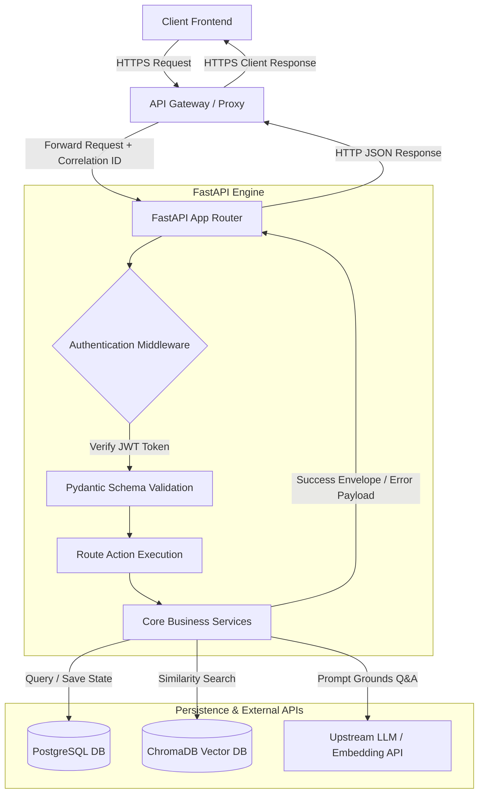

# API Design Specification

| Attribute | Details |
| :--- | :--- |
| **Project Name** | Enterprise AI Knowledge Platform with Intelligent Customer Support (RAG) |
| **Document Name** | API Design Specification |
| **Version** | v1.0.0 (Baseline Approved) |
| **Document Status** | Approved |
| **Owner** | Principal Backend Architect & REST API Designer |
| **Last Updated** | 2026-06-27 |

### Document Purpose
This API Design Specification defines the REST API endpoints exposed by the *Enterprise AI Knowledge Platform*. It specifies endpoint URLs, request-response payloads, HTTP status codes, validation constraints, and security standards. It serves as the authoritative interface contract between frontend and backend developers, ensuring integration compatibility before code implementation.

---

## 1. Introduction

The platform's API layer follows a RESTful architecture, establishing a stateless, secure connection between client applications and backend systems.

### 1.1 Core API Design Principles
*   **RESTful Design:** Endpoints are structured around resources using standard HTTP verbs (`GET`, `POST`, `PUT`, `DELETE`).
*   **Stateless Communication:** The API layer does not maintain session states on the server. Every request must include the authentication token needed to validate the user.
*   **JSON Payloads:** Request and response bodies are formatted as structured JSON payloads, using standard UTF-8 encoding.
*   **URI Versioning:** All endpoints are prefixed with a version indicator (`/api/v1/`) to ensure backward compatibility as the API evolves.
*   **Consistent Response Envelope:** Every response uses a standard envelope structure, simplifying error handling and data parsing on the frontend.

---

## 2. API Architecture Overview

The diagram below illustrates the request execution pathway from the client interface through the API gateway, validation layers, business services, and backend databases.



### 2.1 Request Flow
1.  **Transport Gateway:** The client sends an HTTPS request to the gateway, which attaches a unique `X-Correlation-ID` header.
2.  **Authentication intercept:** Middleware validates the JWT signature in the `Authorization` header.
3.  **Data Validation:** FastAPI parses the request payload against Pydantic schemas, rejecting invalid data with `422 Unprocessable Entity` errors.
4.  **Route Execution:** The router delegates task execution to the appropriate backend business service.
5.  **Database Queries:** Services read or write data to PostgreSQL and search ChromaDB as needed.
6.  **Grounded Generation:** Conversational queries retrieve context and call the LLM API to generate answers.
7.  **Envelope Wrapping:** The API wraps the execution results in a standard JSON response envelope and returns it to the client.

---

## 3. Authentication APIs

Endpoints under `/api/v1/auth` manage user registration, authentication sessions, and token lifecycles.

### 3.1 User Registration: `POST /api/v1/auth/register`
*   **Purpose:** Register a new system user (admin/agent).
*   **Authentication Required:** Yes (Administrator role only).
*   **Expected Request Fields:**
    | Field Name | Type | Description | Required | Constraints |
    | :--- | :--- | :--- | :--- | :--- |
    | `email` | String | Valid email address. | Yes | Format validation |
    | `password` | String | User password. | Yes | Min 8 chars, 1 uppercase |
    | `first_name`| String | User's first name. | Yes | Max 50 chars |
    | `last_name` | String | User's last name. | Yes | Max 50 chars |
    | `role` | String | Assigned role (`Administrator` or `Support Agent`). | Yes | Allowed values only |
*   **Expected Response Fields:**
    | Field Name | Type | Description |
    | :--- | :--- | :--- |
    | `success` | Boolean | Execution status flag (`true`). |
    | `data` | Object | Created user profile metadata (UUID, email, name, role, created timestamp). |
*   **HTTP Status Codes:**
    *   `201 Created` - Registration successful.
    *   `400 Bad Request` - Invalid input data or role selection.
    *   `401 Unauthorized` - Missing or invalid admin credentials.
    *   `403 Forbidden` - User role lacks permission to perform registrations.
    *   `409 Conflict` - Email address is already registered.
    *   `422 Unprocessable Entity` - Payload does not match Pydantic schema constraints.

### 3.2 User Login: `POST /api/v1/auth/login`
*   **Purpose:** Authenticate user credentials and return access tokens.
*   **Authentication Required:** No.
*   **Expected Request Fields:**
    | Field Name | Type | Description | Required |
    | :--- | :--- | :--- | :--- |
    | `username` | String | User's registered email address. | Yes |
    | `password` | String | User's password. | Yes |
*   **Expected Response Fields:**
    | Field Name | Type | Description |
    | :--- | :--- | :--- |
    | `access_token`| String | Short-lived JWT access token. |
    | `token_type` | String | Token schema identifier (`Bearer`). |
    | `expires_in` | Integer | Token validity duration in seconds (1800). |
    | `refresh_token`| String | Long-lived JWT refresh token. |
*   **HTTP Status Codes:**
    *   `200 OK` - Authentication successful.
    *   `400 Bad Request` - Missing email or password fields.
    *   `401 Unauthorized` - Incorrect email or password.
    *   `429 Too Many Requests` - IP rate limit exceeded.

### 3.3 Refresh Token: `POST /api/v1/auth/refresh`
*   **Purpose:** Issue a new access token using a valid refresh token.
*   **Authentication Required:** No.
*   **Expected Request Fields:**
    | Field Name | Type | Description | Required |
    | :--- | :--- | :--- | :--- |
    | `refresh_token`| String | Long-lived JWT refresh token. | Yes |
*   **Expected Response Fields:** Same as User Login response payload.
*   **HTTP Status Codes:**
    *   `200 OK` - Token refresh successful.
    *   `401 Unauthorized` - Invalid, expired, or blacklisted refresh token.

### 3.4 User Logout: `POST /api/v1/auth/logout`
*   **Purpose:** Invalidate active session and refresh tokens.
*   **Authentication Required:** Yes.
*   **Expected Request Fields:** None (reads from auth header).
*   **Expected Response Fields:**
    | Field Name | Type | Description |
    | :--- | :--- | :--- |
    | `success` | Boolean | Logout status flag (`true`). |
*   **HTTP Status Codes:**
    *   `200 OK` - Logout successful.
    *   `401 Unauthorized` - Missing or invalid token.

### 3.5 Current Profile: `GET /api/v1/auth/me`
*   **Purpose:** Retrieve the profile details of the currently authenticated user.
*   **Authentication Required:** Yes.
*   **Expected Request Fields:** None.
*   **Expected Response Fields:** User profile metadata (UUID, email, name, role).
*   **HTTP Status Codes:**
    *   `200 OK` - Profile details retrieved successfully.
    *   `401 Unauthorized` - Missing or invalid token.

---

## 4. User APIs

Endpoints under `/api/v1/users` manage user profiles and administrator privileges.

### 4.1 Retrieve Profile: `GET /api/v1/users/profile`
*   **Purpose:** Get profile details for the authenticated user.
*   **Authentication Required:** Yes.

### 4.2 Update Profile: `PUT /api/v1/users/profile`
*   **Purpose:** Update user profile details (first name, last name, password).
*   **Authentication Required:** Yes.
*   **Expected Request Fields:** Optional fields for `first_name`, `last_name`, `current_password`, and `new_password`.

### 4.3 List Users: `GET /api/v1/users`
*   **Purpose:** List all registered users (admin-only).
*   **Authentication Required:** Yes (Administrator role required).
*   **Query Parameters:** Supporting `page`, `size`, and `role` filtering.

### 4.4 Deactivate User: `DELETE /api/v1/users/{id}`
*   **Purpose:** Deactivate a user account (admin-only).
*   **Authentication Required:** Yes (Administrator role required).
*   **Expected Behavior:** Sets `is_deleted` to true and invalidates active session tokens.

---

## 5. Document APIs

Endpoints under `/api/v1/documents` manage document uploads, library collections, and parsing tasks.

### 5.1 Upload Document: `POST /api/v1/documents/upload`
*   **Purpose:** Upload a document file to the knowledge base (admin-only).
*   **Authentication Required:** Yes (Administrator role required).
*   **Content-Type:** `multipart/form-data`
*   **Expected Request Fields:**
    *   `file`: Binary file upload (PDF/MD/TXT).
    *   `category`: Category tag string (e.g. Warranty, Refund, Guide).
    *   `visibility`: Visibility tag (`public` or `internal`).
*   **Expected Response Fields:**
    | Field Name | Type | Description |
    | :--- | :--- | :--- |
    | `success` | Boolean | Execution status flag (`true`). |
    | `document_id`| String | Assigned document UUID. |
    | `status` | String | Current ingestion status (`Processing`). |
*   **HTTP Status Codes:**
    *   `202 Accepted` - Ingestion job accepted and queued.
    *   `400 Bad Request` - Unsupported file type or file exceeds size limit.
    *   `401 Unauthorized` - Missing authentication token.
    *   `403 Forbidden` - User role lacks permission to upload files.

### 5.2 List Documents: `GET /api/v1/documents`
*   **Purpose:** List documents in the library with pagination and filters.
*   **Authentication Required:** Yes.
*   **Query Parameters:**
    *   `page`: Target page index (default: 1).
    *   `size`: Items per page (default: 20).
    *   `status`: Filter by status (`Processing`, `Completed`, `Failed`).
    *   `visibility`: Filter by visibility (`public`, `internal`).

### 5.3 Search Documents: `POST /api/v1/documents/search`
*   **Purpose:** Search document titles and metadata fields.
*   **Authentication Required:** Yes.

### 5.4 Document Details: `GET /api/v1/documents/{id}`
*   **Purpose:** Retrieve detailed metadata for a specific document.
*   **Authentication Required:** Yes.

### 5.5 Delete Document: `DELETE /api/v1/documents/{id}`
*   **Purpose:** Delete a document and purge its text chunks and vectors.
*   **Authentication Required:** Yes (Administrator role required).
*   **Expected Behavior:** Initiates a cascade delete transaction, removing database metadata, vector embeddings, and physical files.

### 5.6 Restore Document: `POST /api/v1/documents/{id}/restore`
*   **Purpose:** Restore a soft-deleted document.
*   **Authentication Required:** Yes (Administrator role required).

### 5.7 Reindex Document: `POST /api/v1/documents/{id}/reindex`
*   **Purpose:** Reprocess a document's text and update its vector index.
*   **Authentication Required:** Yes (Administrator role required).

### 5.8 Version History: `GET /api/v1/documents/{id}/versions`
*   **Purpose:** View version history logs for a document.
*   **Authentication Required:** Yes.

---

## 6. Chat APIs

Endpoints under `/api/v1/chat` manage conversational sessions and grounded Q&A tasks.

### 6.1 Create Session: `POST /api/v1/chat/sessions`
*   **Purpose:** Create a new conversational chat session.
*   **Authentication Required:** No (Anonymous users can create customer sessions; authenticated agents can create agent sessions).
*   **Expected Request Fields:** Optional field for `organization_id` (defaults to target tenant ID).
*   **Expected Response Fields:**
    | Field Name | Type | Description |
    | :--- | :--- | :--- |
    | `session_id` | String | Unique session UUID. |
    | `created_at` | String | Session creation timestamp. |

### 6.2 Submit Query: `POST /api/v1/chat/sessions/{session_id}/query`
*   **Purpose:** Submit a query, search context, and generate a response.
*   **Authentication Required:** Conditional (No for customers, Yes for support agents).
*   **Expected Request Fields:**
    | Field Name | Type | Description | Required |
    | :--- | :--- | :--- | :--- |
    | `query` | String | Natural language user query. | Yes |
*   **Expected Response Fields:**
    The endpoint streams response tokens via **Server-Sent Events (SSE)**. The final stream event contains:
    | Field Name | Type | Description |
    | :--- | :--- | :--- |
    | `answer` | String | Generated response text. |
    | `citations` | Array | References containing file names, pages, and chunk IDs. |
*   **HTTP Status Codes:**
    *   `200 OK` - Response generated successfully.
    *   `404 Not Found` - Session ID not found.
    *   `429 Too Many Requests` - Query rate limits exceeded.
    *   `503 Service Unavailable` - Upstream AI provider API outage.

### 6.3 Chat History: `GET /api/v1/chat/sessions/{session_id}/history`
*   **Purpose:** Retrieve conversation logs for a chat session.
*   **Authentication Required:** Conditional (Matches session ownership).

### 6.4 Delete Session: `DELETE /api/v1/chat/sessions/{session_id}`
*   **Purpose:** End and delete a chat session.
*   **Authentication Required:** Conditional.

### 6.5 Export Chat: `GET /api/v1/chat/sessions/{session_id}/export`
*   **Purpose:** Download conversation transcript (as PDF or TXT).
*   **Authentication Required:** Conditional.

---

## 7. Feedback APIs

Endpoints under `/api/v1/feedback` log user feedback and system ratings.

### 7.1 Submit Feedback: `POST /api/v1/feedback`
*   **Purpose:** Submit a rating score and comment for a message.
*   **Authentication Required:** Conditional (matches session access rights).
*   **Expected Request Fields:**
    | Field Name | Type | Description | Required |
    | :--- | :--- | :--- | :--- |
    | `message_id` | String | Message ID reference. | Yes |
    | `score` | Integer | Rating score (`1` for thumbs-up, `-1` for thumbs-down). | Yes |
    | `comment` | String | User comment explaining rating. | No |

### 7.2 List Feedback: `GET /api/v1/feedback`
*   **Purpose:** Retrieve all feedback records for administrator review.
*   **Authentication Required:** Yes (Administrator/Agent access required).

### 7.3 Review Feedback: `PUT /api/v1/feedback/{id}/review`
*   **Purpose:** Mark a feedback entry as reviewed (admin-only).
*   **Authentication Required:** Yes (Administrator role required).

---

## 8. Dashboard APIs

Endpoints under `/api/v1/dashboard` provide system metrics for administrators and business owners.

### 8.1 System Statistics: `GET /api/v1/dashboard/statistics`
*   **Purpose:** Get metrics like chat volume, deflection rate, and average response times (admin/agent only).
*   **Authentication Required:** Yes.

### 8.2 Health Checks: `GET /api/v1/dashboard/health`
*   **Purpose:** Check system component health and database latencies.
*   **Authentication Required:** Yes (Administrator/Agent access required).

### 8.3 Recent Uploads: `GET /api/v1/dashboard/recent-uploads`
*   **Purpose:** List recently uploaded files.
*   **Authentication Required:** Yes.

### 8.4 Recent Chats: `GET /api/v1/dashboard/recent-chats`
*   **Purpose:** List active conversation sessions.
*   **Authentication Required:** Yes.

### 8.5 Feedback Summary: `GET /api/v1/dashboard/feedback-summary`
*   **Purpose:** Retrieve satisfaction ratings.
*   **Authentication Required:** Yes.

### 8.6 Failed Queries: `GET /api/v1/dashboard/failed-queries`
*   **Purpose:** List queries that triggered fallbacks.
*   **Authentication Required:** Yes.

---

## 9. Settings APIs

Endpoints under `/api/v1/settings` configure system behavior.

### 9.1 System Settings: `GET /api/v1/settings`
*   **Purpose:** Retrieve prompt configurations, similarity thresholds, and escalation links.
*   **Authentication Required:** Yes.

### 9.2 Update Settings: `PUT /api/v1/settings`
*   **Purpose:** Update system configurations.
*   **Authentication Required:** Yes (Administrator role required).

---

## 10. Request Standards

To ensure consistency, all client requests must follow these standards:

*   **Headers:**
    *   `Authorization: Bearer <token>`: Required for secured endpoints.
    *   `Content-Type: application/json`: Used for standard JSON request bodies.
    *   `X-Correlation-ID`: Attached by the gateway to track requests across logs.
*   **Idempotency:** Write transactions (such as POST creations) use correlation IDs to prevent duplicate requests if network failures cause re-submissions.

---

## 11. Response Standards

The backend wraps all API responses in a standard JSON envelope:

```json
{
  "success": true,
  "data": {},
  "warnings": [],
  "error": null,
  "meta": {
    "correlation_id": "8f3b9c7d-2b1a-4d9e-8c7f-6e5d4c3b2a1a",
    "timestamp": "2026-06-27T17:14:00Z"
  }
}
```

### 11.1 Response Fields
*   **success:** Indicates execution status (`true` or `false`).
*   **data:** Contains the returned payload.
*   **warnings:** Lists warning messages that do not block request execution.
*   **error:** Contains the error payload (only populated if `success` is `false`).
*   **meta:** Metadata tracking log identifiers and timestamps.

### 11.2 Pagination Envelopes
List endpoints wrap responses in a standard pagination envelope:

```json
{
  "success": true,
  "data": {
    "items": [],
    "pagination": {
      "total_items": 125,
      "page_size": 20,
      "current_page": 2,
      "total_pages": 7
    }
  },
  "warnings": [],
  "error": null,
  "meta": {}
}
```

---

## 12. Error Handling

When errors occur, the API returns a standard JSON error payload:

```json
{
  "success": false,
  "data": null,
  "warnings": [],
  "error": {
    "code": "ERR_AUTHENTICATION_FAILED",
    "message": "The credentials provided do not match our records.",
    "details": {}
  },
  "meta": {}
}
```

### 12.1 Error Codes
*   `400 Bad Request` (`ERR_BAD_REQUEST`): Missing fields or malformed JSON payloads.
*   `401 Unauthorized` (`ERR_UNAUTHORIZED`): Missing or expired access tokens.
*   `403 Forbidden` (`ERR_FORBIDDEN`): User permissions block access to the resource.
*   `404 Not Found` (`ERR_NOT_FOUND`): Target resource not found.
*   `409 Conflict` (`ERR_CONFLICT`): Email already exists, or document is processing.
*   `422 Unprocessable Entity` (`ERR_VALIDATION_FAILED`): Input formats do not match constraints.
*   `429 Too Many Requests` (`ERR_RATE_LIMIT_EXCEEDED`): Session or API rate limits exceeded.
*   `500 Internal Server Error` (`ERR_SERVER_ERROR`): Unhandled system exception.
*   `503 Service Unavailable` (`ERR_API_UNAVAILABLE`): Upstream model provider API is offline.

---

## 13. Validation Strategy

Validation logic is enforced across multiple layers to protect the system:

*   **Pydantic Schema Validation:** FastAPI parses request payloads against Pydantic schemas, enforcing type constraints, non-empty bounds, and valid email structures.
*   **Document File Validation:** Ingestion checks verify that files do not exceed 25MB and match approved extensions (`.pdf`, `.md`, `.txt`).
*   **Authentication Checking:** Middleware decodes JWT structures, verifying signature keys and token expirations.
*   **Role Constraints:** Routes check roles (`Administrator` or `Support Agent`) to authorize actions.
*   **Business Rule Checks:** Services verify business rules (e.g. preventing document deletions while ingestion is active).

---

## 14. Pagination & Filtering Strategy

List endpoints use query parameters to handle pagination and filtering:
*   `page`: Targets the page index (default: 1).
*   `size`: Configures items per page (default: 20, limit: 100).
*   `filter`: Query key filters (such as `category=Warranty` or `visibility=public`).

---

## 15. API Versioning Strategy

All endpoints are prefixed with a version indicator:

$$\text{Version Route:} \quad \text{/api/v1/auth/login}$$

*   **Future compatibility:** Major version changes (e.g. updating to `/api/v2/`) will be mapped to separate routers, ensuring older integrations remain active during transitions.

---

## 16. Rate Limiting Strategy

To protect services and control LLM costs, the platform applies rate limits based on IP addresses and authentication keys:
*   *Customer Queries:* Restricts public chat requests (e.g. to 10 queries per minute per IP).
*   *File Uploads:* Restricts bulk uploads (e.g. to 30 uploads per minute per administrator).

---

## 17. Security Considerations

API security controls protect transactions and data:
*   **Transport Protection:** Enforce HTTPS connections with TLS 1.3 encryption.
*   **Token Expirations:** JWT access tokens expire after 30 minutes, requiring clients to request refreshes.
*   **Secrets Isolation:** API keys, database credentials, and token signatures are stored in secure environment configurations on the server.
*   **Input Sanitization:** Sanitize text queries to block prompt injection and cross-site scripting (XSS) attacks.

---

## 18. Logging & Monitoring

*   **Correlation Tracking:** The gateway generates a unique `X-Correlation-ID` header for every request. This ID is included in all downstream server logs, database queries, and external API requests to simplify tracing.
*   **Metric Logs:** The system logs request paths, response times, token counts, and error tracebacks to support system health monitoring.

---

## 19. API Lifecycle & Deprecation

As endpoints evolve, older interfaces follow a clear deprecation path:

```
[Endpoint Active] ──► [Deprecation Warning Header Added] ──► [API Deactivation]
                        - Warning header: "Sunset: Date"
                        - API returns deprecated payload
```

*   **Sunset Warnings:** Deprecated endpoints include warning headers (e.g. `Warning: 299 - "This endpoint is deprecated and will be removed on YYYY-MM-DD"`) to give developers time to migrate.

---

## 20. Engineering Decision Log

The table below documents design choices and trade-offs made during the API architecture design:

| API Design Choice | Selection Rationale | Alternatives Evaluated | Rationale for Rejection |
| :--- | :--- | :--- | :--- |
| **URI Versioning (/api/v1/)** | Simple to implement, works well with static routers, and is highly readable. | Header-based versioning | Header versioning is harder to test directly in web browsers and increases gateway routing complexity. |
| **Server-Sent Events (SSE)** | SSE supports streaming text tokens directly over HTTP, is simple to configure, and handles network reconnects automatically. | WebSockets | WebSockets are bi-directional but add extra connection management and server resource overhead for read-only streaming. |
| **Pydantic Validation Envelopes** | Standardizes response structures, making it easier to parse results and handle errors consistently on the frontend. | Raw JSON payloads | Raw payloads lead to inconsistent layouts across endpoints, increasing frontend integration code. |

---

## 21. Future API Evolution

Future milestones will expand the API's capabilities to support enterprise needs:
*   **GraphQL Integration:** Add a GraphQL endpoint to support custom metadata queries for administrators.
*   **Real-time Event Queues:** Integrate WebSockets to support real-time user-agent handoffs and live escalation queues.
*   **gRPC Support:** Implement internal gRPC communication between backend microservices to reduce query latency.

---

## 22. Conclusion

This API Design Specification defines the integration contracts and endpoints for the Enterprise AI Knowledge Platform. By establishing clear standards for authentication, request-response payloads, error codes, and validation rules, this document provides a stable blueprint for backend and frontend developers to construct the API layer.
