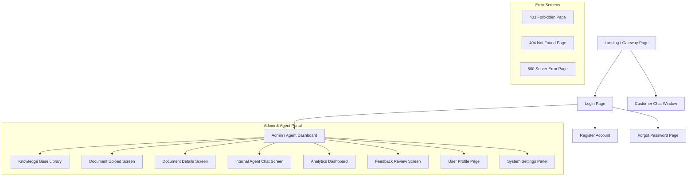
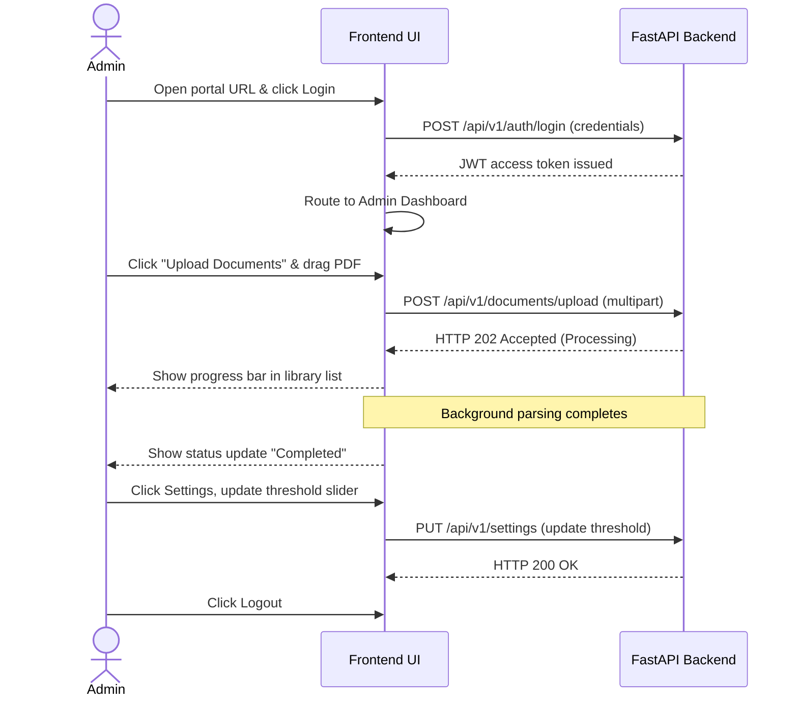
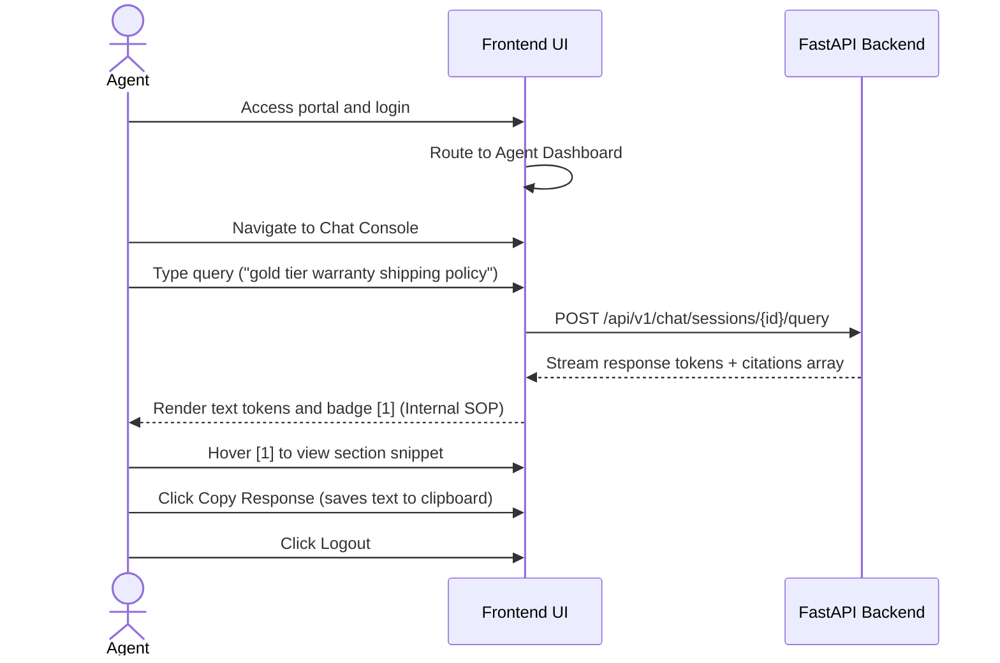
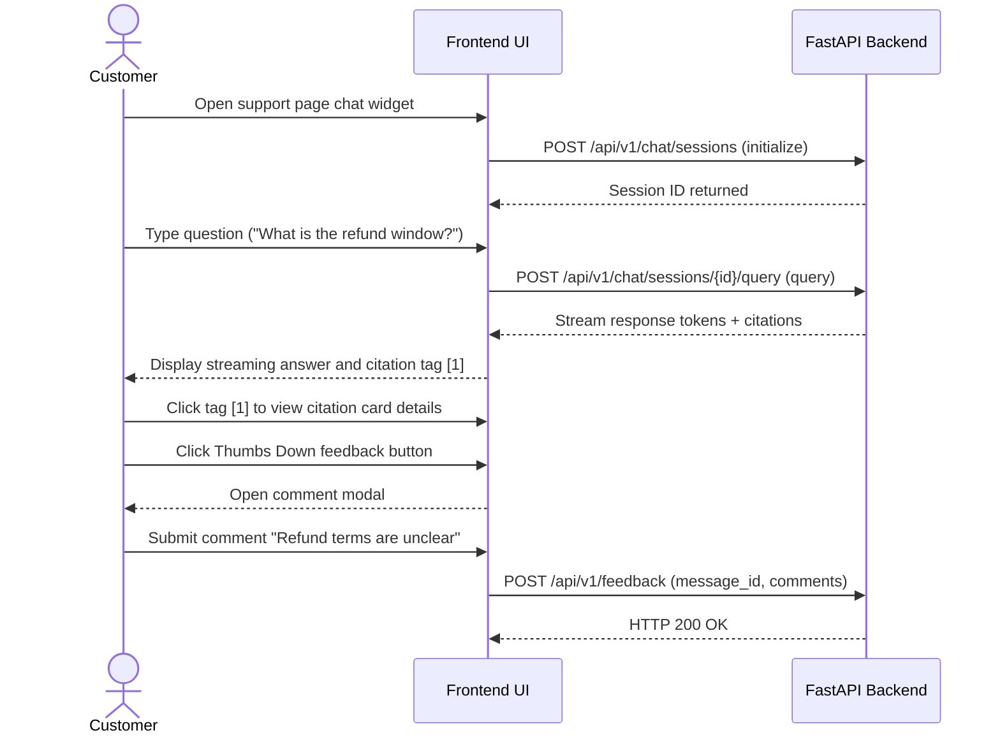

# UI/UX Design Specification

| Attribute | Details |
| :--- | :--- |
| **Project Name** | Enterprise AI Knowledge Platform with Intelligent Customer Support (RAG) |
| **Document Name** | UI/UX Design Specification |
| **Version** | v1.0.0 (Baseline Approved) |
| **Document Status** | Approved |
| **Owner** | Principal UX Architect & Senior Product Designer |
| **Last Updated** | 2026-06-27 |

### Document Purpose
This UI/UX Design Specification defines the user interface layout, navigation structures, design system tokens, responsive behaviors, and accessibility guidelines for the *Enterprise AI Knowledge Platform*. It serves as the design contract for frontend developers and UI designers, ensuring visual consistency and accessibility compliance across all screens and user roles.

---

## 1. Design Philosophy

To deliver an enterprise-grade experience, the platform's user interface is designed around a set of core UI/UX principles:

*   **Simplicity and Clarity:** AI systems present complex data. The UI must focus on simple layouts, avoiding unnecessary clutter and keeping user attention on conversational text and primary metrics.
*   **Enterprise Usability:** The administrative dashboard and agent portals are designed for high-frequency work, offering keyboard navigation, compact tables, and clear status indicators.
*   **Accessibility First:** The interface is built to meet WCAG 2.1 AA guidelines, incorporating keyboard controls, screen-reader compatibility, and strong color contrast ratios.
*   **Minimal Cognitive Load:** The platform uses clean page layouts, consistent button placement, and clear error states to ensure users can navigate the application without training.
*   **Performance-First UI:** The interface remains responsive by utilizing streaming text rendering (SSE), lazy-loaded tables, and skeleton loading screens during data operations.
*   **Mobile-First Responsiveness:** Interfaces are designed to scale fluidly from widescreen desktops to tablet and mobile screens, ensuring a consistent experience across all devices.

---

## 2. Information Architecture

The site map below details the navigation paths and hierarchy for both public customer-facing screens and internal administrative dashboards.



---

## 3. User Navigation Flow

The diagrams below map the user journeys for the system's core personas.

### 3.1 Administrator User Journey
Shows the path of an administrator logging in, uploading a document, verifying its ingestion, and adjusting system settings.



### 3.2 Customer Support Agent User Journey
Shows a support agent logging in and using the internal chat portal to search for policies during a customer call.



### 3.3 Customer User Journey
Shows a customer interacting with the public chat assistant, viewing citations, and submitting feedback.



---

## 4. Screen Specifications

This section specifies the UI layout, components, and responsive behaviors for each screen in the application.

### 4.1 Landing Page
*   **Purpose:** Serve as the gateway for public users to access customer support and route administrators to portals.
*   **Primary Users:** Customers, Administrators, Support Agents.
*   **Major Components:** Hero header, descriptive feature list, floating support chat launcher widget.
*   **Actions:** Click chat launcher widget, click "Portal Sign In" navigation link.
*   **Permissions:** Public (Anonymous Access).
*   **Loading State:** Simple animated logo spinner.
*   **Responsive Behavior:** Center-aligned columns collapse to a single column on mobile. Navigation menu collapses to a hamburger icon on screen sizes below 768px.
*   **Accessibility Notes:** All images require descriptive alt-text; navigation items must support keyboard tab-indexing.

### 4.2 Authentication Pages (Login, Register, Forgot Password)
*   **Purpose:** Manage user authentication and secure entry points.
*   **Primary Users:** Administrators, Support Agents.
*   **Major Components:** Input forms (email, password), role selector, action buttons.
*   **Actions:** Input login details, submit credentials, trigger password resets.
*   **Permissions:** Public.
*   **Error State:** Input fields highlight in red with inline error messages (e.g., "Invalid username or password").
*   **Responsive Behavior:** Centered single-column layout adapts to all screen sizes.
*   **Accessibility Notes:** Form inputs must have explicit labels and associate error messages using `aria-describedby` tags.

### 4.3 Admin / Agent Dashboard
*   **Purpose:** The central workspace for internal users, displaying metrics and quick-access navigation links.
*   **Primary Users:** Administrators, Support Agents, Business Owners.
*   **Major Components:** Navigation sidebar, statistics cards (active sessions, deflection rate), recent uploads grid.
*   **Actions:** Toggle sidebar navigation, click metrics detail views.
*   **Permissions:** Authenticated users only.
*   **Empty State:** Empty list screens display a placeholder icon with an action button (e.g. "Upload Your First Document").
*   **Responsive Behavior:** Navigation sidebar collapses to a slide-out drawer menu on screens below 1024px.
*   **Accessibility Notes:** Metric cards must use clear text labels alongside numerical statistics to support screen readers.

### 4.4 Chat Interface
*   **Purpose:** The conversational Q&A interface for customers and agents.
*   **Primary Users:** Customers, Support Agents.
*   **Major Components:** Chat thread workspace, input bar, citation cards panel, sidebar session list (agent view only).
*   **Actions:** Type queries, send messages, clear conversations, download transcripts, click citations, submit feedback.
*   **Permissions:** Public (Customer view), Authenticated (Agent view).
*   **Loading State:** Animated bouncing dots typing indicator.
*   **Responsive Behavior:** Input bar remains pinned to the bottom of the screen. Message text wraps on small screens to fit mobile dimensions.

### 4.5 Document Upload Screen
*   **Purpose:** Allow administrators to upload new documents to the knowledge base.
*   **Primary Users:** Administrators.
*   **Major Components:** Drag-and-drop zone, category selectors, visibility toggle switch.
*   **Actions:** Drag-and-drop files, select categories, set public/internal visibility tags, submit upload queues.
*   **Permissions:** Authenticated Administrators only.
*   **Success State:** Display a success toast notification and update upload progress bars in real-time.
*   **Responsive Behavior:** Drop zone expands to fill available width. Category selectors wrap on mobile screens.

### 4.6 Document Library (Knowledge Base List)
*   **Purpose:** Displays the registry of uploaded documents and their statuses.
*   **Primary Users:** Administrators, Support Agents.
*   **Major Components:** Search bar, document data table, visibility filters.
*   **Actions:** Search files, filter by status or visibility, click file row to open details.
*   **Permissions:** Authenticated users only.
*   **Responsive Behavior:** Table columns compress on mobile, hiding less critical metadata like file size and upload dates.

### 4.7 Document Details Screen
*   **Purpose:** Show detailed metadata, parsing logs, and version history for a specific document.
*   **Primary Users:** Administrators.
*   **Major Components:** Metadata detail cards, parsing error logs, document version history table.
*   **Actions:** Delete document, toggle approval state, download raw file, restore historical version.
*   **Permissions:** Authenticated Administrators only.
*   **Responsive Behavior:** Split-pane layout collapses to stack detail elements vertically on smaller screens.

### 4.8 Analytics Dashboard
*   **Purpose:** Track system performance, deflection rates, and API token usage.
*   **Primary Users:** Business Owners, Administrators.
*   **Major Components:** Date range selector, daily query volume charts, common fallback question tables.
*   **Actions:** Change date ranges, export dashboard statistics to CSV.
*   **Permissions:** Authenticated Business Owners and Administrators.
*   **Empty State:** Charts display a placeholder state stating: "No data available for the selected range".
*   **Responsive Behavior:** Data grids and chart containers wrap to fit mobile screens.

### 4.9 Feedback Review Screen
*   **Purpose:** Review user ratings and comments on AI responses.
*   **Primary Users:** Administrators, Support Agents.
*   **Major Components:** Feedback lists, ratings filter buttons, review action modals.
*   **Actions:** Filter feedback by rating, add review comments, close review tickets.
*   **Permissions:** Authenticated users only.

### 4.10 Profile Page
*   **Purpose:** Manage user account settings and passwords.
*   **Primary Users:** Administrators, Support Agents.

### 4.11 Settings Panel
*   **Purpose:** Configure system prompts, fallback messages, and similarity thresholds.
*   **Primary Users:** Administrators.
*   **Major Components:** System prompt text fields, similarity threshold sliders, escalation configuration inputs.
*   **Actions:** Save system configurations, restore system defaults.
*   **Permissions:** Authenticated Administrators only.
*   **Responsive Behavior:** Compact form layout with label-input rows collapsing to vertical stacks on mobile.

### 4.12 403 Forbidden Page
*   **Purpose:** Inform users they lack permissions to access a page.
*   **Primary Users:** All users.
*   **Actions:** Click "Return to Safety" navigation button.

### 4.13 404 Not Found Page
*   **Purpose:** Inform users the requested URL does not exist.
*   **Primary Users:** All users.

### 4.14 500 Server Error Page
*   **Purpose:** Inform users the system encountered an unhandled error.
*   **Primary Users:** All users.
*   **Major Components:** Error code summary, system warning illustration, contact support link.

---

## 5. Chat Interface Specification

The chat interface is a core component of the platform, requiring specific design and layout rules.

```
┌────────────────────────────────────────────────────────┐
│ [←] Active Chat Session: Policy Support         [PDF]  │
├────────────────────────────────────────────────────────┤
│                                                        │
│  [User] How long is the warranty?                      │
│                                                        │
│  [AI] Standard hardware is covered for two years [1].  │
│                                                        │
│  [Hover Citation Card [1]] ──────────────────────────┐ │
│  │ Source: warranty_policy_2026.pdf (Page 14)        │ │
│  │ "Section 3.1: Hardware is warrantied for 2 yrs..."│ │
│  └───────────────────────────────────────────────────┘ │
│                                                        │
│  Was this answer helpful? [ThumbsUp] [ThumbsDown]      │
│                                                        │
├────────────────────────────────────────────────────────┤
│  Suggested: "Does this cover shipping?" [Option Pill]   │
├────────────────────────────────────────────────────────┤
│  [ Type your support question here...           ] [Send]│
└────────────────────────────────────────────────────────┘
```

*   **Chat Layout:** Standard message bubbles. User messages are right-aligned with a blue background; system responses are left-aligned with a light gray background.
*   **Streaming Responses (SSE):** AI responses stream in real-time, displaying a pulsing loading animation while waiting for the first token.
*   **Interactive Citations:** Numbered citation badges (e.g. `[1]`) appear inline. Hovering opens a card showing the file name, page, and a text snippet. Clicking the citation opens the source document reader.
*   **Conversation Memory & History:** Active session messages are grouped by date (Today, Yesterday, Last 7 Days).
*   **Typing Indicator:** An animated bouncing dots element appears during network latency before streaming begins.
*   **Scroll Behavior:** The message area locks to the bottom during text streaming, unlocking immediately if the user scrolls up to review history.

---

## 6. Design System

The platform's design system defines typography, spacing, and component tokens to ensure a consistent user interface.

### 6.1 Color Palette
The interface uses a functional HSL color palette to support clean, modern designs and future dark mode updates.

| Tone Class | Color Token | HSL Value | Hex Code | Visual Application |
| :--- | :--- | :--- | :--- | :--- |
| **Primary** | `brand-blue` | `hsl(220, 90%, 56%)` | `#2F80ED` | Primary buttons, active navigation, links. |
| **Secondary** | `brand-purple` | `hsl(260, 80%, 48%)` | `#6200EE` | Secondary highlights, special callouts. |
| **Success** | `state-green` | `hsl(145, 80%, 36%)` | `#1B873F` | Completed status, thumbs-up, success toasts. |
| **Warning** | `state-amber` | `hsl(40, 95%, 48%)` | `#F2C94C` | Processing status, warnings. |
| **Error** | `state-crimson` | `hsl(0, 85%, 48%)` | `#EB5757` | Failed status, delete actions, errors. |
| **Neutral Dark** | `text-primary` | `hsl(220, 15%, 15%)` | `#212121` | Body text, headings. |
| **Neutral Light**| `bg-primary` | `hsl(210, 20%, 98%)` | `#F8F9FA` | Page backgrounds. |
| **Neutral Border**| `border-soft` | `hsl(214, 15%, 85%)` | `#E0E0E0` | Input borders, dividers. |

### 6.2 Typography Hierarchy
The platform uses the **Inter** font family, defining font sizes, line heights, and weights to support clean page layouts.

*   **H1 (Page Title):** Size: 32px / Line Height: 40px / Weight: Bold (700).
*   **H2 (Section Header):** Size: 24px / Line Height: 32px / Weight: Semi-Bold (600).
*   **H3 (Card Header):** Size: 18px / Line Height: 24px / Weight: Semi-Bold (600).
*   **Body (Default):** Size: 14px / Line Height: 20px / Weight: Regular (400).
*   **Caption (Small / Meta):** Size: 12px / Line Height: 16px / Weight: Regular (400).

### 6.3 Spacing & Layout Tokens
*   **Grid Base:** 4px spacing increments (4px, 8px, 12px, 16px, 24px, 32px, 48px, 64px).
*   **Border Radius:** 6px (buttons, input fields), 12px (cards, chat bubbles, dialog panels).
*   **Shadows:** Low-elevation shadow for cards, high-elevation shadow for floating dialogs and modals.

---

## 7. Component Library

Reusable UI components are specified below:

*   **Primary Button:** Blue background with white text, using hover animations. Disabled states are represented in light gray with blocked cursors.
*   **Secondary Button:** Transparent background with blue borders.
*   **Text Inputs:** Gray borders with outline changes on focus. Error states use red borders and include description text.
*   **Status Badges:** Small badges indicating status (e.g. `Processing` in amber, `Completed` in green, `Failed` in red).
*   **Modal Dialogs:** Centered overlays with semi-transparent dark backgrounds. Action buttons are positioned in the bottom right corner.
*   **Toast Notifications:** Non-blocking alert cards displayed in the top right corner.

---

## 8. Accessibility (a11y)

The frontend implements access controls and navigation aids for all users:

*   **Keyboard Navigation:** All interactive controls (buttons, links, form inputs) must be reachable via standard Tab indexing and support activation using the Enter or Space keys.
*   **Color Contrast:** Text-to-background combinations must meet a minimum contrast ratio of 4.5:1.
*   **Focus Ring Indicator:** Focus states must display a high-contrast focus ring around elements during keyboard navigation.
*   **ARIA Labels:** Form fields and interactive graphics require descriptive ARIA tags to support screen-reader technologies.

---

## 9. Responsive Design

Layout structures scale across screen sizes:

*   **Desktop (>= 1200px):** Large layouts with multi-column displays and visible sidebars.
*   **Tablet (768px - 1199px):** Columns shrink and navigation bars collapse to slide-out drawers.
*   **Mobile (< 768px):** Single-column layouts. Navigation menus collapse to hamburger bars, and data tables compress to show only primary columns.

---

## 10. UX Patterns

The platform implements standard interaction workflows:

*   **Drag & Drop File Upload:** Administrators drag files onto an upload target, highlighting the target border in blue. Progress indicators show ingestion progress.
*   **Confirmation Dialogs:** Destructive actions (such as document deletion) require the user to confirm the action in a modal dialog before execution.
*   **Pagination, Filtering, & Sorting:** Tables display pagination controls (items per page, navigation arrows) and column sorting indicators.

---

## 11. Error Handling UX

System and network errors must be presented to users with clear explanations:

*   **Validation Errors:** Form fields show red borders with inline error text (e.g., "Enter a valid email address").
*   **Upstream API Timeout Errors:** If the LLM is offline, the chat interface displays a message explaining the timeout and provides direct links to human support.
*   **Data Integrity Failures:** If document ingestion fails, the document list displays a red error badge with a clickable "View Error Details" link.

---

## 12. Notification Strategy

The platform uses toast notifications to inform users of system events without blocking their workflows.

```
┌──────────────────────────────────────────────┐
│  [Success Check] Ingestion Completed   [x]  │
│  "warranty_policy_2026.pdf is now live."     │
└──────────────────────────────────────────────┘
```

*   **Success Toasts:** Green highlights, used for completed uploads, setting updates, and saved changes.
*   **Error Toasts:** Red highlights, used for failed uploads, invalid actions, and API connection issues.
*   **Warning Toasts:** Yellow highlights, used for rate limit warnings and connection retry attempts.

---

## 13. Performance UX

To keep the application responsive during heavy tasks, the UI uses standard loading patterns:

*   **Skeleton Screens:** Displays structured skeleton placeholders while tables, charts, or document lists are loading.
*   **Pulsing Loading Indicators:** Chat windows display animated typing indicators while waiting for response streams.
*   **Streaming Text (SSE):** AI answers render token-by-token as they are generated, reducing perceived latency.

---

## 14. Future UI Evolution Roadmap

*   **React.js Migration:** In Phase 2, the frontend will be migrated to React.js to provide a custom UI for the public chat widget and admin dashboard.
*   **Native Dark Mode:** Integrate CSS variables to support dark theme styling.
*   **Voice Integration:** Add speech-to-text widgets to support voice queries.

---

## 15. Engineering Decision Log

The table below documents UI/UX design choices and trade-offs:

| UI Design Decision | Selection Rationale | Alternatives Evaluated | Rationale for Rejection |
| :--- | :--- | :--- | :--- |
| **Inline Citation Hover Cards** | Displays citation metadata (filename, page, snippet) without forcing the user to leave the conversation window. | Bottom-of-chat reference footnotes | Footnotes require users to scroll down to view citation details, disrupting the chat flow. |
| **Auto-Scrolling Lock/Unlock** | Message windows scroll automatically during token streaming, but unlock immediately if the user scrolls up, allowing them to review history. | Forced Auto-scroll | Forced auto-scroll blocks users from reading previous messages while a new response is streaming. |
| **Interactive Modal for Deletions** | Prevents accidental document deletions by requiring explicit validation in a modal. | Direct deletions | Direct deletions can lead to accidental data loss and desynchronized vector indexes. |

---

## 16. Implementation Readiness Checklist

*   [x] Navigation hierarchy site map complete.
*   [x] Persona navigation journeys mapped.
*   [x] Core screen layouts and states documented.
*   [x] Accessibility guidelines (WCAG 2.1 AA) specified.
*   [x] Responsive break-point behaviors defined.
*   [x] Design system color, spacing, and typography tokens established.

---

## 17. Conclusion

This UI/UX Design Specification defines the layouts, component behaviors, design tokens, and user journeys for the Enterprise AI Knowledge Platform. By using clean screen structures, clear citation cards, responsive elements, and accessibility standards, this document establishes a stable blueprint for frontend developers to construct the interface layer.
