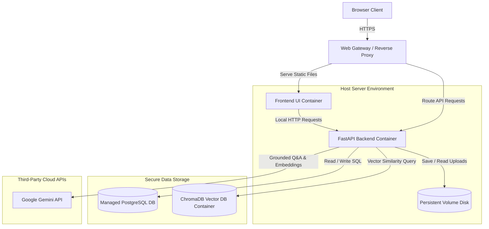
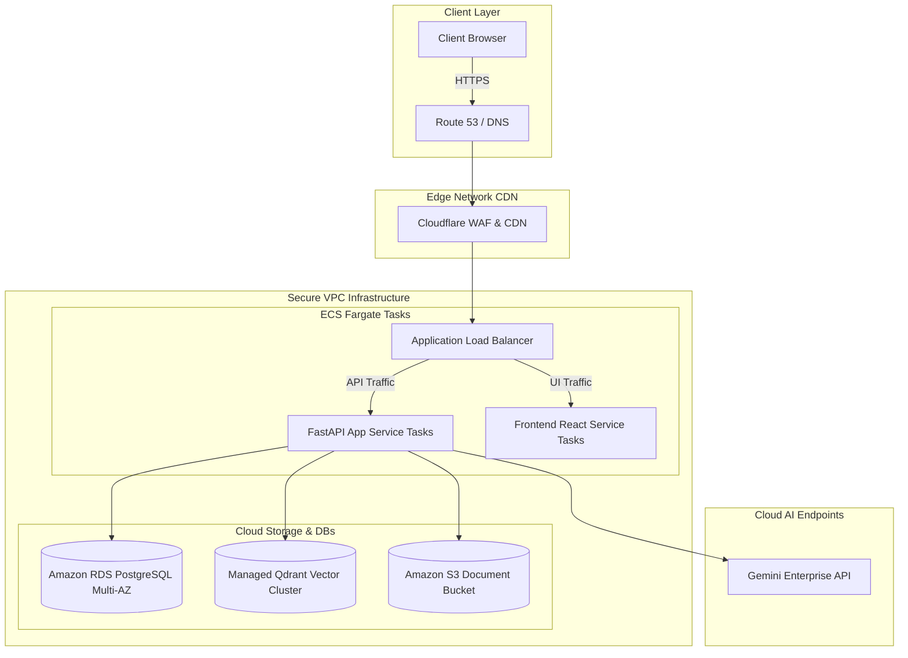

# Deployment Architecture Specification

| Attribute | Details |
| :--- | :--- |
| **Project Name** | Enterprise AI Knowledge Platform with Intelligent Customer Support (RAG) |
| **Document Name** | Deployment Architecture Specification |
| **Version** | v1.0.0 (Baseline Approved) |
| **Document Status** | Approved |
| **Owner** | Senior DevOps Engineer & Cloud Solutions Architect |
| **Last Updated** | 2026-06-27 |

### Document Purpose
This Deployment Architecture Specification defines the hosting models, container structures, storage designs, environment configuration policies, and recovery plans for the *Enterprise AI Knowledge Platform*. It focuses on a practical, developer-friendly setup for Version 1, while providing a clear roadmap for future enterprise scaling.

---

## 1. Deployment Philosophy

For Version 1 of this platform, the deployment architecture is designed around simplicity, maintainability, reproducibility, and a Docker-first development workflow.

Because this project is built and maintained by a single developer, over-engineering the infrastructure is a significant risk. Designing a complex system using Kubernetes clusters or distributed cloud services would increase maintenance overhead, distract from the core AI development, and escalate hosting costs.

Our deployment strategy focuses on the following principles:
*   **Simplicity:** Deploying the entire application using simple container environments (such as Docker Compose) or managed platforms (like Railway or Render).
*   **Maintainability:** Keeping configuration files centralized, ensuring the developer can manage updates and verify server health with minimal effort.
*   **Reproducibility:** Using standardized configurations to ensure the application runs identically on the developer's local machine, staging environments, and production servers.
*   **Docker-first Development:** Packaging the application's components (frontend, backend, databases) into container environments from day one, simplifying local setups and cloud deployments.

---

## 2. Version 1 Deployment Architecture

The Version 1 deployment model packages all application services onto a single host server, communicating with managed databases and external API providers.

### 2.1 Request Flow
1.  **Client Connection:** The user's browser connects to the host server's reverse proxy over a secure HTTPS connection.
2.  **Route Delegation:** The proxy routes requests for the UI to the Frontend Container, and API calls to the Backend FastAPI Container.
3.  **Application Processing:** The backend container processes requests, verifying user roles in the relational database and retrieving context from ChromaDB.
4.  **Local Storage Access:** Document uploads and parsing logs are written directly to a persistent storage volume mounted on the server.
5.  **External Inference:** Grounded Q&A queries retrieve context and send prompt completions to the Google Gemini API.
6.  **Response Delivery:** The backend streams the generated text tokens back to the client interface.

---

## 3. Local Development Architecture

The local development setup mirrors the production architecture, running services in containers to isolate dependencies and simplify the local environment.

*   **Frontend UI Component:** Runs locally in a container, hot-reloading code changes to speed up layout designs and widget styling.
*   **Backend FastAPI Component:** Runs in a separate Python container, mounting local source directories to support automatic server reloads during development.
*   **PostgreSQL Relational DB:** Runs as a local database container, using default ports to handle relational tables.
*   **ChromaDB Vector DB:** Runs in embedded mode within the backend process for Version 1, saving vector indices to local directories.
*   **Environment Variables:** A local configuration file (e.g. `.env`) manages API keys and database URLs, loading them into the containers at startup.

---

## 4. Docker Architecture

The platform uses Docker and Docker Compose to package services and manage communication.

*   **Standardized Environments:** Docker isolates the application's libraries, Python runtimes, and system packages, ensuring the application runs identically on all machines.
*   **Docker Compose Orchestration:** Docker Compose coordinates multi-container configurations. It defines how the frontend, backend, and database containers startup, configure networking, and mount storage volumes.
*   **Container Responsibilities:**
    *   *Frontend Container:* Packages static assets and servers to run the user interfaces.
    *   *Backend Container:* Packages the Python runtime, FastAPI app routers, document parsing engines, and LangChain orchestrators.
    *   *PostgreSQL Container:* Packages the relational database engine.
*   **Isolated Network Communication:** Containers communicate across an isolated internal Docker bridge network. Only the proxy port is exposed to the public internet, protecting database ports.
*   **Persistent Storage Volumes:** Database data directories and uploaded document folders are mapped to persistent volumes on the host machine. This ensures data is preserved when containers are restarted, updated, or rebuilt.

---

## 5. Environment Variables & Configurations

All configuration parameters and secrets are managed statelessly using environment variables.

*   **Centralized Configuration:** Settings are stored in a `.env` file at the root of the project.
*   **Secret Security:** The `.env` file containing database passwords, JWT signing keys, and API secrets is added to `.gitignore`. It is never committed to Git repositories.
*   **Configuration Schema:**
    *   *System Configurations:* Server ports, CORS origins, and default pagination sizes.
    *   *Database Credentials:* Host names, port numbers, database names, and passwords.
    *   *AI API Keys:* Access tokens for the Google Gemini LLM and embedding services.
    *   *Security Keys:* Cryptographic signing keys for generating JWT access tokens.
    *   *Settings Variables:* System prompts, retrieval similarity thresholds, and fallback messages.

---

## 6. Storage Strategy

The storage architecture defines how the system manages files and data across persistent volumes:

*   **Uploaded Documents:** Raw document files (PDFs, Markdown, TXT) are saved to a dedicated directory on a persistent storage volume.
*   **Embeddings:** ChromaDB vector indices are saved to a persistent database folder, ensuring search indices are preserved during container restarts.
*   **Chat History:** Conversational logs are stored in PostgreSQL relational tables.
*   **Application Logs:** Logs are written to rolling text files in a dedicated storage directory on the host machine.
*   **Temporary Files:** Ingestion tasks save temporary files to local directories, purging them immediately after parsing and embedding generation are complete.
*   **Backups:** Database backups and copies of the uploaded document directory are archived daily to a secure backup folder.

---

## 7. Logging Philosophy

The platform logs application events to support debugging and system auditing:
*   **Structured Format:** Logs are written in a standardized text format, recording timestamps, log levels (`INFO`, `WARNING`, `ERROR`), correlation IDs, and event descriptions.
*   **Log Files:** Backend and gateway logs are written to the host server's local file system.
*   **Log Retention:** The system retains logs for a configurable period (e.g. 14 days) to support troubleshooting while managing disk space.

---

## 8. Configuration Management

The system manages configurations dynamically across development, testing, and production environments:

*   **Development Environment:** Configured for local running, enabling verbose logging and hot-reloading for fast development cycles.
*   **Testing Environment:** Runs tests using isolated, temporary database directories, preventing test suites from overwriting local development data.
*   **Production Environment:** Enforces strict validation, disables debugging modes, restricts CORS origins, and uses secure, encrypted database connections.

---

## 9. Deployment Targets

To simplify deployment and reduce hosting overhead, we recommend the following targets for Version 1:

| Environment | Service Type | Selected Target | Alternatives Evaluated | Selection Rationale |
| :--- | :--- | :--- | :--- | :--- |
| **Development** | Complete Stack | **Local Machine** | Dev VM, Cloud Instances | Zero hosting cost, offline availability, and fast iteration speed. |
| **Production** | Web Apps / API | **Railway** or **Render** | AWS EC2, GCP App Engine | Managed platforms that handle deployments, scale simply, and require minimal DevOps configuration. |
| **Production** | Relational DB | **Supabase PostgreSQL** | AWS RDS, Managed DB clusters | Provides a managed, secure PostgreSQL instance with built-in backups and automated scale paths. |

---

## 10. Monitoring

For the Version 1 release, monitoring is kept simple to reduce maintenance overhead:
*   **Application Logs:** The developer reviews log files directly on the host machine to diagnose exceptions.
*   **Health Check Endpoint:** The backend exposes a `/health` endpoint that monitors connection latency to PostgreSQL and ChromaDB.
*   **Basic Server Metrics:** Managed hosting platforms (Railway/Render) display basic CPU, memory, and bandwidth utilization metrics.

> [!NOTE]
> Advanced monitoring suites (such as Prometheus, Grafana, or OpenTelemetry) are deferred to future enterprise scaling phases to avoid over-complicating the Version 1 deployment.

---

## 11. Backup Strategy

The backup strategy focuses on protecting data volumes and configurations:
*   **Database Backups:** Supabase automatically runs daily database backups, preserving relational records.
*   **Document Backups:** The persistent document directory is backed up daily to a separate storage location.
*   **Configuration Backups:** Environment variable templates (`.env.example`) are stored in Git. Active `.env` backups are secured in a separate, encrypted repository.

---

## 12. Failure Recovery Procedures

This section outlines recovery steps for common failure scenarios:

*   **Application Container Failures:** Containers are configured with automatic restart policies (`restart: unless-stopped`), ensuring they restart immediately if a crash occurs.
*   **Database Connection Loss:** The backend handles database disconnects by retrying connections using exponential backoff policies.
*   **Vector DB Corruption:** If the ChromaDB vector index is corrupted, administrators can trigger a system rebuild. The backend reads document files from storage, regenerates embeddings, and re-indexes the vector database.
*   **AI API Failures:** If the Gemini API is unreachable, the chat interface displays a polite error message and offers direct links to human support.

---

## 13. Future Deployment Architecture (Roadmap)

As the platform scales to support multi-tenant SaaS models and high concurrent user traffic, the deployment architecture can migrate to enterprise cloud environments.

### 13.1 Future Enterprise Scale Targets
*   **Application Load Balancers (ALB):** Distribute incoming traffic across multiple container instances running in private subnets.
*   **Horizontal Autoscaling:** Scale container tasks (using Amazon ECS or Google Kubernetes Engine) dynamically based on CPU and memory utilization.
*   **Cloud Object Storage:** Migrate file storage to Amazon S3 or Google Cloud Storage to support horizontal scaling.
*   **Distributed Vector Clusters:** Migrate vector storage to a dedicated Qdrant or Milvus cluster, using horizontal replicas to handle high-throughput query loads.

---

## 14. Engineering Decisions

The table below documents deployment design decisions and trade-offs:

| Deployment Choice | Selection Rationale | Alternatives Evaluated | Rationale for Rejection |
| :--- | :--- | :--- | :--- |
| **Docker Compose** | Simple configuration, orchestrates multi-container environments, and runs identically on developer machines and staging servers. | Kubernetes (K8s) | Kubernetes introduces significant configuration overhead and resource requirements that are unnecessary for Version 1. |
| **Supabase PostgreSQL** | Managed database service that handles backups, updates, and indexing, reducing database management overhead. | Self-hosted DB container | Self-hosted database containers require manual backup configuration, update management, and disk scaling. |
| **Railway / Render Hosting** | Simple Git-to-deploy hosting that manages certificates, logs, and basic scaling metrics. | AWS ECS / EKS | AWS ECS/EKS requires configuring complex VPCs, IAM roles, load balancers, and target groups. |

---

## 15. Ready for Implementation Checklist

*   [x] Version 1 single-server container layout specified.
*   [x] Local development container model defined.
*   [x] Networking and port configuration policies established.
*   [x] Storage strategy for documents, embeddings, and backups documented.
*   [x] Deployment targets (Railway, Render, Supabase) selected.
*   [x] Failover recovery procedures and container restart policies defined.
*   [x] Future enterprise cloud scaling roadmap outlined.

---

## 16. Conclusion

This Deployment Architecture Specification defines a practical hosting strategy for the Enterprise AI Knowledge Platform. By packaging application services in Docker containers and using managed database and hosting platforms, the system ensures reproducibility and high availability while minimizing maintenance overhead. This architecture provides a stable framework for the developer to deploy the application, while establishing a clear scale path for future enterprise releases.
