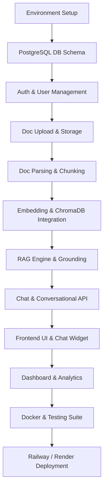

# Project Execution Checklist

| Attribute | Details |
| :--- | :--- |
| **Project Name** | Enterprise AI Knowledge Platform with Intelligent Customer Support (RAG) |
| **Document Name** | Project Execution Checklist |
| **Version** | v1.0.0 (Baseline Approved) |
| **Document Status** | Approved |
| **Owner** | Technical Project Manager & Engineering Lead |
| **Last Updated** | 2026-06-27 |

### Document Purpose
This document acts as the master execution guide and checklist for building Version 1 of the platform. It summarizes the implementation scope, indexes the complete system documentation, recommends a structured build sequence, maps module dependencies, and defines the Definition of Done to guide daily development.

---

## 1. Current Project Status

The complete solution design, requirements specifications, and engineering blueprints for the *Enterprise AI Knowledge Platform* are fully defined. All architecture, database, API, UI/UX, security, deployment, and testing documents are approved and baseline-indexed. The project is ready for local environment setup and backend implementation.

---

## 2. Documentation Index

The following documents define the complete design specifications for this project:

1.  **[01_Project_Overview.md](file:///c:/Users/Abrakant/OneDrive/Documents/Projects/AI%20Customer%20Support%20using%20RAG/docs/01_Project_Overview.md):** High-level vision, mission, problem statements, scope limits, and project deliverables.
2.  **[02_Product_Requirements_Document.md](file:///c:/Users/Abrakant/OneDrive/Documents/Projects/AI%20Customer%20Support%20using%20RAG/docs/02_Product_Requirements_Document.md):** User personas, 35 functional user stories, NFRs, business rules, and error scopes.
3.  **[03_System_Architecture.md](file:///c:/Users/Abrakant/OneDrive/Documents/Projects/AI%20Customer%20Support%20using%20RAG/docs/03_System_Architecture.md):** Clean architecture layout, module descriptions, system diagrams, and transactional sequence flows.
4.  **[04_Technology_Selection_and_Architecture_Decisions.md](file:///c:/Users/Abrakant/OneDrive/Documents/Projects/AI%20Customer%20Support%20using%20RAG/docs/04_Technology_Selection_and_Architecture_Decisions.md):** Rationale and trade-offs for Python, FastAPI, Streamlit, PostgreSQL, ChromaDB, and Google Gemini API.
5.  **[05_AI_RAG_Engine_Design.md](file:///c:/Users/Abrakant/OneDrive/Documents/Projects/AI%20Customer%20Support%20using%20RAG/docs/05_AI_RAG_Engine_Design.md):** Parser extraction, chunking parameters, embedding dimensions, retrieval gates, and citation engines.
6.  **[06_Database_Design_Specification.md](file:///c:/Users/Abrakant/OneDrive/Documents/Projects/AI%20Customer%20Support%20using%20RAG/docs/06_Database_Design_Specification.md):** Entity relationship diagrams, logical schemas, index strategies, and document versioning patterns.
7.  **[07_API_Design_Specification.md](file:///c:/Users/Abrakant/OneDrive/Documents/Projects/AI%20Customer%20Support%20using%20RAG/docs/07_API_Design_Specification.md):** Endpoint path definitions, request-response schemas, HTTP codes, and envelope models.
8.  **[08_UI_UX_Design_Specification.md](file:///c:/Users/Abrakant/OneDrive/Documents/Projects/AI%20Customer%20Support%20using%20RAG/docs/08_UI_UX_Design_Specification.md):** Visual layout requirements, design system HSL tokens, chat stream UI states, and responsive breakpoints.
9.  **[09_Security_Architecture_Specification.md](file:///c:/Users/Abrakant/OneDrive/Documents/Projects/AI%20Customer%20Support%20using%20RAG/docs/09_Security_Architecture_Specification.md):** Threat modeling, JWT lifetimes, bcrypt hashing, file upload security, and data privacy isolation.
10. **[10_Deployment_Architecture.md](file:///c:/Users/Abrakant/OneDrive/Documents/Projects/AI%20Customer%20Support%20using%20RAG/docs/10_Deployment_Architecture.md):** Docker-compose configurations, Supabase/Railway deployment targets, and point-in-time recovery plans.
11. **[11_Testing_Strategy.md](file:///c:/Users/Abrakant/OneDrive/Documents/Projects/AI%20Customer%20Support%20using%20RAG/docs/11_Testing_Strategy.md):** Unit test scopes, Gold Standard RAG evaluation set, and manual QA validation checklists.
12. **[12_Developer_Guide.md](file:///c:/Users/Abrakant/OneDrive/Documents/Projects/AI%20Customer%20Support%20using%20RAG/docs/12_Developer_Guide.md):** Naming conventions, type checking, log routing, thin-router rules, and git feature branching workflows.

---

## 3. Recommended Build Order

Development is organized into four sequential phases, starting with environment setup and ending with deployment:

*   **Phase 1: Foundation & Authentication**
    *   Local environment setup (Python, virtual environments, Git setup).
    *   Database schemas and tables initialization in PostgreSQL.
    *   FastAPI backend shell setup, routing, and Pydantic configuration validation.
    *   Authentication APIs (Register, Login, JWT verification, Bcrypt hashing).
    *   Document Upload endpoint (File validation, raw disk storage logging).
*   **Phase 2: RAG Pipeline & Chat Core**
    *   Text extraction services using PyMuPDF (PDF, MD, TXT extraction).
    *   Recursive Character Splitter configuration.
    *   Embedding Service integration (Google Gemini Embeddings).
    *   ChromaDB indexing and metadata catalog integration.
    *   Retrieval similarity search, fallback gates, and context filters.
    *   LLM Chat API (Stream responses, prompt structures, citation reconciler).
*   **Phase 3: Frontend & Analytics**
    *   Frontend application (Streamlit or React UI shell setup).
    *   Grounded Q&A Chat window implementation (SSE stream, message cards, citation hovers).
    *   Document Management Library lists and Drag-and-Drop uploads.
    *   Metrics dashboard (Query volumes, token costs, feedback tables).
*   **Phase 4: Orchestration & Deployment**
    *   Docker container packaging (Frontend, Backend, Proxy).
    *   Unit and integration testing suites execution (pytest).
    *   Production deployment (Railway/Render + Supabase).

---

## 4. Module Dependency Graph

The graph below defines the implementation path. Downstream components should not be built until their upstream dependencies are verified.

---

## 5. Milestones

We define four milestones to measure development progress:

*   **Milestone 1 (Data & Auth Foundation):** Database tables are active, JWT authentication validates secure routes, and files upload and save to local disk storage successfully.
*   **Milestone 2 (AI Engine Verification):** Ingestion pipelines parse, chunk, and embed documents into ChromaDB. Semantic queries retrieve relevant context chunks, and the LLM streams grounded responses with correct citations.
*   **Milestone 3 (Interactive Interface Ready):** The frontend chat interface streams responses in real-time, displays citation hover cards, provides drag-and-drop document uploads, and updates the administrator analytics panel.
*   **Milestone 4 (Production Deployment):** The application runs within Docker containers, passes the test suite, and is deployed live on Railway/Render with Supabase.

---

## 6. Definition of Done (DoD)

A module is considered complete only when it satisfies all the following criteria:

*   **Code Quality:** Adheres to Python coding standards, type hints, PEP 257 docstrings, and naming conventions defined in the [Developer Guide](file:///c:/Users/Abrakant/OneDrive/Documents/Projects/AI%20Customer%20Support%20using%20RAG/docs/12_Developer_Guide.md).
*   **API Compliance:** Request parameters and response envelopes match the [API Design Specification](file:///c:/Users/Abrakant/OneDrive/Documents/Projects/AI%20Customer%20Support%20using%20RAG/docs/07_API_Design_Specification.md) schemas.
*   **Security:** Routes enforce role permissions (RBAC) and data isolation checks. Secrets are kept out of code.
*   **Testing:** Passes automated unit tests (minimum 80% coverage) and manual QA verification checklists.
*   **Error Safety:** Implements error logging with stack traces and returns user-friendly messages for failures.

---

## 7. Implementation Timeline

A realistic, step-by-step implementation timeline for a single developer:

*   **Week 1 (Foundation):** Environment setup, database creation, router configuration, auth API implementation, and file upload endpoints.
*   **Week 2 (AI Processing Pipeline):** PDF parsers, recursive chunk splitters, vector embeddings configuration, and ChromaDB search indexing.
*   **Week 3 (RAG & Generation Core):** Prompt compilers, citation reconcilers, SSE streaming chat endpoints, and fallback logic.
*   **Week 4 (Frontend UI):** Chat interfaces, citation badge hover cards, document management tables, and dashboard panels.
*   **Week 5 (Validation & Deployment):** Test suite execution, Docker setups, staging deployments, and final production releases.

---

## 8. Progress Checklist

The developer can track implementation progress using this master checklist:

### Phase 1: Foundation
- [ ] Initialize Python environment, git repository, and settings configurations.
- [ ] Initialize PostgreSQL tables (Users, Documents, Chat History, Logs).
- [ ] Build FastAPI server shell, route mappings, and global exception handlers.
- [ ] Implement Register, Login, Refresh, and Logout authentication endpoints (JWT + Bcrypt).
- [ ] Build File Upload endpoint with size and extension validators.

### Phase 2: Ingestion & RAG
- [ ] Implement text extraction pipelines (PyMuPDF parser for PDF/MD/TXT).
- [ ] Build Recursive Character Splitter logic.
- [ ] Integrate Google Gemini Embeddings client wrapper.
- [ ] Configure ChromaDB vector index creation and metadata filters.
- [ ] Implement semantic search matching and similarity threshold checks.
- [ ] Build Prompt Compiler and Grounding Validation.
- [ ] Build stream-enabled chat query endpoint (SSE + Citation generator).

### Phase 3: User Interfaces
- [ ] Set up frontend UI template and client layout structure.
- [ ] Build Chat Console (SSE stream text renderer, suggested question buttons, copy commands).
- [ ] Implement Citation Badge components and metadata hover panels.
- [ ] Build Admin Document Library view and Drag-and-Drop file uploads interface.
- [ ] Build Admin metrics dashboard (volumes, token counts, feedback comments).

### Phase 4: Delivery
- [ ] Create Dockerfiles and docker-compose configurations.
- [ ] Run pytest unit suites and verify code coverage > 80%.
- [ ] Conduct manual QA checklists.
- [ ] Deploy PostgreSQL to Supabase.
- [ ] Deploy Frontend and Backend to Railway/Render.
- [ ] Conduct final production sanity testing.

---

## 9. Developer Guidelines

### 9.1 Before Writing Code
*   Verify that your local environment variables (`.env`) match the current config template (`.env.example`).
*   Confirm that target database instances are running and accessible.
*   Create a clean, isolated git branch for the feature (e.g., `git checkout -b feat/pdf-parsing`).

### 9.2 During Development
*   Always include type hints and docstrings for new functions.
*   Keep functions focused on a single task (single responsibility principle).
*   Log milestones using `INFO` and system exceptions using `ERROR` with stack traces.
*   Write unit tests alongside feature code.

### 9.3 Before Deploying
*   Confirm that all environment variables are correctly configured on the target hosting platform.
*   Verify that the test suite passes locally.
*   Verify that all document deletion and visibility filtering tests succeed, preventing data leaks.

---

## 10. Final Goal

The completed *Enterprise AI Knowledge Platform* will provide organizations with a secure, grounded customer support assistant. By indexing corporate manuals and policies, the platform resolves knowledge fragmentation and automates routine support ticket resolution. By strictly anchoring generative AI outputs to retrieved contexts and appending clear citations, the platform ensures data security, prevents hallucinations, and delivers a reliable, production-ready AI support assistant.

---

## 11. Conclusion

This Project Execution Checklist defines a structured roadmap to build the Enterprise AI Knowledge Platform. By following the recommended build order, verifying module dependencies, and adhering to the Definition of Done, the developer can build, test, and release the platform with confidence.
